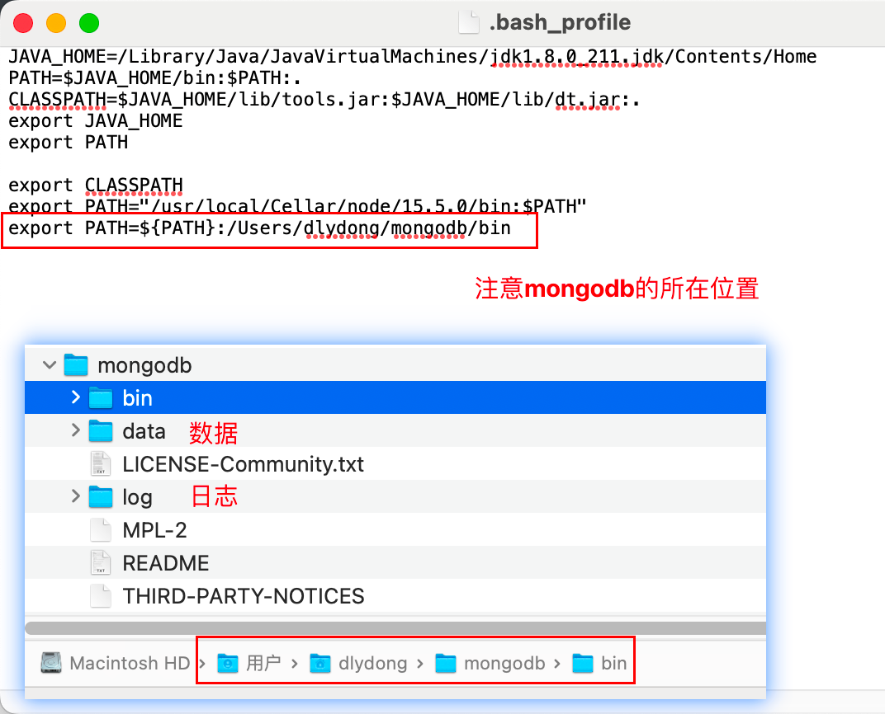
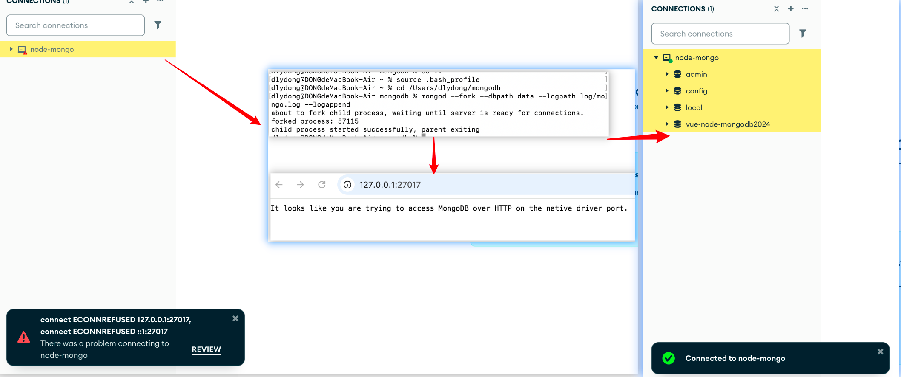
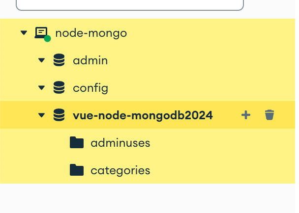
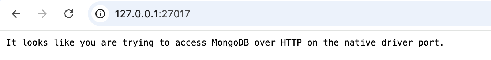
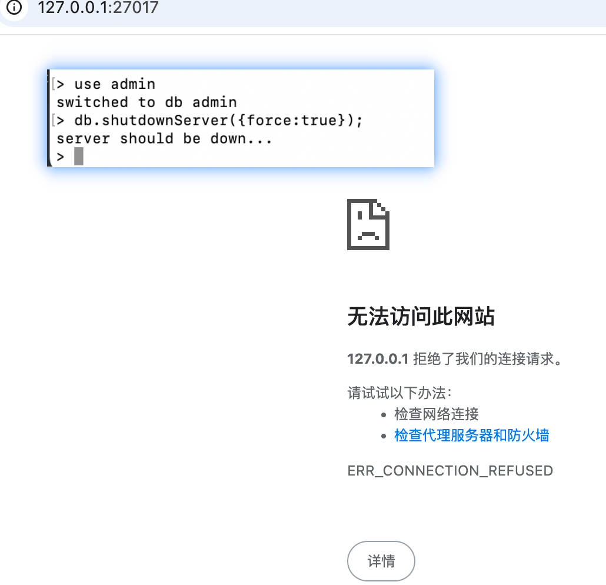

# 配置

```bash
// 打开
dlydong@DONGdeAir ~ % open .bash_profile  
```



```bash
// 生效
dlydong@DONGdeMacBook-Air ~ % source .bash_profile
```

```bash
// 版本
dlydong@DONGdeAir mongodb % mongo -version

// 出现以下信息，表示成功
Build Info: {
    "version": "5.0.5",
    "gitVersion": "d65fd89df3fc039b5c55933c0f71d647a54510ae",
    "modules": [],
    "allocator": "system",
    "environment": {
        "distarch": "x86_64",
        "target_arch": "x86_64"
    }
}
```

# 运行（△）



```bash
dlydong@DONGdeMacBook-Air ~ % source .bash_profile
dlydong@DONGdeMacBook-Air ~ % cd /Users/dlydong/mongodb 
dlydong@DONGdeAir mongodb % mongod --fork --dbpath data --logpath log/mongo.log --logappend
```


运行后数据库才能正常连接

```bash
项目地址《/Users/dlydong/learn/04Node/Node.js基础/vue-node-mongo-db02/server》

运行
dlydong@DONGdeAir server % npm run serve
```




# 验证

```bash
// 浏览器输入地址
http://127.0.0.1:27017/
```



```bash
dlydong@DONGdeAir mongodb % mongod   // mongo localhost:27017

> db
test
```


# 停止

```bash
> use admin
> db.shutdownServer({force:true});
```




