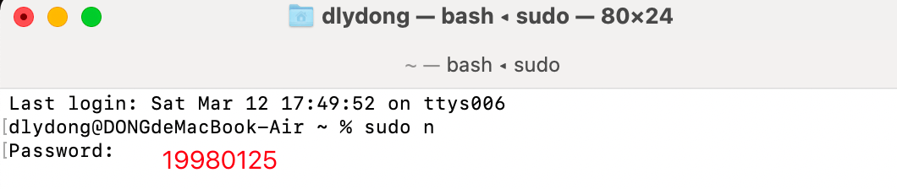
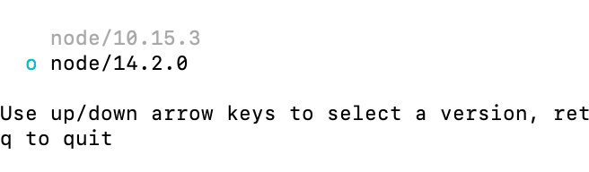
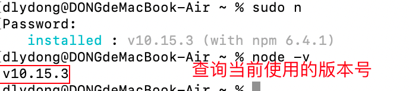
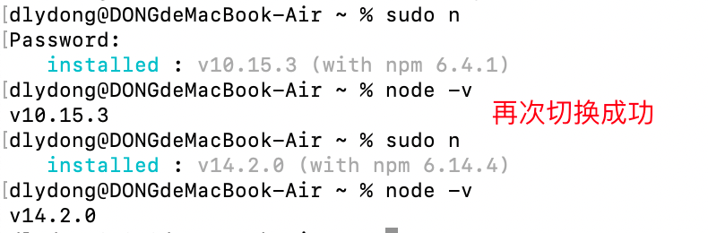
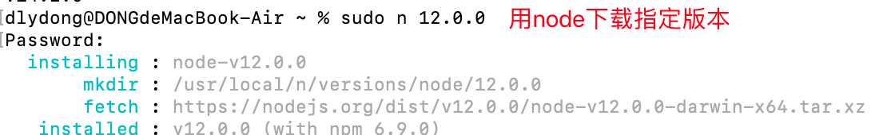
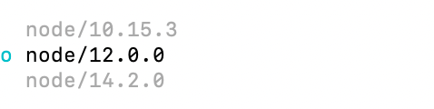
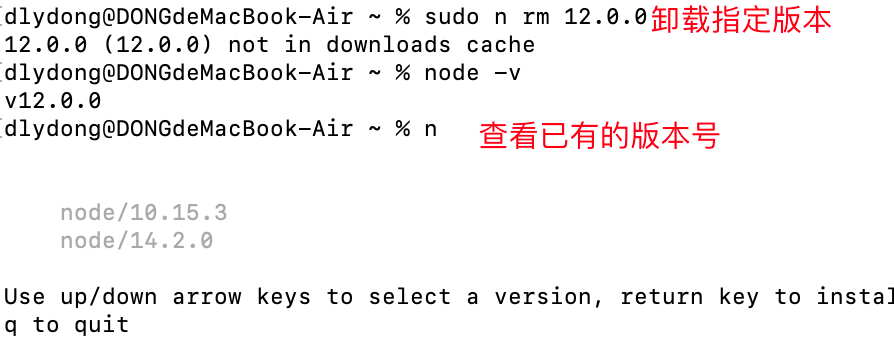
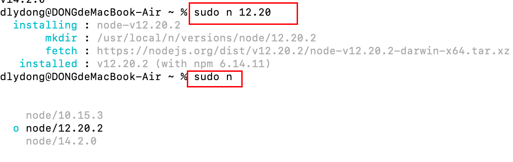

# 作用

在我们开发多个项目的时候，因为框架支持的node版本不同，所以要切换多个node版本

下载vue CLI3.0以上的时候，想要node12.0.0以上的版本，因此用n管理工具来管理node版本，并切换到需要的版本来做对应的项目


# npm全局安装模块 n 

```
sudo npm  install  -g  n
```

# 切换Node版本号

```
sudo n <回车>
```






# 查看当前Node版本号

```
node -v
```










# 卸载指定Node版本号




# 下载Node指定版本

```
sudo n 12.20 
```




