0308-0309

> ```
> 1、如何调试
> 2、如何打包测试
> 3、接口的封装
> 4、完整项目，项目布局 
> 5、掌握几种布局
> 长视频
> https://developer.huawei.com/consumer/cn/doc/best-practices-V5/multi-video-app-V5
> 购物
> https://developer.huawei.com/consumer/cn/doc/best-practices-V5/multi-shopping-price-comparison-V5
> 即使通讯
> https://developer.huawei.com/consumer/cn/doc/best-practices-V5/multi-communication-app-V5
> ```
>
> ```markdown
> 首页
> 1、轮播
> 2、功能tab
> 3、功能tab
> 4、card：分享
> 5、底部服务热线card 
> ```


1、ui开发布局

- 线性布局Row/Column

- 层叠布局Stack

- Scroll

- layoutWeight(1)


```bash
思考：

交互、数据的遍历、如何定义变量

react新建项目、运行app、打包
```


---


之前构建的页面多为静态界面。
但如果希望构建一个动态的、有交互的界面，就需要引入“状态”的概念

### 知识点总结

- **注解**：用于标记组件和状态变量，是框架提供的一种元数据机制。
- **状态管理**：使用 `@State` 注解标记状态变量，当状态变量的值发生变化时，框架会自动重新渲染组件。
- **组件构建**：通过 `build` 方法定义组件的 UI 结构，使用框架提供的组件和方法来构建界面。
- **事件绑定**：使用 `.onClick()` 等方法绑定组件的事件，当事件触发时，会执行传入的回调函数。


#### 案例-购物车

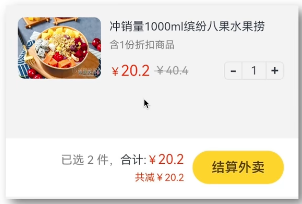


- ```
  Text()标签
  ```

- ```
  Row({ space: 10})
  ```

- ```
  Column({space: 10}) 
  ```


- 数组的操作


#### 阶段案例-生肖抽奖

> #### 知识点
>
> - ###### Grid宫格布局
>
> - ##### 层叠布局Stack
>
> - ##### 对象数组
>
> - ###### ForEach渲染控制
>
> - ###### Badge角标组件


> 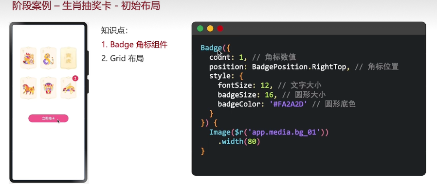
>
> 
>
> #### 基本布局
>
> 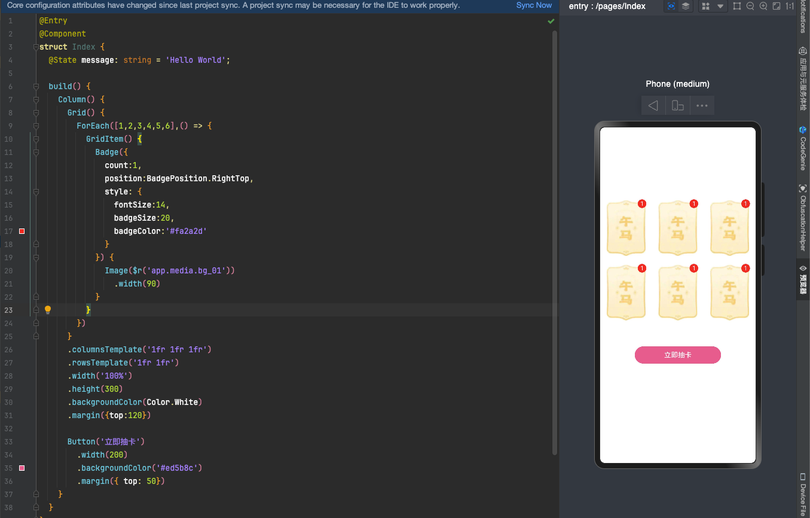
>
> ```ts
> // 基本布局
> @Entry
> @Component
> struct Index {
>   @State message: string = 'Hello World';
> 
>   build() {
>     Column() {
>       Grid() {
>         ForEach([1,2,3,4,5,6],() => {
>           GridItem() {
>             Badge({
>               count:1,
>               position:BadgePosition.RightTop,
>               style: {
>                 fontSize:14,
>                 badgeSize:20,
>                 badgeColor:'#fa2a2d'
>               }
>             }) {
>               Image($r('app.media.bg_01'))
>                 .width(90)
>             }
>           }
>         })
>       }
>       .columnsTemplate('1fr 1fr 1fr')
>       .rowsTemplate('1fr 1fr')
>       .width('100%')
>       .height(300)
>       .backgroundColor(Color.White)
>       .margin({top:120})
> 
>       Button('立即抽卡')
>         .width(200)
>         .backgroundColor('#ed5b8c')
>         .margin({ top: 50})
>     }
>   }
> }
> ```
>
> 
>
> #### 数据动态渲染
>
> - 图片的地址
>
> - 抽中的数量
>
>   ```ts
>   // 1、定义接口
>   interface ImageCount {
>     url:string
>     count:number
>   }
>   @Entry
>   @Component
>   struct Index {
>     @State images: ImageCount[] = [
>       {url:'app.media.bg_00',count:2222},
>       {url:'app.media.bg_01',count:22},
>       {url:'app.media.bg_02',count:1},
>       {url:'app.media.bg_03',count:2},
>       {url:'app.media.bg_04',count:1},
>       {url:'app.media.bg_05',count:3},
>       {url:'app.media.bg_06',count:4},
>                   
>     ]
>                   
>     build() {
>       Column() {
>         Grid() {
>           ForEach(this.images,(item:ImageCount,index:number) => {
>             GridItem() {
>               Badge({
>                 count:item.count,
>                 position:BadgePosition.RightTop,
>                 style: {
>                   fontSize:14,
>                   badgeSize:20,
>                   badgeColor:'#fa2a2d'
>                 }
>               }) {
>                 Image($r(item.url))
>                   .width(90)
>               }
>             }
>           })
>         }
>         .columnsTemplate('1fr 1fr 1fr')
>         .rowsTemplate('1fr 1fr')
>         .width('100%')
>         .height(300)
>         .backgroundColor(Color.White)
>         .margin({top:120})
>                   
>         Button('立即抽卡')
>           .width(200)
>           .backgroundColor('#ed5b8c')
>           .margin({ top: 50})
>       }
>     }
>   }
>   ```
>
>   
>
> #### 遮罩和显影动画
>
> -  层叠布局Stack
>
>   
>
>   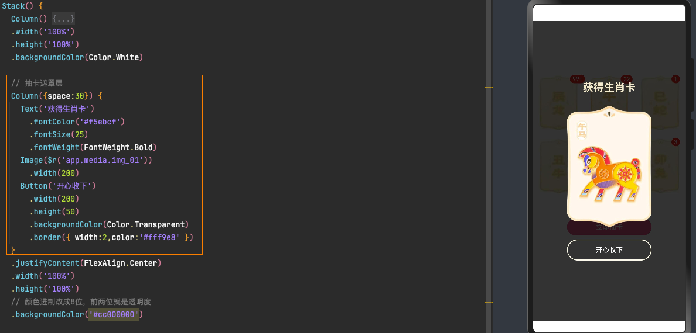
>
> - 基本布局
>
>   - 点击动画效果
>
>   - 图片缩放处理
>
>     ```tx
>     .scale({
>     	x:this.maskImgX,
>     	y:this.maskImgY
>     })
>                                     
>     .animation({
>      	 duration:500
>     })
>     ```
>
>     
>
> #### 随机卡片
>
> 
>
> 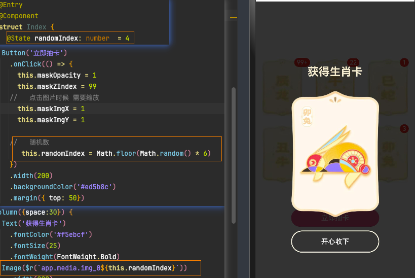
>
> 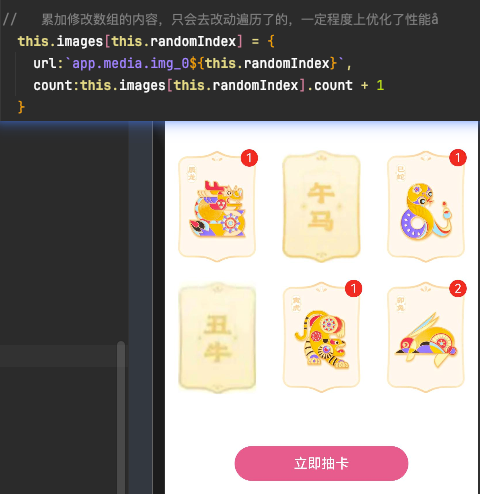
>
> #### 大奖结构和显影控制
>
> 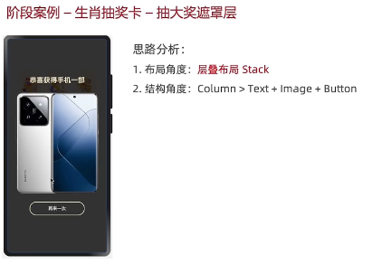
>
> 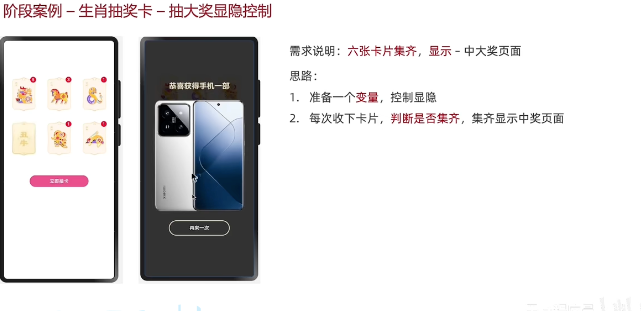
>
> - 判断数组中的内容是否存在0，是，不重，否，重==定义一个标识isGet
>
> - 每次抽完都需要判断一次，是否抽到了大奖
>
>   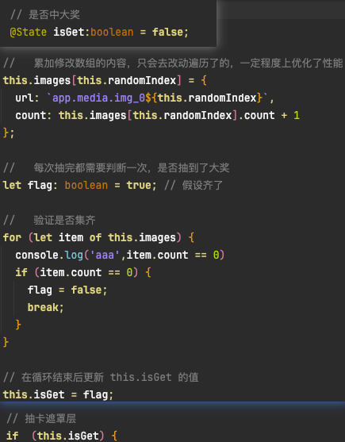


> #### 随机奖品和再来一次
>
> 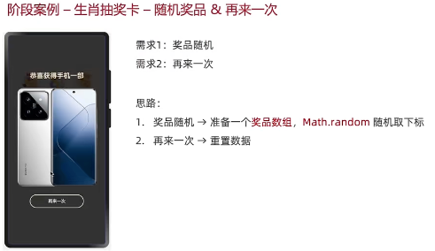

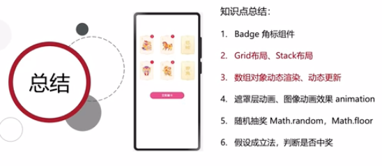


------


###### 自适应布局常常需要借助[Row组件](https://developer.huawei.com/consumer/cn/doc/harmonyos-references-V5/ts-container-row-V5)、[Column组件](https://developer.huawei.com/consumer/cn/doc/harmonyos-references-V5/ts-container-column-V5)或[Flex组件](https://developer.huawei.com/consumer/cn/doc/harmonyos-references-V5/ts-container-flex-V5)实现。

###### 响应式布局常常与[GridRow组件](https://developer.huawei.com/consumer/cn/doc/harmonyos-references-V5/ts-container-gridrow-V5)、[Grid组件](https://developer.huawei.com/consumer/cn/doc/harmonyos-references-V5/ts-container-grid-V5)、[List组件](https://developer.huawei.com/consumer/cn/doc/harmonyos-references-V5/ts-container-list-V5)、[Swiper组件](https://developer.huawei.com/consumer/cn/doc/harmonyos-references-V5/ts-container-swiper-V5)或[Tabs组件](https://developer.huawei.com/consumer/cn/doc/harmonyos-references-V5/ts-container-tabs-V5)搭配使用。


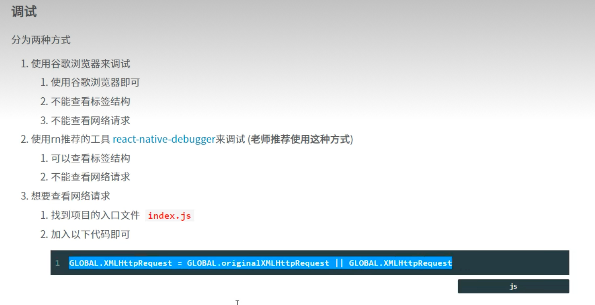

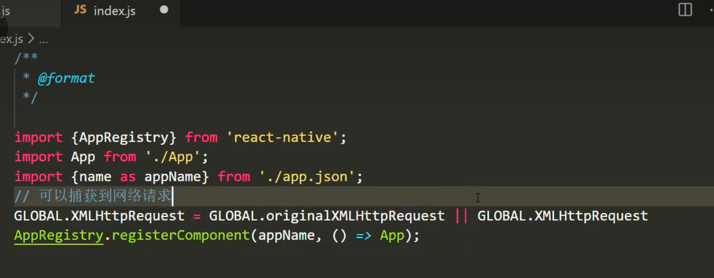


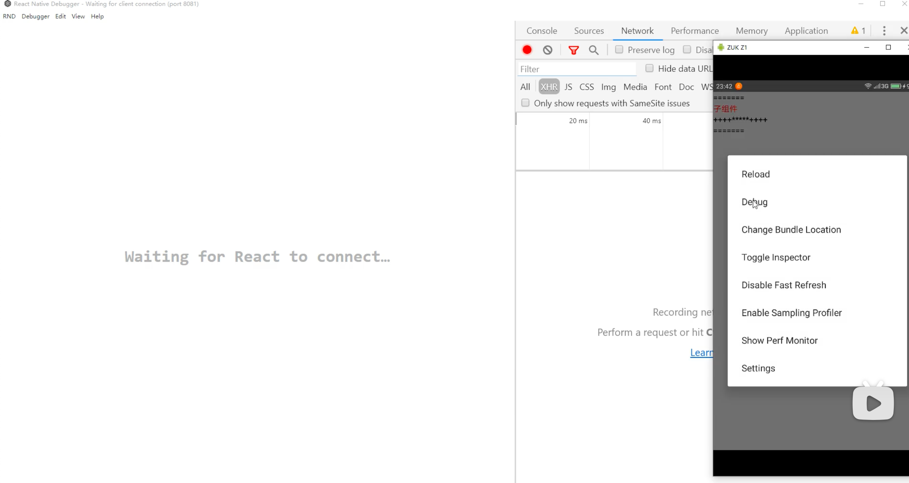


```
npx react-native@latest init AwesomeProject --version 0.76.0
```


启动页面


生命周期


