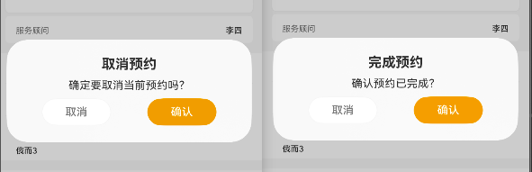

```
创建时间：20250521
状态：完成
```


# 需求

鸿蒙开发中的弹出框内的样式(https://developer.huawei.com/consumer/cn/doc/harmonyos-references-V5/ts-methods-alert-dialog-box-V5)，无法自定义；

# 链接

https://developer.huawei.com/consumer/cn/doc/harmonyos-references-V5/ts-methods-custom-dialog-box-V5

# 效果


# 自定义弹窗(CustomDialog)

```tsx
// src/main/ets/components/ComCustomDialog.ets

@Preview
@CustomDialog
export default struct ComCustomDialog {
  controllerComCustomDialog?: CustomDialogController
  @Prop titleValue: string
  @Prop contentValue: string
  @Prop btnCancelValue: string = '取消'
  @Prop btnAgreeValue: string = '确认'
  btnCancel:() => void = () => { }
  btnAgree: () => void = () => {}
  build() {
    Column({ space:10 }) {
      Text(this.titleValue??'提示').fontSize(20).fontWeight(FontWeight.Bold)
      Text(this.contentValue??'')

      Row() {
        Button(this.btnCancelValue).width(100).backgroundColor($r('app.color.colorFf')).fontColor($r('app.color.color7'))
          .border({
            width:1,
            color:$r('app.color.colorF6')
          })
          .onClick(() => {
            this.btnCancel()
          })
        Button(this.btnAgreeValue).width(100).backgroundColor($r('app.color.primary'))
          .onClick(() => {
            this.btnAgree()
          })
      }
      .width('100%')
      .justifyContent(FlexAlign.SpaceAround)
    }.ContainerStyle()

  }
}
@Extend(Column) function ContainerStyle() {
  .padding(25)
  .width("100%")
  .justifyContent(FlexAlign.Center)
  .borderRadius(20)
}
@Extend(Span) function TextStyle() {
  .fontColor($r('app.color.primary'))
}
```

# 使用

```tsx
// src/main/ets/pages/MinePage.ets
import ComCustomDialog from '../components/ComCustomDialog'

@Entry
@Component
struct MinePage {
	
  controllerComCustomDialog:CustomDialogController | null  = new CustomDialogController({
    builder:ComCustomDialog({
      titleValue: '提示',
      contentValue: '确定要退出吗？',
      btnCancel:() => {
        this.controllerComCustomDialog?.close()
      },
      btnAgree:() => {
        this.logout()
        this.controllerComCustomDialog?.close()
        setTimeout(() => {
          router.pushUrl({url:'pages/UserReg'})
        },1000)
      },

    })
  })
  
}
```

# 使用--更加灵活



```tsx
@Entry
@Component
struct DocDetail {
  // 对话框内容状态
  @State dialogTitle: string = '提示';
  @State dialogContent: string = '确定要取消吗？';
  // 回调函数存储
  private confirmCallback: () => void = () => {};
  // 对话框控制器
  private dialogController: CustomDialogController | null = null;
  aboutToAppear(): void {
    // 在组件初始化后创建对话框控制器
    this.dialogController = new CustomDialogController({
      builder: ComCustomDialog({
        titleValue: this.dialogTitle,
        contentValue: this.dialogContent,
        btnCancel: () => {
          this.closeDialog()
        },
        btnAgree: () => {
          try {
            // 执行确认回调
            this.confirmCallback();
          } catch (error) {
            console.error('[Dialog] 确认回调执行失败:', error);
          } finally {
            // 无论如何都关闭对话框
            this.closeDialog();
          }
        },
      })
    });
  }
  // 打开对话框的方法
   openDialog(title: string, content: string, callback: () => void) {
    this.dialogTitle = title;
    this.dialogContent = content;
    this.confirmCallback = callback;
    this.dialogController?.open();
  }

  // 关闭对话框的方法
  closeDialog() {
    this.dialogController?.close();
    // 重置回调以避免意外调用
    this.confirmCallback = () => {};
  }


	if (this.propsStatue == 'PreOrder') {
      Row() {
        Button('取消预约')
          .bottomContentButtonPrBorStyle()
          .margin({ top: 5, bottom: 5 })
          .onClick(() => {
            this.openDialog(
              '取消预约',
              '确定要取消当前预约吗？',
              () => {
                console.log('执行取消预约逻辑');
                // 处理取消预约的具体业务逻辑
              }
            );
          });

        Button('完成预约')
          .bottomContentButtonPrStyle()
          .margin({ top: 5, bottom: 5 })
          .onClick(() => {
            this.openDialog(
              '完成预约',
              '确认预约已完成？',
              () => {
                console.log('执行完成预约逻辑');
                // 处理完成预约的具体业务逻辑
              }
            );

          });
      }
      .bottomContentStyle()
    }	
}
```


