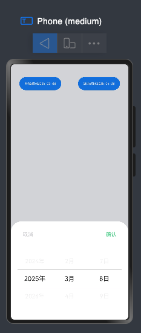

## 需求：完成基本面板的显示与隐藏，传递基本数据

> 

```tsx
// Index.ets
import ComBtn from '../components/ComBtn'
import ComPanel from '../components/ComPanel'

interface ICallbackHandler {
  onAction: (start: string, end: string) => void;
  // 新增关闭回调
  onClose:() => void
}
@Entry
@Component
struct SheetTransitionExample {
  @State startTime:string = ''
  @State endTime:string = ''
  @State isShowComPanel:boolean = false

  // 使用类型断言初始化（关键）
  @State btnCallback: ICallbackHandler = {
    onAction: (start: string, end: string) => {
      this.startTime = start;
      this.endTime = end;
      this.isShowComPanel = true;
      console.log('Open:', this.isShowComPanel);
    },
    onClose: () => {
      this.isShowComPanel = false; // 新增关闭状态同步
      console.log('Close:', this.isShowComPanel);
    }
  } as ICallbackHandler;


  build() {
    Column() {
      // 使用ArkUI合法参数传递语法
      ComBtn({ callback: this.btnCallback })
      ComPanel({ isShowComPanel:this.isShowComPanel,startTime:this.startTime,endTime:this.endTime,
        // 传递关闭回调
        callback: this.btnCallback })
    }
    .justifyContent(FlexAlign.Center)
    .width('100%')
    .height('100%')
  }
}

```


```tsx
// ComPanel.ets
interface ICallbackHandler {
  onAction: (start: string, end: string,sel:string) => void;
  // 新增关闭回调
  onClose:() => void
}

@Component
export default struct ComPanel {
  @Prop isShowComPanel: boolean = false
  @Prop startTime: string = ''
  @Prop endTime: string = ''
  @Prop SelectTime: string = ''
  @State sheetHeight: number = 300;
  // 使用明确接口类型
  @Link callback: ICallbackHandler;

  @Builder
  myBuilder() {
    Column() {
      Text(`开始时间: ${this.startTime}`)
        .fontSize(20)
        .margin(10)
      Text(`结束时间: ${this.endTime}`)
        .fontSize(20)
        .margin(10)
    }
    .padding(20)
    .width('100%')
    .height('80%')
  }

  build() {
    Column()
      .justifyContent(FlexAlign.Center)
      .width('100%')
      .height('100%')
      .bindSheet($$this.isShowComPanel, this.myBuilder(), {
        height: this.sheetHeight,
        backgroundColor: $r('app.color.colorFf'),
        // showClose:false, // 按钮隐藏
        onWillAppear: () => {
          console.log("BindSheet onWillAppear.")
        },
        onAppear: () => {
          console.log("BindSheet onAppear.")
        },
        onWillDisappear: () => {
          console.log("BindSheet onWillDisappear.")
        },
        onDisappear: () => {
          console.log("BindSheet onDisappear.")
          this.callback.onClose();
        }
      })
  }
}
```

```tsx
// ComBtn.ets
import Util from '../common/util/Index'

interface ICallbackHandler {
  onAction: (start: string, end: string) => void;

}

@Component
export default struct ComBtn {
  // 使用明确接口类型
  @Link callback: ICallbackHandler;

  @State startTime: string = Util.DateUtils.getOneMonthAgoDate();
  @State endTime: string = Util.DateUtils.getCurrentDate();

  build() {
    Row() {
      Button(`开始时间${this.startTime}`)
        .onClick(() => {
          console.log(this.startTime)
          this.callback.onAction(this.startTime, this.endTime)
        })
        .fontSize(10)

      Button(`结束时间${this.endTime}`)
        .onClick(() => {
          console.log(this.endTime)
          this.callback.onAction(this.startTime, this.endTime)
        })
        .fontSize(10)
    }
    .justifyContent(FlexAlign.SpaceAround)
    .width('100%')
  }
}
```


## 需求：日期组件-自定义点击

> 


```tsx
// ComPanel.ets
interface ICallbackHandler {
  onAction: (start: string, end: string,sel:string) => void;
  // 新增关闭回调
  onClose:() => void
}

@Component
export default struct ComPanel {
  @Prop isShowComPanel: boolean = false
  @Prop startTime: string = ''
  @Prop endTime: string = ''
  @Prop SelectTime: string = ''
  @State sheetHeight: number = 300;
  // 使用明确接口类型
  @Link callback: ICallbackHandler;

  @Builder
  myBuilder() {
    Column() {
      // 按钮栏
      Row({ space: 10 }) {
        Button('取消', { controlSize: ControlSize.NORMAL, buttonStyle: ButtonStyleMode.TEXTUAL })
          .fontColor('#d2d3d7')
          .onClick(() => {
            this.callback.onClose();
          })
        Button('确认', { controlSize: ControlSize.NORMAL, buttonStyle: ButtonStyleMode.TEXTUAL })
          .fontColor('#48D08E')
          .onClick(() => {

          })
      }
      .justifyContent(FlexAlign.SpaceBetween)
      .width('100%')

      Row() {
        // 日期选择器
        DatePicker({
          start: new Date('1970-1-1'),
          end: new Date('2100-1-1'),
          selected: new Date(this.SelectTime)
        })
          .disappearTextStyle({ color: Color.Gray, font: { size: '14', weight: FontWeight.Bold } })
          .textStyle({ color: '#eeeeee', font: { size: '18fp', weight: FontWeight.Normal } })
          .selectedTextStyle({ color: '#2b2b2b', font: { size: '20', weight: FontWeight.Regular, style: FontStyle.Normal } })
          .onDateChange((value: Date) => {

          })
      }
      .margin({top:30})
    }
    .padding(20)
    .width('100%')
    .height('80%')
  }

  build() {
    Column()
      .justifyContent(FlexAlign.Center)
      .width('100%')
      .height('100%')
      .bindSheet($$this.isShowComPanel, this.myBuilder(), {
        height: this.sheetHeight,
        backgroundColor: $r('app.color.colorFf'),
        showClose:false, // 按钮隐藏
        onWillAppear: () => {
          console.log("BindSheet onWillAppear.")
        },
        onAppear: () => {
          console.log("BindSheet onAppear.")
        },
        onWillDisappear: () => {
          console.log("BindSheet onWillDisappear.")
        },
        onDisappear: () => {
          console.log("BindSheet onDisappear.")
          this.callback.onClose();
        }
      })
  }
}
```

```tsx
// Index.ets
import ComBtn from '../components/ComBtn'
import ComPanel from '../components/ComPanel'

interface ICallbackHandler {
  onAction: (start: string, end: string,sel:string) => void;
  // 新增关闭回调
  onClose:() => void
}
@Entry
@Component
struct SheetTransitionExample {
  @State startTime:string = ''
  @State endTime:string = ''
  @State SelectTime:string = ''
  @State isShowComPanel:boolean = false

  // 使用类型断言初始化（关键）
  @State btnCallback: ICallbackHandler = {
    onAction: (start: string, end: string,sel:string) => {
      this.startTime = start;
      this.endTime = end;
      this.SelectTime = sel;

      this.isShowComPanel = true;
      console.log('Open:', this.isShowComPanel);
    },
    onClose: () => {
      this.isShowComPanel = false; // 新增关闭状态同步
      console.log('Close:', this.isShowComPanel);
    }
  } as ICallbackHandler;


  build() {
    Column() {
      // 使用ArkUI合法参数传递语法
      ComBtn({ callback: this.btnCallback })
      ComPanel({ isShowComPanel:this.isShowComPanel,startTime:this.startTime,endTime:this.endTime,SelectTime:this.SelectTime,
        // 传递关闭回调
        callback: this.btnCallback })
    }
    .justifyContent(FlexAlign.Center)
    .width('100%')
    .height('100%')
  }
}

```

```tsx
import Util from '../common/util/Index'

interface ICallbackHandler {
  onAction: (start: string, end: string,sel:string) => void;

}

@Component
export default struct ComBtn {
  // 使用明确接口类型
  @Link callback: ICallbackHandler;

  @State startTime: string = Util.DateUtils.getOneMonthAgoDate();
  @State endTime: string = Util.DateUtils.getCurrentDate();
  @State SelectTime:string = ""

  build() {
    Row() {
      Button(`开始时间${this.startTime}`)
        .onClick(() => {
          console.log(this.startTime)
          this.SelectTime = this.startTime
          this.callback.onAction(this.startTime, this.endTime,this.SelectTime)
        })
        .fontSize(10)

      Button(`结束时间${this.endTime}`)
        .onClick(() => {
          console.log(this.endTime)
          this.SelectTime = this.endTime
          this.callback.onAction(this.startTime, this.endTime,this.SelectTime)
        })
        .fontSize(10)
    }
    .justifyContent(FlexAlign.SpaceAround)
    .width('100%')
  }
}
```


## 需求：面板组件与按钮组件的同步更新

> 点击ComBtn.ets中的按钮，开始/结束；
>
> 完成需求：
>
> 当点"开始时间"按钮：ComPanel.ets 打开面板，选择时间，点击"确认"按钮，更新ComBtn.ets的开始时间；
>
> 当点"结束时间"按钮：ComPanel.ets 打开面板，选择时间，点击"确认"按钮，更新ComBtn.ets的结束时间；
>
> ```txt
> ComBtn点击 → 触发onPanelOpen → 父组件记录操作类型 → 
> → 打开面板并传入初始值 → 用户选择 → 
> → 确认触发onTimeConfirm → 父组件更新对应状态 → 
> → 状态传递回ComBtn显示
> ```
>
> 
>
> - 一、数据结构重构
>
> - 二、父组件逻辑改造（Index.ets）
>
>   ```tsx
>   import ComBtn from '../components/ComBtn'
>   import ComPanel from '../components/ComPanel'
>   import ComIndex from '../components/ComIndex'
>   import Util from '../common/util/Index'
>   
>   // 新增时间类型枚举
>   enum TimeType {
>     START = 'start',
>     END = 'end'
>   }
>   
>   // 增强回调接口
>   interface ICallbackHandler {
>     onPanelOpen: (type: TimeType, currentTime: string) => void;
>     onPanelClose: () => void;
>     onTimeConfirm: (type: TimeType, newTime: string) => void;
>   }
>   
>   @Entry
>   @Component
>   struct SheetTransitionExample {
>     @State startTime: string = Util.DateUtils.getOneMonthAgoDate();
>     @State endTime: string = Util.DateUtils.getCurrentDate();
>     @State isShowComPanel: boolean = false;
>     @State activeTimeType: TimeType = TimeType.START;
>     @State updateFlag: number = 0; // 新增状态用于触发更新
>
> 
>
> ```tsx
> // 使用类型断言初始化（关键）
> @State callbackHandler: ICallbackHandler = {
>   onPanelOpen: (type: TimeType, currentTime: string) => {
>     this.activeTimeType = type;
>     if (type === TimeType.START) {
>       this.startTime = currentTime;
>     } else {
>       this.endTime = currentTime;
>     }
>     this.isShowComPanel = true;
>     this.updateFlag++; // 手动触发更新
>     console.log(this.activeTimeType, this.startTime, this.endTime, currentTime);
>   },
>   onPanelClose: () => {
>     this.isShowComPanel = false;
>   },
>   onTimeConfirm: (type: TimeType, newTime: string) => {
>     // 增加时间范围校验
>     if (type === TimeType.START && newTime > this.endTime) {
>       promptAction.showToast({ message: '开始时间不能晚于结束时间' });
>       console.error("开始时间不能晚于结束时间");
>       return;
>     }
>     if (type === TimeType.END && newTime < this.startTime) {
>       promptAction.showToast({ message: '结束时间不能早于开始时间' });
>       console.error("结束时间不能早于开始时间");
>       return;
>     }
>     // 更新对应时间
>     if (type === TimeType.START) {
>       this.startTime = newTime;
>     } else {
>       this.endTime = newTime;
>     }
>     this.isShowComPanel = false;
>   }
> } as ICallbackHandler;
> 
> build() {
>   Column() {
>     // 使用ArkUI合法参数传递语法
>     ComBtn({
>       startTime: this.startTime,
>       endTime: this.endTime,
>       callback: this.callbackHandler
>     });
> 
>     Text(`父：开始时间${this.startTime}  结束时间：${this.endTime}`).margin({ top: 20 }).fontSize(12);
> 
>     ComIndex({
>       timeType: this.activeTimeType,
>       initialTime: this.activeTimeType == TimeType.START
>         ? this.startTime
>         : this.endTime,
>     })
> 
>     ComPanel({
>       isVisible: this.isShowComPanel,
>       timeType: this.activeTimeType,
>       initialTime: this.activeTimeType == TimeType.START
>         ? this.startTime
>         : this.endTime,  // 动态选择当前时间
>       callback: this.callbackHandler,
>       updateFlag: this.updateFlag // 传递更新标志
>     });
>   }
>   .justifyContent(FlexAlign.Center)
>   .width('100%')
>   .height('100%');
> }
> ```
>   }
>   ```
> 
> 
> 
> - 三、按钮组件改造（ComBtn.ets）
> 
>   ```tsx
>   import Util from '../common/util/Index'
> 
>   // 新增时间类型枚举
>   enum TimeType {
>     START = 'start',
>     END = 'end'
>   }
> 
>   // 增强回调接口
>   interface ICallbackHandler {
>     onPanelOpen: (type: TimeType, currentTime: string) => void;
>     onPanelClose: () => void;
>     onTimeConfirm: (type: TimeType, newTime: string) => void;
>   }
> 
>   @Component
>   export default struct ComBtn {
>     // 使用明确接口类型
>     @Link callback: ICallbackHandler;
>     @Link startTime: string
>     @Link endTime: string
> 
> 
>     build() {
>       Row() {
>         Button(`开始时间 ${this.startTime}`)
>           .onClick(() => {
>             this.callback.onPanelOpen(TimeType.START, this.startTime)
>           })
>           .fontSize(10)
> 
>         Button(`结束时间 ${this.endTime}`)
>           .onClick(() => {
>             this.callback.onPanelOpen(TimeType.END, this.endTime)
>           })
>           .fontSize(10)
>       }
>       .justifyContent(FlexAlign.SpaceAround)
>       .width('100%')
>     }
>   }
>   ```
>
> - 四、面板组件改造（ComPanel.ets）


#### 1、简单的一个demo处理

```tsx
			// Index.est ------------------ 简单的一个demo处理
      ComIndex({
        timeType: this.activeTimeType,
        initialTime: this.activeTimeType == TimeType.START
          ? this.startTime
          : this.endTime,
      })      
```


```tsx
// ComIndex.ets

// 新增时间类型枚举
enum TimeType {
  START = 'start',
  END = 'end'
}

// 增强回调接口
interface ICallbackHandler {
  onPanelOpen: (type: TimeType, currentTime: string) => void;
  onPanelClose: () => void;
  onTimeConfirm: (type: TimeType, newTime: string) => void;
}

@Component
export default struct ComIndex {
  @Prop initialTime: string
  @Prop timeType: TimeType
  build() {
    Row() {
      Button(`ComIndex--${this.timeType} -- ${ this.initialTime}`)
        .fontSize(10)
    }
    .margin({top:20})
    .justifyContent(FlexAlign.SpaceAround)
    .width('100%')
  }
}
```


#### 2、`bindSheet`面板的处理


```tsx
// ComPanel.ets

// 新增时间类型枚举
enum TimeType {
  START = 'start',
  END = 'end'
}

// 增强回调接口
interface ICallbackHandler {
  onPanelOpen: (type: TimeType, currentTime: string) => void;
  onPanelClose: () => void;
  onTimeConfirm: (type: TimeType, newTime: string) => void;
}
@Component
export default struct ComPanel {
  @State sheetHeight: number = 300;
  @Prop isVisible: boolean = false;
  @Prop timeType: TimeType
  @Prop initialTime: string
  @Link callback: ICallbackHandler;

  @State selectedDate: Date = new Date();
  @State tempTime: string = '';
  @Prop updateFlag: number; // 接收更新标志

  @State prevInitialTime: string = ''; // 用于存储上一次的 initialTime 值

  // 统一更新时间逻辑
  private updateSelectedDate(timeStr: string) {
    this.selectedDate = new Date(timeStr);
    this.tempTime = timeStr;
  }


  @Builder
  myBuilder() {
    Column() {
      // 按钮栏
      Row({ space: 10 }) {
        Button('取消', { controlSize: ControlSize.NORMAL, buttonStyle: ButtonStyleMode.TEXTUAL })
          .fontColor('#d2d3d7')
          .onClick(() => {
            this.callback.onPanelClose()
          })
        Button(`${this.timeType}--${this.tempTime}`, { controlSize: ControlSize.NORMAL, buttonStyle: ButtonStyleMode.TEXTUAL })
          .fontColor('#48D08E')
          .onClick(() => {
            this.callback.onTimeConfirm(
              this.timeType,
              this.tempTime
            )
          })
      }
      .justifyContent(FlexAlign.SpaceBetween)
      .width('100%')

      Row() {
        // 日期选择器
        DatePicker({
          start: new Date('1970-1-1'),
          end: new Date('2100-1-1'),
          selected:this.selectedDate
        })
          .disappearTextStyle({ color: Color.Gray, font: { size: '14', weight: FontWeight.Bold } })
          .textStyle({ color: '#eeeeee', font: { size: '18fp', weight: FontWeight.Normal } })
          .selectedTextStyle({ color: '#2b2b2b', font: { size: '20', weight: FontWeight.Regular, style: FontStyle.Normal } })
          .onDateChange((date: Date) => {
            this.selectedDate = date;
            this.tempTime = date.toISOString().split('T')[0];
          })
      }
      .margin({top:30})
    }
    .padding(20)
    .width('100%')
    .height('80%')
  }

  build() {
    Column()
      .justifyContent(FlexAlign.Center)
      .width('100%')
      .height('100%')
      .bindSheet($$this.isVisible, this.myBuilder(), {
        height: this.sheetHeight,
        backgroundColor: $r('app.color.colorFf'),
        showClose:false, // 按钮隐藏
        onWillAppear: () => {
          console.log("BindSheet onWillAppear.")
          this.updateSelectedDate(this.initialTime);
        },
        onAppear: () => {
          console.log("BindSheet onAppear.")
        },
        onWillDisappear: () => {
          console.log("BindSheet onWillDisappear.")
        },
        onDisappear: () => {
          console.log("BindSheet onDisappear.")
          this.callback.onPanelClose();
        }
      })
  }
}
```

#### `@Prop` 用于从父组件接收属性值，适合用于接收回调函数。

#### `@Link` 用于双向数据绑定，通常绑定到一个响应式数据，而不是方法。


```tsx

```

