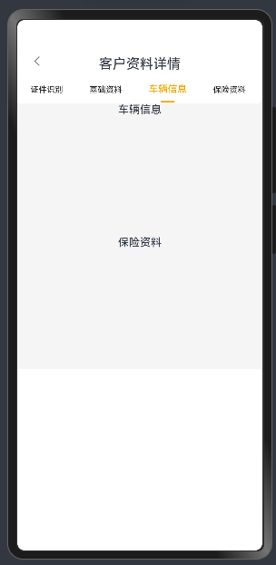
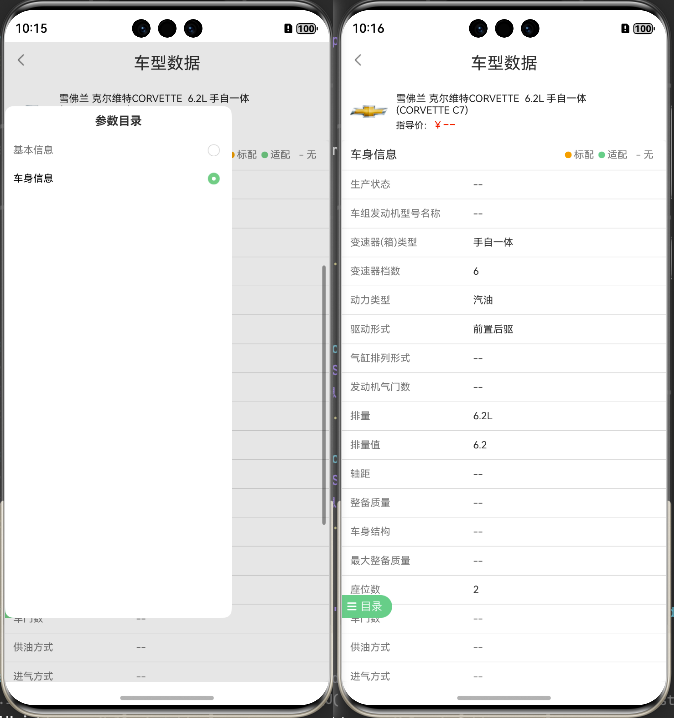

#### 需求：滚动的时候可以自动的切换到对应的tab栏

```tsx
/**
 * 查看资料
 */
import { curves,router } from '@kit.ArkUI';
import ComTopBar from '../../components/ComTopBar';
import ComTabs from '../../components/ComTabs';
@Entry
@Component
struct CustomerDetailPage {
  @State message: string = '客户资料详情';
  @State tabsItems: string[] = ['证件识别', '基础资料', '车辆信息','保险资料'];
  @State currentTabIndex: number = 0;
  @State currentIndex: number = 0;
  private scroller: Scroller = new Scroller();

  // 区块偏移量存储（单位：vp）
  @State private sectionOffsets: number[] = [];
  @State ColumnHeight: number = 0
  @State scrollHeight: number = 0
  @State screenHeight: number = 0
  // 内容区域锚点标识（与导航项顺序对应）
  private readonly sectionIds: string[] = ['Section1', 'Section2', 'Section3','Section4']

  build() {
    Stack({alignContent:Alignment.Top}) {
      ComTopBar({ title: this.message })
      Column() {
        // 导航选项卡
        ComTabs({
          tabsItems: this.tabsItems,
          currentIndex: $currentTabIndex,
          onTabClick: (index: number) => {
            this.currentIndex = index;
            this.tabScrollArea(index)
          }
        })

        // 内容滚动区
        Scroll(this.scroller) {
          Column() {
            // 证件识别
            this.buildSection1()
            // 基础资料
            this.buildSection2()
            // 车辆信息
            this.buildSection3()
            // 保险资料
            this.buildSection4()
            // 补充高度
            Column().width('100%').height(this.ColumnHeight).backgroundColor(Color.White)
          }
          .width('100%')
          .onSizeChange((oldValue: SizeOptions, newValue: SizeOptions) => {
            // console.info(`Ace: on size change, oldValue is ${JSON.stringify(oldValue)} value is ${JSON.stringify(newValue)}`)
            this.scrollHeight = newValue.height as number
          })

        }
        .scrollable(ScrollDirection.Vertical)
        .scrollBar(BarState.Auto)
        .edgeEffect(EdgeEffect.Spring)
        .onSizeChange((oldValue: SizeOptions, newValue: SizeOptions) => {
          // console.info(`Ace1: on size change, oldValue is ${JSON.stringify(oldValue)} value is ${JSON.stringify(newValue)}`)
          this.screenHeight = newValue.height as number
        })
        .onDidScroll((xOffset: number, yOffset: number) => { // 滚动事件回调，Scroll滚动时触发。
          // // 滚动过程中持续监听位置变化
          // console.log('yOffset',yOffset)
          // this.handleScrollPosition(yOffset);
        })
        .onScrollStop(() => {
          // 滚动停止时再次确认位置，确保状态准确
          const yOffset = this.scroller.currentOffset().yOffset;
          console.log('yOffset', yOffset)
          this.handleScrollPosition(yOffset);
        })

      }.width('100%').margin({ top: 45 })
    }
    .width('100%')
    .height('100%')
    .backgroundColor('#f5f5f5')
  }
  @Builder
  buildSection1() {
    this.comColumnId('Section1')
    Column() {
      Text('证件识别')
      Column().width('100%').height('25%').margin({top:10})
    }
    .id('Section1') // 绑定锚点ID
  }

  @Builder
  buildSection2() {
    this.comColumnId('Section2')
    Column() {
      Text('基础资料')
      Column().width('100%').height('25%').margin({top:10})
    }
    .id('Section2') // 绑定锚点ID
  }
  @Builder
  buildSection3() {
    this.comColumnId('Section3')
    Column() {
      Text('车辆信息')
      Column().width('100%').height('25%').margin({top:10})
    }
    .id('Section3') // 绑定锚点ID
  }
  @Builder
  buildSection4() {
    this.comColumnId('Section4')
    Column() {
      Text('保险资料')
      Column().width('100%').height('25%').margin({top:10})
    }
    .id('Section4') // 绑定锚点ID
  }
  // 封装scroll的获取高度方法
  @Builder
  comColumnId(id: string) {
    Column()
      .id(id)
      .onAreaChange((oldArea: Area, newArea: Area) => {
        if (newArea?.globalPosition) {
          const index = this.sectionIds.indexOf(id);
          if (index !== -1) {
            this.sectionOffsets[index] = Number(newArea.position.y);
            // console.log(`${id}偏移量更新:`, this.sectionOffsets[index]);
          }
        }
      })
  }


  //  处理tab点击区域的联动
  private tabScrollArea(index: number) {
    this.scrollHeight = this.scrollHeight - this.ColumnHeight; // scroll高度复原
    let diff = this.scrollHeight - this.sectionOffsets[index]; // 高度差值计算

    if (this.screenHeight - diff > 0) {
      this.ColumnHeight = this.screenHeight - diff // Column4 的容器高度补充
    } else {
      this.ColumnHeight = 0
    }
    this.scrollToSection(index);
  }
  // 滚动定位
  private scrollToSection(index: number) {
    // console.log('1',index)
    if (index >= 0 && index < this.sectionOffsets.length) {
      // console.log('2',index)
      this.scroller.scrollTo({
        xOffset: 0,  // 必须显式声明x轴偏移量
        yOffset: this.sectionOffsets[index],
        animation: {  // 可选动画参数
          duration: 300,
          curve: curves.initCurve()
        }
      });
    }
  }
  // 处理滚动位置变化，更新当前激活的Tab
  private handleScrollPosition(yOffset: number) {
    // 获取当前滚动位置对应的区域索引
    let targetIndex = 0;

    // 遍历各区域的起始位置，找到当前滚动位置所在的区域
    for (let i = this.sectionOffsets.length - 1; i >= 0; i--) {
      // 添加一个小的容差值，确保在区域顶部附近时能正确切换
      if (yOffset >= this.sectionOffsets[i] - 50) {
        targetIndex = i;
        break;
      }
    }
    console.log('targetIndex', targetIndex)
    // 如果检测到新的激活区域，则更新Tab状态
    if (targetIndex !== this.currentTabIndex) {
      this.currentTabIndex = targetIndex;
      this.tabScrollArea(this.currentTabIndex)
      console.log(`滚动到区域 ${targetIndex}，更新Tab状态`);
    }
  }
}
```



## 查询-车型数据 VehicleInfoPage.ets

`src/main/ets/pages/QueryPage/VehicleInfoPage/VehicleInfoPage.ets`

```tsx
@Builder
  ListComponent() {
    Column() {
      List({ scroller: this.scroller }) {
        ListItem() {
          Column() {
            // 基本信息
            this.buildSection({
              comColumnId:'Section1',
              title:'基本信息',
              listData:this.state.listData1
            })
            this.buildSection({
              comColumnId:'Section2',
              title:'车身信息',
              listData:this.state.listData2
            })

            // 补充高度
            Column().width('100%').height(this.ColumnHeight).backgroundColor(Color.White)
          }
          .width('100%')
          .onSizeChange((oldValue: SizeOptions, newValue: SizeOptions) => {
            // console.info(`Ace: on size change, oldValue is ${JSON.stringify(oldValue)} value is ${JSON.stringify(newValue)}`)
            this.scrollHeight = newValue.height as number
          })
        }
      }
    }

    .layoutWeight(1)
    .borderRadius(5)
    .backgroundColor($r('app.color.colorFf'))
  }

```


```tsx

//  处理tab点击区域的联动
  private tabScrollArea(index: number) {
    console.log('1',index)
    this.scrollHeight = this.scrollHeight - this.ColumnHeight; // scroll高度复原
    let diff = this.scrollHeight - this.sectionOffsets[index]; // 高度差值计算

    if (this.screenHeight - diff > 0) {
      this.ColumnHeight = this.screenHeight - diff // Column4 的容器高度补充
    } else {
      this.ColumnHeight = 0
    }
    this.scrollToSection(index);
  }
  // 滚动定位
  private scrollToSection(index: number) {
    // console.log('1',index)
    if (index >= 0 && index < this.sectionOffsets.length) {
      // console.log('2',index)
      this.scroller.scrollTo({
        xOffset: 0,  // 必须显式声明x轴偏移量
        yOffset: this.sectionOffsets[index],
        animation: {  // 可选动画参数
          duration: 300,
          curve: curves.initCurve()
        }
      });
    }
  }

  @Builder
  buildSection(sectionObj:FinanceParams) {
    this.comColumnId(sectionObj.comColumnId)
    Column() {
      ForEach(sectionObj.listData, (item: FinanceParams, index: number) => {
        ListItem() {
          Column() {
            Row() {
              Text(item.typeName)
                .fontSize(14)

              Row() {
                Row() {
                  Row().width(8).height(8).borderRadius(8).margin({right:3}).backgroundColor('#FDA001')
                  Text('标配')
                    .fontSize(12)
                    .fontColor($r('app.color.color7'))
                }.margin({right:5})

                Row() {
                  Row().width(8).height(8).borderRadius(8).margin({right:3}).backgroundColor('#48D08E')
                  Text('适配')
                    .fontSize(12)
                    .fontColor($r('app.color.color7'))
                }.margin({right:5})

                Row() {
                  Text('- 无')
                    .fontSize(12)
                    .fontColor($r('app.color.color7'))
                    .margin({ left: 5 })
                }.margin({right:5})
              }
            }
            .width('100%')
            .justifyContent(FlexAlign.SpaceBetween)
            .padding(10)

            Divider()
              .width('100%')
              .height(1)
              .backgroundColor($r('app.color.colorF6'))
          }
        }
        ForEach( item.typeVal ,( item1:FinanceParams,index:number) => {
          ListItem() {
            Column() {
              Row() {
                Text(item1.infoName)
                  .fontColor('#777777')
                  .fontSize(12)
                  .width('40%')
                Text(item1.infoVal)
                  .fontSize(12)
                  .width('60%')
              }
              .width('100%')
              .justifyContent(FlexAlign.SpaceBetween)
              .padding(10)

              Divider()
                .width('100%')
                .height(1)
                .backgroundColor($r('app.color.colorF6'))

            }
            .width('100%').alignItems(HorizontalAlign.Start)
          }
          .width('100%')
          .onClick(() => {

          })
        },( item1:FinanceParams ) => item1.id)
      }, (item: FinanceParams) => item.id)
    }
    .id(sectionObj.comColumnId) // 绑定锚点ID
  }
  // 封装scroll的获取高度方法
  @Builder
  comColumnId(id: string) {
    Column()
      .id(id)
      .onAreaChange((oldArea: Area, newArea: Area) => {
        if (newArea?.globalPosition) {
          const index = this.sectionIds.indexOf(id);
          if (index !== -1) {
            this.sectionOffsets[index] = Number(newArea.position.y);
            // console.log(`${id}偏移量更新:`, this.sectionOffsets[index]);
          }
        }
      })
  }
```


