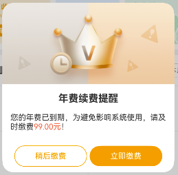
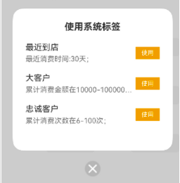
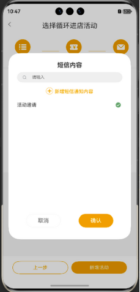
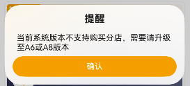

[^20251010]: 

##### 1、您的客户营销数量已达上限

`src/main/ets/components/VipDialog.ets`

```tsx
import VipDialog from '../../components/VipDialog'

controllerVipDialog: CustomDialogController = new CustomDialogController({
    builder: VipDialog({
      PropTitle: '您的客户营销数量已达上限',
      PropTitle2: '需增加数量，可购买此功能',
      isShowMarking: true,
      addLoodData: () => {
        promptAction.showToast({ message: '正在开发...' })
      }
    }),
    backgroundColor: 'rgba(0,0,0,0)',
    customStyle: true,
  })


this.controllerVipDialog.open()
```


##### 2、年费续费提醒

`src/main/ets/pages/BasePage/YearPayDialog.ets`

```tsx
	@Prop DialogImg:string = 'pic_simple_erp_pop_xufei_2x' // 背景图
  @Prop DialogTitle:string // 标题
  @Prop DialogDetail:string // 内容
  @Prop DialogCloseName:string = '取消' // 取消按钮文字
  @Prop DialogGoName:string = '确认' // 确认按钮文字
```

```tsx
controllerYearPayDialog: CustomDialogController = new CustomDialogController({
    builder: YearPayDialog({
      DialogTitle: '年费续费提醒',
      DialogImg:'pic_simple_erp_pop_xufei_2x',
      DialogDetail: `您的${ this.DialogAppUser}已到期，为避免影响系统使用，请及时缴费`,
      DialogNumRed:`${this.state.yearPayMoney}元`,
      DialogCloseName:'稍后缴费',
      DialogGoName:'立即缴费',
      closeModal: () => {
        this.controllerYearPayDialog?.close()
        router.back()
      },
      goModel:() => {
        this.controllerYearPayDialog?.close()
        router.pushUrl({
          url: 'view/UserView/page/YearPayPage/YearPayPage',
          params:{
            type:'jf'
          }
        })
      }
    }),
    backgroundColor: 'rgba(0,0,0,0)',
    customStyle: true,
    autoCancel: false,
  })


this.controllerYearPayDialog.open();
```




##### 3、调整续费产品

`src/main/ets/pages/BasePage/TemOnePopup.ets`

```tsx
import TemOnePopup from '../../../../pages/BasePage/TemOnePopup'

controllerTemOnePopup: CustomDialogController = new CustomDialogController({
    builder: TemOnePopup({
      PopupTitle: '调整缴费产品',
      PopupData:this.goodsData,
      PopupGoName:'确定',
      goModel:() => {
        this.controllerTemOnePopup?.close()
      }
    }),
    backgroundColor: 'rgba(0,0,0,0)',
    customStyle: true,
    autoCancel: false,
  })
```


##### 4、使用系统标签

`src/main/ets/view/UserView/page/LabelPage/SetAutoLabelPage.ets`



##### 5、标签分组

`src/main/ets/view/UserView/page/LabelPage/SetManualLabelPop.ets`


##### 6、短信内容

`src/main/ets/view/UserView/page/MarketingPage/components/MarketingSmsTemplateListPop.ets`



##### 7、提醒

`src/main/ets/view/UserView/page/StoreShopPayPage/StoreShopPayPage.ets`

```tsx
import { AlertDialog } from '@kit.ArkUI';
dialogControllerConfirm: CustomDialogController = new CustomDialogController({
    builder: AlertDialog({
      primaryTitle: '提醒',
      content: `当前系统版本不支持购买分店，需要请升级至A6或A8版本`,
      secondaryButton: {
        value: '确认',
        fontColor: $r('app.color.colorFf'),
        background: $r('app.color.primary'),
        action: () => {
          this.dialogControllerConfirm?.close()
        },
      },
    }),
    autoCancel: false,
  })
```




##### 8、门店信息-修改

`src/main/ets/pages/BasePage/TemTwoPopup.ets`

```tsx
import TemTwoPopup from '../../../../pages/BasePage/TemTwoPopup'
controllerTemOnePopup: CustomDialogController = new CustomDialogController({
    builder: TemTwoPopup({
      PopupDetail: '修改门店名称后，需由运营商重新审核短信发送功能！',
      PopupCloseName:'取消修改',
      PopupGoName: '确认修改',
      closeModal:() => {
        this.controllerTemOnePopup?.close();
      },
      goModel: (selectedItems: FinanceParams[]) => {
        this.controllerTemOnePopup?.close();
      },
    }),
    backgroundColor: 'rgba(0,0,0,0)',
    customStyle: true,
    autoCancel: false,
  })
```


