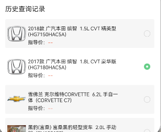

[^251202]: 


## 一、 加载实例-启动页`EntryAbility.ets`

`src/main/ets/entryability/EntryAbility.ets`

```tsx
async onCreate(want: Want, launchParam: AbilityConstant.LaunchParam){

    this.context.getApplicationContext().setColorMode(ConfigurationConstant.ColorMode.COLOR_MODE_NOT_SET);
    hilog.info(DOMAIN, 'testTag', '%{public}s', 'Ability onCreate');

    // 加载实例
    await PreferencesUtil.loadPreference(this.context,'myAid')
    await PreferencesUtil.loadPreference(this.context, 'curCurrentEnv')
    await PreferencesUtil.loadPreference(this.context, 'curBaseFullURL')
  
    // 加载实例（记录当前门店和门店ID）
    await PreferencesUtil.loadPreference(this.context, 'curShopName')
    await PreferencesUtil.loadPreference(this.context, 'curShopNameId')
    // 隐私保护提示
    await PreferencesUtil.loadPreference(this.context, 'isRenderPrivacyDialog')

    // 加载实例（查询-历史查询记录）
    await PreferencesUtil.loadPreference(this.context, 'searchCarArr')
    // 加载实例（查询-已选车型）
    await PreferencesUtil.loadPreference(this.context, 'searchCarChoose')
  	 // 加载实例（查询-请输入VIN码/车型）
    await PreferencesUtil.loadPreference(this.context, 'searchCarHistoryDataArr')
  
    DialogHelper.setDefaultConfig((config) => {
      config.uiAbilityContext = this.context;
    })


  }
```


------


## 二、 读`getPreferenceValue`和存`putPreferenceValue`

### 1、历史查询记录



#### 1.1 读

`src/main/ets/pages/QueryPage/QueryPage.ets`

```tsx
async aboutToAppear() {
    // 读取历史查询记录
    this.searchCarArr = await PreferencesUtil.getPreferenceValue(
      'searchCarArr',
      'searchCarArrKey',
      []
    ) as FinanceParams[];
}
```


#### 1.2 存

```tsx
/**
   * 处理搜索车辆记录：添加参数到搜索数组（去重+排序）
   * @param params 路由传递的车辆参数（需包含id等核心字段，类型为FinanceParams）
   * 核心逻辑：
   * 1. 过滤无效数据（空对象、无id的参数），避免数组存入垃圾数据
   * 2. 基于唯一标识id去重，防止重复添加相同车辆记录
   * 3. 保持搜索记录排序：新添加/重复的记录移到数组开头（符合"最近搜索"用户习惯）
   * 4. 同步更新AppStorage中的搜索记录，确保页面刷新后数据不丢失
   */
  async FunSearchCarArr(params: FinanceParams) {

    // 给空对象显式声明 FinanceParams 类型，避免无类型字面量错误
    const defaultEmptyParams: FinanceParams = {};
    // 过滤空对象（无任何字段的{}）
    const isEmptyObj = Object.keys(params || defaultEmptyParams).length === 0;

    // 确保核心字段id存在（避免无id的无效数据）
    const hasValidId = !!params.id;
    if (isEmptyObj || !hasValidId) {
      console.warn('无效的参数，不添加到搜索记录：', params);
      return;
    }

    // 去重逻辑：判断当前params.id是否已存在于数组中
    const isDuplicate = this.searchCarArr.some(item => item.id === params.id);

    if (!isDuplicate) {
      // 不重复则添加（添加到数组开头，“最近搜索”排序）
      this.searchCarArr.unshift(params); // unshift \ push
    } else {
      // 将重复项移到开头（更新为最近搜索）
      this.searchCarArr = this.searchCarArr.filter(item => item.id !== params.id);
      this.searchCarArr.unshift(params);
    }

    // this.state = this.searchCarArr[0] || []
    // 存
    PreferencesUtil.putPreferenceValue('searchCarArr', 'searchCarArrKey', this.searchCarArr);
  }

```


--------

### 2、已选车型


#### 2.1 读

`src/main/ets/pages/QueryPage/QueryPage.ets`

```tsx
async aboutToAppear() {
    // 读取已选车型
    this.state = await PreferencesUtil.getPreferenceValue(
      'searchCarChoose',
      'searchCarChooseKey',
      {}
    ) as FinanceParams;

}
```


#### 2.2 存

```tsx
private ChooseSearchCarArr(params: FinanceParams) {
    this.state = params
    PreferencesUtil.putPreferenceValue('searchCarChoose',
      'searchCarChooseKey', this.state);
  }
```


-----------


### 3、搜索历史


#### 3.1 读

```tsx
async aboutToAppear() {
    // 读取搜索历史
    this.searchCarHistoryDataArr = await PreferencesUtil.getPreferenceValue(
      'searchCarHistoryDataArr',
      'searchCarChooseKeyKey',
      []
    ) as FinanceParams[];
}
```


#### 3.2 存

```tsx
// 搜索确认
  debouncedQuery = Util.debounce(() => {
    this.queryCarFun(this.cleanedValue);
  }, 300);

  private async queryCarFun(queryValue: string) {
    // 步骤1：非空校验
    if (!queryValue) return;

    try {
      // 步骤2：获取全局历史记录（深拷贝，避免污染原数组）
      const historyList= await PreferencesUtil.getPreferenceValue(
        'searchCarHistoryDataArr',
        'searchCarHistoryDataArrKey',
        [] // 默认空数组
      ) as string[] ;
      // 深拷贝原数组，防止修改原数据
      const newHistoryList = JSON.parse(JSON.stringify(historyList)) as string[];

      // 步骤3：添加当前搜索值到数组头部（保证最新的在最前面）
      newHistoryList.unshift(queryValue);

      // 步骤4：调用封装的去重函数（核心：用上uniqueArr，简化代码）
      const uniqueHistory = this.uniqueArr(newHistoryList);

      // 可选：限制历史记录长度（如最多10条）
      const limitHistory = uniqueHistory.slice(0, 10);

      // 步骤5：更新全局缓存
      await PreferencesUtil.putPreferenceValue(
        'searchCarHistoryDataArr',
        'searchCarHistoryDataArrKey',
        limitHistory
      );

      // 步骤6：更新组件状态
      this.searchCarHistoryDataArr = limitHistory;
      console.log('修复后历史记录:', JSON.stringify(this.searchCarHistoryDataArr, null, 2));

    } catch (e) {
      console.error('历史记录处理失败:', e);
    }
  }

  // 简化版去重方法（封装成工具函数，复用且符合类型规范）
  private uniqueArr(arr: string[]): string[] {
    const uniqueRecords: UniqueRecord[] = [];
    const result: string[] = [];
    for (const item of arr) {
      if (!uniqueRecords.find(r => r.value === item)) {
        uniqueRecords.push({ value: item });
        result.push(item);
      }
    }
    return result;
  }
```


---

## 三、清除`clearPreferences`

`src/main/ets/model/HttpUtil.ts`

```tsx
// 从本地存储加载 aid
(async () => {
  // await PreferencesUtil.clearPreferences('curCurrentEnv'); // 强制清除
  // await PreferencesUtil.clearPreferences('myAid'); // 强制清除
  // await PreferencesUtil.clearPreferences('curBaseFullURL'); // 强制清除
  // await PreferencesUtil.clearPreferences('curShopName'); // 强制清除
  // await PreferencesUtil.clearPreferences('curShopNameId'); // 强制清除
  // await PreferencesUtil.clearPreferences('searchCarChoose'); // 强制清除
  // await PreferencesUtil.clearPreferences('searchCarArr'); // 强制清除
  // await PreferencesUtil.clearPreferences('searchCarHistoryDataArr'); // 强制清除
  const rawAid = await PreferencesUtil.getPreferenceValue('myAid', 'aidKey', '') as string;
  console.log('初始化清理后 aid:', curAid);
  curAid = rawAid ? rawAid.replace(/\n/g, '') : null; // 关键清理
  if (curAid) {
    AppStorage.setOrCreate<string>('curAid', curAid);
  }
})();
```

