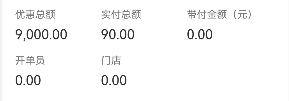

# 0317

```
0317
104-113 掘金评论 
```

> https://www.bilibili.com/video/BV14t421W7pA?spm_id_from=333.788.videopod.episodes&vd_source=45b1ea5d80a271b24029deadc0c69379&p=106

> - ##### 头中尾组件的拆分
>
> - ###### @Extend 样式的复用
>
> - ###### List组件的使用
>
> - ##### 维护数据`model`文件的使用
>
> - ###### 父传子
>
> - ###### 子回调事件
>
> - ###### 操作数据
>
>   - 给数组新增内容
>   - 给数组按需排序


# 0318

```
0318：
数据传递-组件间的@Link@Provide & @Consume@Observed & @ObjectLink
```

```tsx
import TopNavBar from '../../components/TopNavBar';
// import  ComTabs from  '../../../components/ComTabs'

import RevenueSummaryModel from '../../model/RevenueSummaryModel'
import {LengthMetrics} from '@kit.ArkUI';
// 定义数据模型
interface typeDetailItem {
  id: string;
  title: string;
  amount: number;
}
interface InfoItem {
  label: string;     // 左侧标签
  value: string;     // 中间数值
  isExpanded?: boolean;
  detail?:typeDetailItem[], // 数组形式
  unit?: string;     // 右侧单位（可选）
  hasIcon?: boolean; // 是否显示图标（最后一行）
  showDetail?: boolean; // 新增：是否显示明细字样
  icon?:Resource
}

interface entityType {
  saleMoney:number,
  goodsMoneyCount:number,
  customerCardMoney:number,
  paidMoney:number,
  toShopCarAmount:number,
  carAmount:number,
  billCount:number,
  customerCardNumber:number,
  preOrderCount:number,
}
@Entry
@Component
struct RevenueSummaryPage {
  @StorageLink('curAid') curAid: string = "";

  scroller: Scroller = new Scroller()
  @State message: string = '营收汇总';
  @State tabsItems: string[] = ['今日', '昨日','本月','其他'];
  @State currentTabIndex: number = 0;
  @State listData:entityType = {} as entityType; // 初始化为空对象


  aboutToAppear() {
    this.totalSaleAccountRequest()
  }

  private async totalSaleAccountRequest () {
    const res = await RevenueSummaryModel.totalSaleAccount({
      aid:"Py5yOUDwu4muj4l+pKZs79f5dfZrwTpD5n/90JsIef5F6SZYSk21c4vPXs/c8HGleRYyeRgfH5DBgtKs+aLJNfy0SF5c68wiNTIJ3dEFhhZ9mmyWrswFZq3LbP8uL49b+oAYr0JJ3aM=",
      accountTimeLower:"2025-03-31",
      accountTimeUpper:"2025-03-31"
    });
    console.log(JSON.stringify(res.data.entity))
    // 判空及有效性检查‌:ml-citation{ref="3,8" data="citationList"}
    if (res.data?.success && Object.keys(res.data.entity).length > 0) {
      this.listData = res.data.entity;

    } else {
      console.error('数据为空或格式错误');
    }
  }
  @State items1 : InfoItem[] = [
    {label:'服务项目',value:'000000.00'},
    {label:'商品销售',value:'000000.00'},
    {label:'会员储值',value:'000000.00'},
    {label:'套餐销售',value:'000000.00'},
    {label:'收预付金',value:'000000.00'},
    {label:'套餐终止',value:'000000.00'},
    {label:'挂账还款',value:'000000.00'},
    {label:'工时',value:'000000.00'}
  ]
  @State items2 : InfoItem[] = [
    {label:'现金',value:'000000.00'},
    {label:'微信',value:'000000.00'},
    {label:'支付宝',value:'000000.00'},
    {label:'其他',value:'000000.00'}
  ]
  @State items3 : InfoItem[] = [
    {label:'储值余额',value:'000000.00'},
    {label:'赠送余额',value:'000000.00'},
    {label:'赠送终止',value:'000000.00'},
    {label:'预付金余额',value:'000000.00'},
    {label:'套餐价值',value:'000000.00'},
    {label:'待收欠款',value:'000000.00'},
    {label:'赠送到期',value:'000000.00'}
  ]

  @State items4 : InfoItem[] = [
    {label:'现金',value:'000000.00'},
    {label:'微信',value:'000000.00'},
    {label:'支付宝',value:'000000.00'},
    {label:'其他',value:'000000.00'}
  ]
  @State items5 : InfoItem[] =   [
    {label:'高频易损件',value:'000000.00',detail:[],isExpanded: true },
    {label:'维保',value:'000000.00',detail:[],isExpanded: true },
    {label:'养护',value:'000000.00',detail:[],isExpanded: true },
  ]


  build() {
    Column() {
      // 顶部导航栏
      TopNavBar({ title: this.message })
      Column() {
        // 切换栏组件
        ComTabs({
          tabsItems : this.tabsItems,
          currentIndex: $currentTabIndex,
          onTabClick: (index: number) => {
            this.currentTabIndex = index;
            console.log('currentTabIndex'+this.currentTabIndex)
          }
        })
      }
      .margin({top:1,bottom:1})

      //   选择日期组件
      SelectItem()


      Scroll(this.scroller) {
        Column() {
          summaryCard1({
            listData:this.listData
          })
          summaryCard2({
            itemTitle:'收入类型',
            items:this.items1
          })

          summaryCard2({
            itemTitle:'收现结算',
            items:this.items2
          })

          summaryCard2({
            itemTitle:'其他统计',
            items:this.items3
          })

          summaryCard2({
            itemTitle:'其他结算',
            items:this.items4
          })

          summaryCard4({
            items:this.items5
          })

          summaryCard2({
            itemTitle:'优惠及退款',
            items:this.items4
          })

          summaryCard2({
            itemTitle:'其他收支',
            items:this.items4
          })
        }
        .width('100%')
        .backgroundColor('#f5f5f5')
        .padding({ bottom:12,left:12,right:12 })
      }
      .scrollable(ScrollDirection.Vertical)
      .scrollBar(BarState.Auto)
      .edgeEffect(EdgeEffect.Spring)

    }

  }
}

@Component
struct ComTabs {
  // 接收父组件传递的选项卡项
  @Prop tabsItems: string[] = [];
  // 双向绑定当前选中索引
  @Link @Watch('onIndexChange') currentIndex: number;
  // 定义点击事件回调
  onTabClick?: (index: number) => void;


  // 索引变化监听
  private onIndexChange() {
    console.log(`当前选中索引更新为：${this.currentIndex}`);
  }

  build() {
    Row() {
      ForEach(this.tabsItems, (item: string, index: number) => {
        Column() {
          // 选项卡文本
          Text(item)
            .fontSize(this.currentIndex === index ? 14 : 12)
            .fontColor(this.currentIndex === index ? '#FDA001' : '#202020')
            .onClick(() => {
              this.currentIndex = index;
              this.onTabClick?.(index); // 触发父组件回调
            })

          // 动态下划线
          if (this.currentIndex === index) {
            Divider()
              .strokeWidth(2)
              .color('#FDA001')
              .width(20)
              .height(3)
              .margin({ top: 8 })
          } else {
            Blank().height(3).margin({ top: 8 })
          }
        }
        .flexGrow(1) // 弹性权重平分空间
        .padding({ top: 9.5 })
        // .margin({ bottom: 8 })
      })
    }
    .width('100%')
    .backgroundColor('#FFFFFF')
    // .margin({ top: 10 })
    // .borderRadius({ bottomLeft: 10, bottomRight: 10 })
    .justifyContent(FlexAlign.Center)
  }
}

@Component
struct SelectItem {
  // 时间状态
  @State startTime: string = '选择开始时间'
  @State endTime: string = '选择结束时间'

  // 确认事件回调
  @Prop onConfirm?: (start: string, end: string) => void

  build() {
    Row() {
      // 左侧标签
      Text("时间：")
        .fontSize(12)
        .fontColor("#202020")
        .margin({ right: 9.5 })

      // 时间选择区域
      Row() {
        // 开始时间
        this.TimePickerBox(this.startTime)
        // .onClick(() => this.pickStartTime())

        Text(" 至 ")
          .fontColor("#202020")
          .fontSize(12)
          .margin({ left: 10.5, right: 10.5 })

        // 结束时间
        this.TimePickerBox(this.endTime)
        // .onClick(() => this.pickEndTime())
      }
      .flexGrow(1)

      // 确认按钮

      Text("确定") {}
      .onClick(() => {
        if (this.validateTime()) {
          this.onConfirm?.(this.startTime, this.endTime)
        }
      })
      .padding({left:10,right:10,top:4.5,bottom:4.5})
      .borderRadius(2)    // 直角按钮
      .fontSize(11)
      .fontColor('#FFFFFF')
      .backgroundColor('#FDA001')


    }
    .padding({left:15,right:15,top:7,bottom:7})
    .width('100%')
    .backgroundColor("#FFF")
    .borderRadius({bottomLeft:8,bottomRight:8})
    .shadow({ radius: 4, color: "#10000000", offsetX: 2, offsetY: 2 })
  }

  // 时间选择框组件
  @Builder
  private TimePickerBox(text: string) {
    Text(text)
      .fontSize(12)
      .padding({top:4.5,bottom:4.5,left:7.5,right:7.5})
        // .border({ width: 1, color: "#DDD" })
      .backgroundColor('#f6f6f6')
      .borderRadius(4)
      .fontColor(text.startsWith("选择") ? "#999" : "#333")
  }

  // 时间验证逻辑
  private validateTime(): boolean {
    if (this.startTime.startsWith("选择") || this.endTime.startsWith("选择")) {
      AlertDialog.show({
        message: '请先选择时间范围'
      });

      return false
    }
    return true
  }

  // 打开时间选择器（示例逻辑）
  private pickStartTime() {
    // 实际应调用日期选择组件
    this.startTime = "2023-07-01"
  }

  private pickEndTime() {
    // 实际应调用日期选择组件
    this.endTime = "2023-07-15"
  }
}


@Component
struct DatePickerExample {
  @State isLunar: boolean = false
  private selectedDate: Date = new Date('2021-08-08')

  build() {
    Column() {
      Button('切换公历农历')
        .margin({ top: 30, bottom: 30 })
        .onClick(() => {
          this.isLunar = !this.isLunar
        })
      DatePicker({
        start: new Date('1970-1-1'),
        end: new Date('2100-1-1'),
        selected: this.selectedDate
      })
        .disappearTextStyle({color: Color.Gray, font: {size: '16fp', weight: FontWeight.Bold}})
        .textStyle({color: '#ff182431', font: {size: '18fp', weight: FontWeight.Normal}})
        .selectedTextStyle({color: '#ff0000FF', font: {size: '26fp', weight: FontWeight.Regular, family: "HarmonyOS Sans", style: FontStyle.Normal}})
        .lunar(this.isLunar)
        .onDateChange((value: Date) => {
          this.selectedDate = value
          console.info('select current date is: ' + value.toString())
        })

    }.width('100%')
  }
}

@Component
struct summaryCard1 {
  @Prop listData: entityType = {} as entityType; // 初始化为空对象

  build() {
    Column() {
      Row() {
        Column() {
          Text('营业额').fontColor('#FFFFFF').fontSize(13)
          Row() {
            Text(this.listData.saleMoney.toString()).fontColor('#FFFFFF').fontSize(30)
            Text('元').fontColor('#FFFFFF').fontSize(12)
          }.alignItems(VerticalAlign.Bottom)
        }.alignItems(HorizontalAlign.Start)

        Column() {
          Text('项目销售').fontColor('#FFFFFF').fontSize(13)
          Row() {
            Text(this.listData.goodsMoneyCount.toString()).fontColor('#FFFFFF').fontSize(30)
            Text('元').fontColor('#FFFFFF').fontSize(12)
          }.alignItems(VerticalAlign.Bottom)
        }.alignItems(HorizontalAlign.Start)
      }.width('100%').justifyContent(FlexAlign.SpaceBetween)

      Row() {
        Column() {
          Text('储值充值').fontColor('#FFFFFF').fontSize(13)
          Row() {
            Text(this.listData.customerCardMoney.toString()).fontColor('#FFFFFF').fontSize(30)
            Text('元').fontColor('#FFFFFF').fontSize(12)
          }.alignItems(VerticalAlign.Bottom)
        }.alignItems(HorizontalAlign.Start)
        Column() {
          Text('实收金额').fontColor('#FFFFFF').fontSize(13)
          Row() {
            Text(this.listData.paidMoney.toString()).fontColor('#FFFFFF').fontSize(30)
            Text('元').fontColor('#FFFFFF').fontSize(12)
          }.alignItems(VerticalAlign.Bottom)
        }.alignItems(HorizontalAlign.Start)
      }.width('100%').justifyContent(FlexAlign.SpaceBetween).margin({top:19})

      Row() {
        Column() {
          Text('到店/消费车辆').fontColor('#FFFFFF').fontSize(13)
          Text(this.listData.toShopCarAmount.toString()).fontColor('#FFFFFF').fontSize(16)
        }.alignItems(HorizontalAlign.Start)

        Column() {
          Text('消费车辆').fontColor('#FFFFFF').fontSize(13)
          Text(this.listData.carAmount.toString()).fontColor('#FFFFFF').fontSize(16)
        }.alignItems(HorizontalAlign.Start)


        Column() {
          Text('开单量').fontColor('#FFFFFF').fontSize(13)
          Text(this.listData.billCount.toString()).fontColor('#FFFFFF').fontSize(16)
        }.alignItems(HorizontalAlign.Start)


        Column() {
          Text('开卡数').fontColor('#FFFFFF').fontSize(13)
          Text(this.listData.customerCardNumber.toString()).fontColor('#FFFFFF').fontSize(16)
        }.alignItems(HorizontalAlign.Start)


      }.width('100%').justifyContent(FlexAlign.SpaceBetween).margin({top:19})


    }.width('100%').backgroundColor('#48D08E').borderRadius(5).padding(15).margin({top:10})

  }
}


@Component
struct summaryCard2 {
  @Prop itemTitle:string = '暂无标题'
  @Prop items : InfoItem[] = []
  @Prop isExpanded: boolean = false; // 展开状态（双向绑定）
  build() {
    Column() {
      Row() {
        Row() {
          Image($r('app.media.ic_erp_title_gn')).width(5).height(12).margin({right:5})
          Text(this.itemTitle).fontSize(14).fontColor('#202020')
        }.alignItems(VerticalAlign.Center)
      }.width('100%').justifyContent(FlexAlign.SpaceBetween)

      Flex({ wrap: FlexWrap.Wrap, space: {main: LengthMetrics.px(50), cross: LengthMetrics.px(50)} }) { // 子组件多行布局
        ForEach(this.items, (item: InfoItem,index:number) => {
          Column() {
            Text(item.label).fontColor('#777777').fontSize(12)
            Text(item.value).fontColor('#323232').fontSize(16).margin({top:7})
          }
          .key(item.label)
          .alignItems(HorizontalAlign.Start)
        })

      }
      .width('100%')
      .margin({top:15})


      if (this.itemTitle == '收现结算') {
        Row() {
          Text(this.isExpanded ? '收起' : '展开')
            .fontSize(11)
            .fontColor('#48D08E')

          Image(this.isExpanded ? $r('app.media.ic_svg_up') : $r('app.media.ic_svg_down'))
            .width(11.8)
            .height(6.3)
        }
        .position({
          right:0,
          top:110
        })
        .justifyContent(FlexAlign.SpaceAround)
        .alignItems(VerticalAlign.Center)
        .margin({ top: 13 })
        .onClick(() => {
          this.isExpanded = !this.isExpanded
        })
        if (this.isExpanded) {
          Flex({ wrap: FlexWrap.Wrap, space: {main: LengthMetrics.px(50), cross: LengthMetrics.px(50)}}) {
            Column() {
              Text('兴业银行').fontColor('#777777').fontSize(12)
              Text('3000000.00').fontColor('#323232').fontSize(14).margin({top:7})
            }
            .alignItems(HorizontalAlign.Start)
            Column() {
              Text('兴业银行').fontColor('#777777').fontSize(12)
              Text('3000000.00').fontColor('#323232').fontSize(14).margin({top:7})
            }
            .alignItems(HorizontalAlign.Start)
            Column() {
              Text('兴业银行').fontColor('#777777').fontSize(12)
              Text('3000000.00').fontColor('#323232').fontSize(14).margin({top:7})
            }
            .alignItems(HorizontalAlign.Start)
            Column() {
              Text('兴业银行').fontColor('#777777').fontSize(12)
              Text('3000000.00').fontColor('#323232').fontSize(14).margin({top:7})
            }
            .alignItems(HorizontalAlign.Start)
            Column() {
              Text('兴业银行').fontColor('#777777').fontSize(12)
              Text('3000000.00').fontColor('#323232').fontSize(14).margin({top:7})
            }
            .alignItems(HorizontalAlign.Start)
            Column() {
              Text('兴业银行').fontColor('#777777').fontSize(12)
              Text('3000000.00').fontColor('#323232').fontSize(14).margin({top:7})
            }
            .alignItems(HorizontalAlign.Start)
          }.backgroundColor('#F6F6F6').padding(14).borderRadius(5)

        }
      }

    }.padding(15).backgroundColor('#FFFFFF').borderRadius(5).margin({top:10}).shadow({
      radius: 4,
      color: '#10000000',
      offsetX: 2,
      offsetY: 2
    })

  }
}

@Component
struct summaryCard4 {
  @Prop itemTitle:string = '分类统计'
  @Prop items: InfoItem[] = [];

  build() {
    Column() {
      Row() {
        Row() {
          Image($r('app.media.ic_erp_title_gn')).width(5).height(12).margin({right:5})
          Text(this.itemTitle).fontSize(14).fontColor('#202020')
        }.alignItems(VerticalAlign.Center)
      }.width('100%').justifyContent(FlexAlign.SpaceBetween)
      Column() {
        ForEach(this.items, (item: InfoItem, index: number) => {
          Row() {
            Column() {
              Text(item.label).fontColor('#777777').fontSize(12)
              Text(item.value).fontColor('#323232').fontSize(16).margin({ top: 7 })
            }
            .alignItems(HorizontalAlign.Start)

            Row() {
              Text(item.isExpanded ? '收起' : '展开')
                .fontSize(11)
                .fontColor('#48D08E')

              Image(item.isExpanded ? $r('app.media.ic_svg_up') : $r('app.media.ic_svg_down'))
                .width(11.8)
                .height(6.3)
            }
            .onClick(() => {
              // 精准更新当前项状态

              this.items = this.items.map((currentItem, currentIndex) => {
                if (currentIndex === index) {
                  // 显式拷贝所有属性
                  return {
                    label: currentItem.label,
                    value: currentItem.value,
                    isExpanded: !currentItem.isExpanded, // 修改目标属性
                    detail: currentItem.detail           // 保持其他属性不变
                  };
                }
                console.log('currentItem:'+ currentItem.isExpanded)
                return currentItem;
              });


            })
          }
          .width('100%')

          .margin({ top: 15 })
          .justifyContent(FlexAlign.SpaceBetween).alignItems(VerticalAlign.Bottom)


          if (item.isExpanded) { // 根据当前项状态显示内容

            Flex({ wrap: FlexWrap.Wrap, space: {main: LengthMetrics.px(50), cross: LengthMetrics.px(50)}}) {
              Column() {
                Text('兴业银行').fontColor('#777777').fontSize(12)
                Text('3000000.00').fontColor('#323232').fontSize(14).margin({top:7})
              }
              .alignItems(HorizontalAlign.Start)

            }.backgroundColor('#F6F6F6').padding(14).borderRadius(5).margin({top:11})


          }
        }, (item:InfoItem) => item.label)
      }

    }.padding(15).backgroundColor('#FFFFFF').borderRadius(5).margin({top:10})
    .shadow({
      radius: 4,
      color: '#10000000',
      offsetX: 2,
      offsetY: 2
    })

  }
}

```

```tsx

```


# 0402

```bash
进入系统-数据看版
```


# 客户管理


1、进入系统接口和交互处理

# 组件间的传值

##### 1、父获得接口数据，传子接收显示；

##### 2、子改变index，传父接收，更新数据


1、‌**组件通信机制**‌：

- 子组件通过回调函数 `onPeriodChange` 通知父组件

- 父组件通过Prop传递当前选中状态 `selectedPeriod`

- 实现双向数据流：

  ```bash
  子组件点击 → 触发回调 → 父组件更新类型 → 请求新数据 → 更新Prop → 子组件刷新
  ```

  

子组件点击传值，使得获取到父组件的接口更新数据 indexDataList

```bash
// 父组件 SystemPage
@Entry
@Component
struct SystemPage {
  // ...其他状态声明...

  @State indexDataList: IndexDataListItemType = initialIndexDataItem; // 初始化数据
  @State indexType: string = "1"; // 当前选中类型

  // 定义子组件回调事件类型
  private handlePeriodChange = (type: string) => {
    this.indexType = type;
    this.postIndexDataRequest(type);
  }

  build() {
    Flex({ direction: FlexDirection.Column }) {
      // ...其他组件...
      
      indexDataPage({
        indexDataList: this.indexDataList,
        selectedPeriod: this.indexType,
        onPeriodChange: this.handlePeriodChange // 传递回调方法
      })
      
      this.FooterBuild()
    }
    // ...其他样式...
  }
}

// 子组件 indexDataPage
@Component
struct indexDataPage {
  @Prop indexDataList: IndexDataListItemType;   // 数据展示
  @Prop selectedPeriod: string;                 // 当前选中状态
  private onPeriodChange?: (type: string) => void; // 事件回调

  build() {
    Stack({ alignContent: Alignment.Center }) {
      Column() {
        // ...其他内容...
        
        ForEach([
          { name:"昨日", type:'1' },  // 注意type需要与接口参数对应
          { name:"今日", type:'2' },
          { name:"本月", type:'3' }
        ], (period: PeriodItem) => {
          Row() {
            // ...样式设置...
            
            .onClick(() => {
              if (this.onPeriodChange) {
                this.onPeriodChange(period.type); // 触发父组件回调
              }
            })
          }
        })
      }
    }
  }
}

// 父组件数据请求方法修正
private async postIndexDataRequest(indexType: string) {
  try {
    // ...请求逻辑...
    
    switch (indexType) {
      case "1":
        this.indexDataList = datas.yestodayIndexData;
        break;
      case "2":
        this.indexDataList = datas.todayIndexData; // 修正为正确字段
        break;
      case "3":
        this.indexDataList = datas.monthIndexData; // 修正为正确字段
        break;
      default:
        throw new Error('Invalid indexType');
    }
  } catch (error) {
    // ...错误处理...
  }
}

```


## 数组处理

```tsx

interface CustomerItem {
  id: string;
  carNumber: string;
}
interface CustomerListResponse {
  total: number;
  rows: CustomerItem[]; // 明确列表结构
}
@State customerData:CustomerListResponse[] = []
this.customerData = res.data.rows
```


## 分页加载

‌**完整的分页加载流程：**‌

1. 初始化加载（page=1）
2. 用户滚动到底部自动触发加载
3. 显示加载指示器
4. 请求下一页数据（page+1）
5. 成功返回后合并数据
6. 更新分页状态
7. 处理错误和重试
8. 显示最终状态（无更多数据/加载失败）

```bask
要求 处理分页加载功能
linkList()组件下拉后，RequestCustomerList接口数据要加载更多并显示，注意性能问题。
```

```tsx
    // 接口数据
		{
    "page": 1,
    "pageCount": 2,
    "pageSize": 20,
    "recordCount": 28,
    "total": 28
    }
```


```tsx
// CustomerManagementPage

import TopNavBar from '../../components/TopNavBar';
import ComSearch from '../../components/ComSearch'
import CustomerManagementModel from '../../model/CustomerManagementModel'

interface CustomerListType {
  total:number
}

interface CustomerItem {
  id: string;
  carNumber: string;
}

// 分页相关接口类型
interface PaginationParams {
  page: number;
  pageCount: number;
  pageSize: number;
  total: number;
}
interface CustomerListResponse extends PaginationParams {
  rows: CustomerItem[];
}

@Entry
@Component
struct CustomerManagementPage {
  @State message: string = '客户管理';
  @State totalNum: number = 0;
  @State currentPage: number = 1;
  @State totalPages: number = 1;
  @State isLoadingMore: boolean = false;
  @State hasMore: boolean = true;
  @State customerData: CustomerItem[] = [];
  private lastLoadTime: number = 0; // 最后加载时间戳

  aboutToAppear() {
    console.log('[“客户管理”页---pages/CustomerManagePage]')
    this.RequestCustomerList();

  }

  private async RequestCustomerList(isLoadMore: boolean = false) {
    try {
      // 防抖处理（1秒内不重复请求）
      if (Date.now() - this.lastLoadTime < 1000) return;
      this.lastLoadTime = Date.now();

      if (isLoadMore) {
        if (!this.hasMore || this.isLoadingMore) return;
        this.isLoadingMore = true;
      }

      const res = await CustomerManagementModel.customerList({
        rows: 20,
        page: this.currentPage,
        key: '',
        cust: true,
        selected: 1,
        showCount: 1,
        label: 1,
        showLeftWalletMoney: 1,
        setWxUser: 1,
      });

      const response = res.data as CustomerListResponse;

      // 更新分页状态
      this.totalPages = response.pageCount;
      this.hasMore = this.currentPage < response.pageCount;
      this.totalNum = response.total;

      // 合并数据
      if (isLoadMore) {
        this.customerData = [...this.customerData, ...response.rows];
      } else {
        this.customerData = response.rows;
      }

      console.log(`加载第${this.currentPage}页，共${response.rows.length}条数据`);
    } catch (error) {
      console.error('请求失败:', error);
      // 失败时回退页码
      if (isLoadMore) this.currentPage--;
    } finally {
      this.isLoadingMore = false;
    }
  }

  // 智能加载更多
  private handleLoadMore = () => {
    if (this.hasMore && !this.isLoadingMore) {
      this.currentPage++;
      this.RequestCustomerList(true);
    }
  }

  // 搜索处理（重置分页）
  handleSearch = (value: string) => {
    console.log('搜索关键字:', value);
    this.currentPage = 1;
    this.hasMore = true;
    this.customerData = [];
    this.RequestCustomerList();
  }


  build() {
    Stack({ alignContent: Alignment.Top }) {
      // 顶部导航栏组件
      TopNavBar({title:this.message})

      Column() {
        ComSearch({
          onSearchChange: this.handleSearch,
          placeholderText:"请输入姓名/电话/VIN"
        })

        List(){
          totalCard({
            totalNum:this.totalNum
          })
          linkList(
            {
              customerData:this.customerData,
              onLoadMore: this.handleLoadMore,
              hasMore: this.hasMore,
              isLoading: this.isLoadingMore
            }
          )
        }.width('100%').layoutWeight(1).backgroundColor("#f3f3f3").padding({top:10})
        .onReachEnd( () => {
          this.handleLoadMore();
        })


      }.width('100%').margin({ top: 40 })


    }
    .width('100%')
    .backgroundColor('#ffffff')

  }
}
@Component
struct totalCard {
  @Prop totalNum:number
  build() {
    ListItem() {
      Stack({ alignContent: Alignment.Center }) {
        // 图片层（使用绝对定位）
        Image($r('app.media.pic_simple_erp_finance_kehu_top')).objectFit(ImageFit.Cover)
          .height('auto').width('auto').objectFit(ImageFit.Cover)
        Column() {
          Text('总计客户数').fontColor('#FFFFFF').fontSize(13)
          Row() {
            Text(`${this.totalNum ?? '0'}`).fontColor('#FFFFFF').fontSize(30)
            Text('人').fontColor('#FFFFFF').fontSize(13)
          }.alignItems(VerticalAlign.Bottom).margin({ top: 9.5 })
        }
        .width('100%')
        .height('auto')
        .padding({ left: 15, top: 14.5, bottom: 14.5 })
        .alignItems(HorizontalAlign.Start)


      }
      .width('100%').padding({left:12,right:12})
    }
  }
}

@Component
struct linkList {
  @Prop customerData: CustomerItem[];
  // 定义自定义事件
  private onLoadMore?: () => void
  @Prop hasMore: boolean;
  @Prop isLoading: boolean;

  build() {
    Column() {
      ForEach(this.customerData, (item: CustomerItem) => {
        ListItem() {
          Column() {
            Row() {
              Text(`${item.carNumber}`)
                .fontSize(12)
                .fontColor('#202020')
                .width('90%')

              Image($r('app.media.ic_svg_right'))
                .width(6)
                .height(11)
            }
            .border({ width: 0.5, color: '#F6F6F6' })
            .padding({ top: 14, bottom: 14 })
          }
          .backgroundColor('#ffffff')
          .width('100%')
          .padding({ left: 12, right: 12 })

        }
      }, (item: CustomerItem) => item.id)

      // 加载状态提示
      if (this.hasMore) {
        ListItem() {
          Column() {
            if (this.isLoading) {
              // Loading()
              //   .size(25)
              //   .margin({ bottom: 8 })
              Text("正在加载更多数据...")
                .fontSize(12)
                .fontColor('#666')
            } else {
              Text("上拉加载更多")
                .fontSize(12)
                .fontColor('#999')
            }
          }
          .padding(10)
          // .onClick(() => !this.isLoading && this.onLoadMore())
        }
      }

      // 无更多数据提示
      if (!this.hasMore && this.customerData.length > 0) {
        ListItem() {
          Text("—— 已经到底了 ——")
            .fontSize(12)
            .fontColor('#999')
            .textAlign(TextAlign.Center)
            .width('100%')
            .padding(10)
        }
      }

      // 空状态提示
      if (!this.isLoading && this.customerData.length === 0) {
        ListItem() {
          Text("暂无相关客户数据")
            .fontSize(14)
            .fontColor('#666')
            .textAlign(TextAlign.Center)
            .width('100%')
            .padding(20)
        }
      }
    }

  }
}

```

```tsx
import TopNavBar from '../../components/TopNavBar';
import ComSearch from '../../components/ComSearch';
import CustomerManagementModel from '../../model/CustomerManagementModel';
import {
    Stack,
    Column,
    List,
    ListItem,
    Image,
    Text,
    Row,
    ForEach,
    Alignment,
    VerticalAlign,
    HorizontalAlign,
    TextAlign
} from '@ohos/ui';
import { Component, State, Prop } from '@ohos/builder';

interface CustomerListType {
    total: number;
}

interface CustomerItem {
    id: string;
    carNumber: string;
}

// 分页相关接口类型
interface PaginationParams {
    page: number;
    pageCount: number;
    pageSize: number;
    total: number;
}

interface CustomerListResponse extends PaginationParams {
    rows: CustomerItem[];
}

@Entry
@Component
struct CustomerManagementPage {
    @State message: string = '客户管理';
    @State totalNum: number = 0;
    @State currentPage: number = 1;
    @State totalPages: number = 1;
    @State isLoadingMore: boolean = false;
    @State hasMore: boolean = true;
    @State customerData: CustomerItem[] = [];
    private lastLoadTime: number = 0; // 最后加载时间戳

    aboutToAppear() {
        console.log('[“客户管理”页---pages/CustomerManagePage]');
        this.RequestCustomerList();
    }

    private async RequestCustomerList(isLoadMore: boolean = false) {
        try {
            // 防抖处理（1秒内不重复请求）
            if (Date.now() - this.lastLoadTime < 1000) return;
            this.lastLoadTime = Date.now();

            if (isLoadMore) {
                if (!this.hasMore || this.isLoadingMore) return;
                this.isLoadingMore = true;
            }

            const res = await CustomerManagementModel.customerList({
                rows: 20,
                page: this.currentPage,
                key: '',
                cust: true,
                selected: 1,
                showCount: 1,
                label: 1,
                showLeftWalletMoney: 1,
                setWxUser: 1,
            });

            const response = res.data as CustomerListResponse;

            // 更新分页状态
            this.totalPages = response.pageCount;
            this.hasMore = this.currentPage < response.pageCount;
            this.totalNum = response.total;

            // 合并数据
            if (isLoadMore) {
                this.customerData = [...this.customerData, ...response.rows];
            } else {
                this.customerData = response.rows;
            }

            console.log(`加载第${this.currentPage}页，共${response.rows.length}条数据`);
        } catch (error) {
            console.error('请求失败:', error);
            // 失败时回退页码
            if (isLoadMore) this.currentPage--;
        } finally {
            this.isLoadingMore = false;
        }
    }

    // 智能加载更多
    private handleLoadMore = () => {
        if (this.hasMore && !this.isLoadingMore) {
            this.currentPage++;
            this.RequestCustomerList(true);
        }
    }

    // 搜索处理（重置分页）
    handleSearch = (value: string) => {
        console.log('搜索关键字:', value);
        this.currentPage = 1;
        this.hasMore = true;
        this.customerData = [];
        this.RequestCustomerList();
    }

    build() {
        Stack({ alignContent: Alignment.Top }) {
            // 顶部导航栏组件
            TopNavBar({ title: this.message });

            Column() {
                ComSearch({
                    onSearchChange: this.handleSearch,
                    placeholderText: "请输入姓名/电话/VIN"
                });

                List() {
                    totalCard({
                        totalNum: this.totalNum
                    });
                    linkList({
                        customerData: this.customerData,
                        onLoadMore: this.handleLoadMore,
                        hasMore: this.hasMore,
                        isLoading: this.isLoadingMore
                    });
                }
               .width('100%')
               .layoutWeight(1)
               .backgroundColor("#f3f3f3")
               .padding({ top: 10 })
               .onScrollIndex((start: number, end: number) => {
                    // 距离底部3条数据时触发加载
                    if (end >= this.customerData.length - 3) {
                        this.handleLoadMore();
                    }
                });
            }
           .width('100%')
           .margin({ top: 40 });
        }
       .width('100%')
       .backgroundColor('#ffffff');
    }
}

@Component
struct totalCard {
    @Prop totalNum: number;

    build() {
        ListItem() {
            Stack({ alignContent: Alignment.Center }) {
                // 图片层（使用绝对定位）
                Image($r('app.media.pic_simple_erp_finance_kehu_top'))
                   .objectFit(ImageFit.Cover)
                   .height('auto')
                   .width('auto');
                Column() {
                    Text('总计客户数')
                       .fontColor('#FFFFFF')
                       .fontSize(13);
                    Row() {
                        Text(`${this.totalNum ?? '0'}`)
                           .fontColor('#FFFFFF')
                           .fontSize(30);
                        Text('人')
                           .fontColor('#FFFFFF')
                           .fontSize(13);
                    }
                   .alignItems(VerticalAlign.Bottom)
                   .margin({ top: 9.5 });
                }
               .width('100%')
               .height('auto')
               .padding({ left: 15, top: 14.5, bottom: 14.5 })
               .alignItems(HorizontalAlign.Start);
            }
           .width('100%')
           .padding({ left: 12, right: 12 });
        }
    }
}

@Component
struct linkList {
    @Prop customerData: CustomerItem[];
    @Prop onLoadMore: () => void;
    @Prop hasMore: boolean;
    @Prop isLoading: boolean;

    build() {
        Column() {
            ForEach(this.customerData, (item: CustomerItem) => {
                ListItem() {
                    Column() {
                        Row() {
                            Text(`${item.carNumber}`)
                               .fontSize(12)
                               .fontColor('#202020')
                               .width('90%');
                            Image($r('app.media.ic_svg_right'))
                               .width(6)
                               .height(11);
                        }
                       .border({ width: 0.5, color: '#F6F6F6' })
                       .padding({ top: 14, bottom: 14 });
                    }
                   .backgroundColor('#ffffff')
                   .width('100%')
                   .padding({ left: 12, right: 12 });
                }
            }, (item: CustomerItem) => item.id);

            // 加载状态提示
            if (this.hasMore) {
                ListItem() {
                    Column() {
                        if (this.isLoading) {
                            Text("正在加载更多数据...")
                               .fontSize(12)
                               .fontColor('#666');
                        } else {
                            Text("上拉加载更多")
                               .fontSize(12)
                               .fontColor('#999');
                        }
                    }
                   .padding(10);
                }
            }

            // 无更多数据提示
            if (!this.hasMore && this.customerData.length > 0) {
                ListItem() {
                    Text("—— 已经到底了 ——")
                       .fontSize(12)
                       .fontColor('#999')
                       .textAlign(TextAlign.Center)
                       .width('100%')
                       .padding(10);
                }
            }

            // 空状态提示
            if (!this.isLoading && this.customerData.length === 0) {
                ListItem() {
                    Text("暂无相关客户数据")
                       .fontSize(14)
                       .fontColor('#666')
                       .textAlign(TextAlign.Center)
                       .width('100%')
                       .padding(20);
                }
            }
        }
    }
}
```


# 0403

单据中心

# 1、`@Observed && @ObjectLink`

| 特性           | @ObjectLink 方案                     | @Prop 方案                             |
| -------------- | ------------------------------------ | -------------------------------------- |
| ‌**数据流向**‌   | 双向绑定（子组件修改会同步到父组件） | 单向数据流（父到子）                   |
| ‌**更新触发**‌   | 自动响应嵌套对象属性变化             | 需要显式重新赋值整个对象               |
| ‌**内存消耗**‌   | 共享对象引用（内存友好）             | 每次传递生成新对象（可能增加内存开销） |
| ‌**适用场景**‌   | 需要修改父组件数据的复杂对象交互     | 仅展示父组件数据的简单场景             |
| ‌**代码复杂度**‌ | 需要配合@Observed类使用（稍复杂）    | 声明简单（直接使用基础类型）           |
| ‌**性能优化**‌   | 支持局部更新（属性级变更检测）       | 需要重新渲染整个组件                   |
| ‌**类型安全**‌   | 强类型校验（通过模型类约束）         | 依赖原始类型校验                       |


> #### `@Observed && @ObjectLink`实现步骤
>
> ##### 1、关键类定义`@Observed`
>
> ###### 2、父子组件`@ObjectLink`
>
> ```tsx
> // demoObjectLink
> 
> // 观测类
> @Observed
> class Item {
>   value: number;
>   constructor(value: number) {
>     this.value = value;
>   }
> }
> 
> // 封装数组的观测类
> @Observed
> class ItemListWrapper {
>   items: Item[] = [];
> }
> 
> @Component
> struct ParentComponent {
>   @State itemListWrapper: ItemListWrapper = new ItemListWrapper();
> 
>   aboutToAppear() {
>     this.itemListWrapper.items = [new Item(1), new Item(2), new Item(3)];
>   }
> 
>   build() {
>     Column({ space: 50 }) {
>       ChildComponent({ itemListWrapper: this.itemListWrapper })
>     }
>   }
> }
> 
> // 在ChildComponent里，@ObjectLink直接修饰Item类型的数组itemList，这不符合@ObjectLink的使用规则，因为它要求链接的对象必须是@Observed类的实例。
> // 正确示例：定义了ItemListWrapper类，它是@Observed类，用于封装Item类型的数组。在ChildComponent中，@ObjectLink修饰ItemListWrapper类的实例itemListWrapper，这是符合规则的。
> @Component
> struct ChildComponent {
>   @ObjectLink itemListWrapper: ItemListWrapper;
> 
>   build() {
>     Column() {
>       ForEach(this.itemListWrapper.items, (item: Item) => {
>         Text(`${item.value}`)
>       }, (item: Item) => item.value.toString())
>     }
>   }
> }
> 
> 
> ```


# 2、封装工具类-获取时间

```tsx
// src/main/ets/common/util/Index.ts

import { NumberFormatter } from './NumberUtils'
import  { DateUtils } from './DateUtils'
```

```tsx
// src/main/ets/common/util/DateUtils.ts

// 日期工具类
export  class DateUtils {
  static getCurrentDate(): string {
    const now = new Date();
    const year = now.getFullYear();
    const month = String(now.getMonth() + 1).padStart(2, '0');
    const day = String(now.getDate()).padStart(2, '0');
    return `${year}-${month}-${day}`;
  }

  static getOneMonthAgoDate(): string {
    const now = new Date();
    const oneMonthAgo = new Date(now);
    oneMonthAgo.setMonth(oneMonthAgo.getMonth() - 1);
    const year = oneMonthAgo.getFullYear();
    const month = String(oneMonthAgo.getMonth() + 1).padStart(2, '0');
    const day = String(oneMonthAgo.getDate()).padStart(2, '0');
    return `${year}-${month}-${day}`;
  }
}
```

```tsx
/*
 * 结算 src/main/ets/pages/DocumentCenterPage/DocAccountList.ets
 */

import Util from '../../common/util/Index'
  
	// 结算/报价接口
  private async RequestSaleBillList() {
    const billTimeLower = Util.DateUtils.getOneMonthAgoDate();
    const billTimeUpper = Util.DateUtils.getCurrentDate();
    const res = await DocumentCenterModel.saleBillList({
      billTimeLower:billTimeLower,
      billTimeUpper:billTimeUpper,
      status: "Checked",
      canceled: false,
      page: 1,
      rows: 10,
      items: true,
      showCount: 1
    })
    try {
      if (res && res.data && res.data.footer && res.data.footer.length > 0) {
        
      }
    } catch (e) {
      console.error('请求销售账单列表时出错:', e);
    }
  }
```


```tsx
/*
 * 结算
 */

import Util from '../../common/util/Index'
import DocumentCenterModel from '../../model/DocumentCenterModel'


// 封装财务数据数组的观测类
@Observed
class DataWrapper {
  financialData: ItemModel[] = [];
  amountData:ItemModel[] = [];
}
// 财务数据观测类
@Observed
class ItemModel {
  title: string;
  value: number; // 严格限定为数值类型
  constructor(title: string, value: number) {
    this.title = title;
    this.value = Number(value) || 0; // 强制类型转换
  }
}

// card1数据观测类
@Observed
class FooterItemModel {
  money: number = 0;
  saleMoney: number = 0;
  cost: number = 0;
  profitMoney:number = 0;
}
// card2数据观测类
@Observed
class AmountItemModel {
  payEndAmount: number = 0;
  unpayEndAmount: number = 0;
  undebetAmount: number = 0;
}


interface SaleBillFooter {
  money?: number;
  saleMoney?: number;
  cost?: number;
  profitMoney?:number
  payEndAmount?:number
  unpayEndAmount?:number
  undebetAmount?:number

}

interface SaleBillResponseAll {
  footer?: SaleBillFooter[];
  rows?: SaleBillFooter[];
}

interface ResponseData {
  data: SaleBillResponseAll;
}

@Component
export default struct DocAccountPage {
  @State private _DataWrapper: DataWrapper = new DataWrapper();
  @State FooterData: FooterItemModel = new FooterItemModel();
  @State AmountData:AmountItemModel = new AmountItemModel();

  aboutToAppear(): void {
    this.RequestSaleBillList()
  }

  // 结算/报价接口
  private async RequestSaleBillList() {
    const billTimeLower = Util.DateUtils.getOneMonthAgoDate();
    const billTimeUpper = Util.DateUtils.getCurrentDate();
    const res = await DocumentCenterModel.saleBillList({
      billTimeLower:billTimeLower,
      billTimeUpper:billTimeUpper,
      status: "Checked",
      canceled: false,
      page: 1,
      rows: 10,
      items: true,
      showCount: 1
    })
    try {
      if (res && res.data && res.data.footer && res.data.footer.length > 0) {
        const footerData: SaleBillFooter = res.data.footer[0];
        this.FooterData.money = footerData.money || 0;
        this.FooterData.saleMoney = footerData.saleMoney || 0;
        this.FooterData.cost = footerData.cost || 0;
        this.FooterData.profitMoney = footerData.profitMoney || 0;

        this.AmountData.payEndAmount = footerData.payEndAmount || 0;
        this.AmountData.unpayEndAmount = footerData.unpayEndAmount || 0;
        this.AmountData.undebetAmount = footerData.undebetAmount || 0;
        this.updateFinancialData();
      }
    } catch (e) {
      console.error('请求销售账单列表时出错:', e);
    }
  }

  private updateFinancialData() {
    this._DataWrapper.financialData = this.getFinancialData();
    this._DataWrapper.amountData = this.getAmountData();
  }

  private getFinancialData(): ItemModel[] {
    return [
      new ItemModel('应收', this.FooterData.money),
      new ItemModel('营收', this.FooterData.saleMoney),
      new ItemModel('成本', this.FooterData.cost),
      new ItemModel('毛利', this.FooterData.profitMoney)
    ];
  }
  private getAmountData():ItemModel[] {
    return [
      new ItemModel('已结清', this.AmountData.payEndAmount),
      new ItemModel('未结清', this.AmountData.unpayEndAmount),
      new ItemModel('未欠款', this.AmountData.undebetAmount),
    ]
  }


  private calculateGrossProfit(): number {
    const profit = this.FooterData.saleMoney - this.FooterData.cost;
    return Number(profit.toFixed(2));
  }

  build() {
    List() {
      ListItem() {
        DocCard1({ DataWrapper: this._DataWrapper })
      }.padding({ bottom: 10, left: 10, right: 10 })
      ListItem() {
        DocCard2({ DataWrapper: this._DataWrapper })
      }.padding({ bottom: 10, left: 10, right: 10 })
      // DocCard3()
    }.width('100%').layoutWeight(1).backgroundColor("#f3f3f3").padding({ top: 10 })
  }
}

@Component
struct DocCard1 {
  @ObjectLink DataWrapper: DataWrapper;
  private getColumnWidth() {
    const itemCount = this.DataWrapper.financialData.length;
    return itemCount > 0 ? `${100 / itemCount}%` : '0%';
  }
  build() {

    Row() {
      ForEach(this.DataWrapper.financialData, (item: ItemModel) => {
        Column() {
          Text(item.title).fontColor('#FFFFFF').fontSize(12)
          Text(Util.NumberFormatter.format(item.value)).fontColor('#FFFFFF').fontSize(16).fontWeight('bolder').margin({ top: 7 })
        }.alignItems(HorizontalAlign.Start).justifyContent(FlexAlign.Center).width(this.getColumnWidth()).height(50)
      }, (item: ItemModel) => item.title)
    }.width('100%').borderRadius(5).backgroundColor('#48d08e').padding(15).width('100%').justifyContent(FlexAlign.SpaceBetween)
  }
}

// 定义数据结构接口
interface FinancialItem {
  title:string;
  value:number | string;
  // 可扩展字段
  color?:string;
  unit?:string;
}
// / 数据项接口定义
interface DetailItem {
  id: string;
  title: string;
  amount: number;
}

@Component
struct DocCard2 {
  @ObjectLink DataWrapper:DataWrapper;
  private amountSum(): number {
    let sum = 0;
    this.DataWrapper.amountData.forEach((item) => {
      sum += item.value;
    });
    return sum;
  }

  build() {
    Column() {
      Text('总计(单)').fontColor('#FDA001').fontSize(14)
      Text(`${this.amountSum()}`).fontColor('#323232').fontSize(18).margin({top:10})

      Image($r('app.media.total_top')).width(21).height(7)
      Row() {
        ForEach(this.DataWrapper.amountData, (item:ItemModel) => {
          Column() {
            Text(item.title).fontColor('#777777').fontSize(12)
            Text(item.value.toString()).fontColor('#323232').fontSize(14).margin({top:5})
          }.alignItems(HorizontalAlign.Center).justifyContent(FlexAlign.Center).width('30%')

        }, (item:ItemModel) => item.title)

      }.width('100%').borderRadius(5).backgroundColor('#f6f6f6').padding(5).width('100%').justifyContent(FlexAlign.SpaceBetween)
    }
    .width('100%').borderRadius(5).backgroundColor('#ffffff').padding(15).width('100%')
    .shadow({
      radius: 12,          // 模糊半径
      color: '#f1f1f1',  // 阴影颜色
      offsetX: 0,         // X轴偏移
      offsetY: 2          // Y轴偏移（正值向下）
    })
  }
}


```


# 3、Flex组件



> 1. **使用 `Flex` 组件**：并设置 `wrap` 属性为 `FlexWrap.Wrap`，这样元素在一行放不下时会自动换行。
> 2. **调整 `Column` 样式**：为 `Column` 组件添加 `margin` 属性，设置 `right` 为 `3%` 和 `bottom` 为 `15`，使元素之间有一定的间距。

```tsx
import Util from '../../../common/util/Index'


// 定义数据结构接口
interface FinancialItem {
  title:string;
  value:number | string;
  // 可扩展字段
  color?:string;
  unit?:string;
}
@Component
export default  struct FinancialSection {
  @State financialData:FinancialItem[] = [
    { title: '优惠总额', value: 9000 },
    { title: '实付总额', value: 90 },
    { title: '带付金额（元）', value: 0 },
    { title: '开单员', value: 0 },
    { title: '门店', value: 0 },
    // { title: '已换金额（元）', value: 0 }
  ]
  build() {
    Flex({ wrap: FlexWrap.Wrap }) {
      ForEach(this.financialData, (item: FinancialItem) => {
        Column() {
          Text(item.title).fontColor('#777777').fontSize(12)
          Text(Util.NumberFormatter.format(item.value)).fontColor('#323232').fontSize(16).margin({ top: 7 })
        }.alignItems(HorizontalAlign.Start).justifyContent(FlexAlign.Center).width('30%').margin({ right: '3%', bottom: 15 })
      }, (item: FinancialItem) => item.title)
    }.width('100%').borderRadius(5).padding({ left: 15, right: 15, top: 15 })

  }

}
```


```json

```

```html
<div align="right">

</div>
```

<div align="right">

</div>

