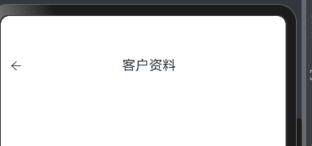
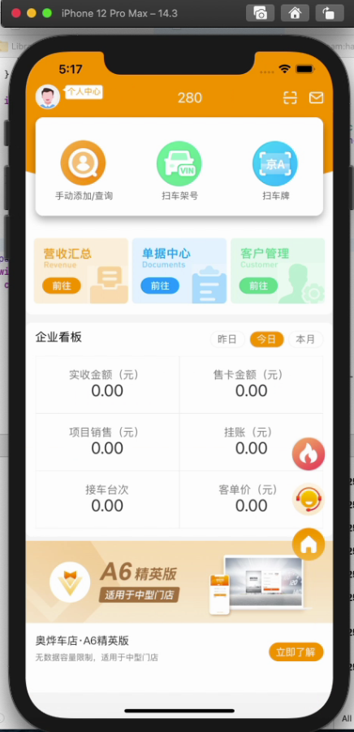

```

// 打包正式版
https://developer.huawei.com/consumer/cn/doc/app/agc-lowcode-package-formal-0000001598742385
```

```bash
测试账号
18959808131
```

```
组件间的使用
scroll滚动模块
```


## 配置目录说明

```bash
entry/src/main/ets/resources/base/element/
			 └── color.json  # 全局颜色配置
			 
			 使用方式：  .backgroundColor($r('app.color.colorFf'))
```

## 项目目录说明

```bash
entry/src/main/ets/
			└── model
            └── HttpUtil.ts   # http请求处理
            └── UserRegModel.ts # 登陆注册相关接口
            
			└── components 	# 公用组件目录
						└── TopNavBar.ets     # 顶部导航栏（返回按钮+标题）      
			└── pages/      # 业务页面目录
    		  	└── LaunchPage.ets    # 启动页
    		  	└── AppIndexPage.ets      # 首页
    		  	└── UserReg.ets       # 登陆页
    		  	└── SystemPage.ets    # 进入系统
    		  	└── MinePage.ets      # 我的
```

## 用户首选项

> ##### 一、‌**用户偏好设置**‌
>
> 存储用户自定义的个性化配置，实现应用状态记忆功能‌25：
>
> - 界面显示参数：字体大小、主题颜色、夜间模式开关状态
> - 功能开关配置：消息通知权限、自动播放设置、定位服务开关
> - 交互偏好记录：默认排序方式（如价格/销量）、列表展示模式（网格/列表视图）
>
> ###### 二、‌**应用配置管理**‌
>
> 保存应用运行时关键参数，提升启动加载效率‌37：
>
> - 版本更新标识：记录最后检测更新时间戳
> - 功能引导状态：标记新手教程是否完成
> - 本地缓存策略：设置图片预加载开关、离线模式阈值
>
> ##### 三、‌**轻量级数据存储**‌
>
> 适用于高频访问的小数据量存储场景‌46：
>
> - 用户身份标识：登录后的`aid`等临时凭证缓存（需配合定期刷新机制）
> - 表单草稿保存：未提交订单的商品选择记录
> - 浏览进度记忆：视频播放时间点、阅读器最后打开页码
>
> ###### 四、‌**跨进程数据共享**‌
>
> 实现同一设备上多应用间的配置同步‌24：
>
> - 多端主题同步：手机与平板设备的主题颜色统一
> - 全局开关控制：家长控制模式下的内容过滤标记
> - 设备偏好继承：新安装应用自动继承系统语言设置
>
> ##### 五、‌**元服务(Meta Service)支持**‌
>
> 支撑鸿蒙特色服务的快速状态恢复‌18：
>
> - 服务卡片状态：保存卡片布局配置和显示参数
> - 碰一碰(NFC)配置：存储常用设备的快速连接参数
> - 近场推荐设置：记录用户兴趣标签（如美食/景点偏好）


## HTTP接口的请求

```tsx
// src/main/ets/model/HttpUtil.ts

import http from '@ohos.net.http';

// 创建HttpClient实例（每个实例只能处理一个请求）
const createHttpClient = () => http.createHttp();
const baseURL:string = 'https://t.aoyexm.com'
// 对象转x-www-form-urlencoded格式
function convertToFormData(params: Record<string, string|number>): string {
  return Object.keys(params)
    .map(key => `${encodeURIComponent(key)}=${encodeURIComponent(params[key].toString())}`)
    .join('&');
}

// 核心请求方法
async function baseRequest(
  method: http.RequestMethod,
  url: string,
  params?: Record<string, any>
): Promise<ApiResponse> {
  const httpClient = createHttpClient();
  try {
    // 配置请求参数
    const options: http.HttpRequestOptions = {
      method,
      header: { 'Content-Type': 'application/x-www-form-urlencoded' },
      extraData: params ? convertToFormData(params) : undefined
    };

    //  在发送请求前打印参数
    console.log(`[Request] ${method}`,baseURL+`${url}`);
    console.log('Request Params:', JSON.stringify(params, null, 2));

    // 发送请求
    const response = await httpClient.request(baseURL+`${url}`, options);

    // 处理响应
    if (response.responseCode === http.ResponseCode.OK) {
      // 在收到响应后打印结果
      console.log('Response Data:', response.result.toString());
      const result = JSON.parse(response.result.toString());
      return { code: 200, data: result, msg: 'success' };
    } else {
      return { code: response.responseCode, data: null, msg: 'HTTP Error' };
    }
  } catch (error) {
    return { code: -1, data: null, msg: error.message };
  } finally {
    httpClient.destroy(); // 释放资源
  }
}

// 接口响应类型
interface ApiResponse {
  code: number;
  data: any;
  msg: string;
}

// 暴露方法
export const HttpUtil = {
  post: (url: string, params: object) => baseRequest(http.RequestMethod.POST, url, params),
  get: (url: string, params?: object) => baseRequest(http.RequestMethod.GET, url, params)
};

```

```tsx
// src/main/ets/model/UserRegModel.ts

import { HttpUtil } from './HttpUtil';
import { resourceManager } from '@kit.LocalizationKit';


// 定义接口参数类型
interface LoginParams {
  mobilePhone: string;
  psword: string;
  appVersion: string;
  terminal?: string;
  device?: string;
  inner?: string;
}

interface RegisterParams {
  mobilePhone: string;
  code: string;
  psword: string;
}

interface SendCodeParams {
  mobilePhone: string;
  type: 'register' | 'reset'; // 验证码类型
}

// 定义所有用户相关接口
const UserAPI = {
  /**
   * 用户登录
   * @param params 登录参数
   */
  login: (params: LoginParams) => {
    return HttpUtil.post('/client/appUser/login', params);
  },

  /**
   * 用户注册
   * @param params 注册参数
   */
  register: (params: RegisterParams) => {
    return HttpUtil.post('/client/appUser/register', params);
  },

  /**
   * 发送验证码
   * @param params 手机号+类型
   */
  sendCode: (params: SendCodeParams) => {
    return HttpUtil.post('/client/appUser/sendSmsCode', {
      mobilePhone: params.mobilePhone,
      bizType: params.type === 'register' ? 1 : 2 // 假设1是注册，2是找回密码
    });
  }
};

// 导出所有接口
export default UserAPI;
```

```tsx
// src/main/ets/pages/Index.ets

import promptAction from '@ohos.promptAction';
import UserRegModel from '../model/UserRegModel'; // 引入接口文件
@Entry
@Component
struct HttpExample {
  @State responseData: string = '等待响应...';

  // 发起POST请求
  private async postRequest() {
    const res = await UserRegModel.login({
      mobilePhone: '18959808131',
      psword: '111111',
      terminal: 'App',
      device: 'App',
      appVersion: '2.22.230202.51',
      inner: '1'
    });

    if (res.code === 200) {
      this.responseData = JSON.stringify(res.data);
      promptAction.showToast({ message: '登录成功' });
    } else {
      promptAction.showToast({ message: `失败：${res.msg}` });
    }
  }

  build() {
    Column({ space: 20 }) {
      Text(this.responseData)
        .fontSize(16)
        .textAlign(TextAlign.Center)

      Button('发送POST请求')
        .width('60%')
        .height(40)
        .onClick(() => this.postRequest())
    }
    .width('100%')
    .padding(20)
  }
}

```


## 


# 


```tsx
这个updateNotifyList的接口类型要怎么定义？才能正常的获取到这个数据

// types.ts
export interface updateNotifyListType {
  id:string,
  name:string,
  description:string,
  createTime:string
}

// AppIndexPage.ets
@State updateNotifyList = []
console.log('页面公告数据：',JSON.stringify(res.data.rows))
this.updateNotifyList = res.data.rows
接口获取到的数据为：

"rows": [
        {
            "id": "ff808081934237a90193516e96015848",
            "lid": null,
            "name": "23.03.01不停服更新公告",
            "description": "尊敬的奥烨车店用户：\r\n系统将于系统将于系统将于系统将于系统将于系统将于系统将于系统将于系统将于系统将于系统将于系统将于系统将于系统将于系统将于系统将于系统将于系统将于系统将于系统将于系统将于系统将于系统将于系统将于系统将于系统将于系统将于系统将于系统将于系统将于系统将于系统将于系统将于系统将于\r\n\r\n系统将于系统将于系统将于系统将于系统将于系统将于\r\n\r\n\r\n\r\n                                                          xxxx年xx月xx日",
            "displayOrder": null,
            "createTime": "2025-03-28 10:25:42",
            "deleted": false,
            "clientId": null,
            "clientLid": null,
            "user": null,
           
        },
  ]
```


---


# 1、启动页面

`src/Home/Guide.js`

`src/main/ets/MainAbility/pages/SplashPage.ets`

> - #### 解决白屏问题
>
>   在 `EntryAbility.ets` 文件里，`windowStage.loadContent` 方法所使用的路径是错误的。这个方法需要的是页面模块的名称，而非文件的完整路径。
>
>   - ##### 错误代码
>
>     ```ts
>     windowStage.loadContent('/entry/src/main/ets/MainAbility/pages/SplashPage.ets', (err) => {
>       // ...
>     });
>     ```
>
>   - ##### 解决办法
>
>     要使用 `main_pages.json` 里定义的页面模块名称。
>
>     ```tsx
>     // src/main/resources/base/profile/main_pages.json
>     {
>       "src": [
>         "MainAbility/pages/SplashPage"
>       ]
>     }
>                                                                                     
>     ```
>
>     ```tsx
>     // src/main/ets/entryability/EntryAbility.ets
>     windowStage.loadContent('MainAbility/pages/SplashPage', (err) => {
>       if (err.code) {
>         hilog.error(DOMAIN, 'testTag', 'Failed to load the content. Cause: %{public}s', JSON.stringify(err));
>         return;
>       }
>       hilog.info(DOMAIN, 'testTag', 'Succeeded in loading the content.');
>     });
>     ```
>
>     自此启动模拟器正常

# 2、首页

> `src/main/ets/MainAbility/pages/HomePage.ets`
>
> ```bash
> entry/src/main/ets/
> 			└── model
>             └── HttpUtil.ts   # http请求处理
>             └── AppIndexModel.ts # 首页相关接口
>             
> 			└── components 	# 公用组件目录
> 						└── TopNavBar.ets     # 顶部导航栏（返回按钮+标题）      
> 			└── pages/      # 业务页面目录
>     		  	└── AppIndexPage.ets      # 首页
>     		  	
>     	└── view/updateNotifyView/      # 其他页面目录
>     		  			 └── updateNotifyList.ets      # 公告列表	
>                  └── updateNotifyDetail.ets		 # 公告详细
>             
> ```
>
> 
>
> 

#### 1、公告栏

- 轮播效果
- 点击跳转列表


# 3、进入系统

### 初始化模版

```tsx
 import { manageListData,ManageListItem } from '../../../model/CustomerManagementData'
 import TopNavBar from '../../../components/TopNavBar';
 import ComSearch from '../../../components/ComSearch'
 @Entry
 @Component

 struct Customer {
   @State message: string = '客户资料';
   build() {
     Stack({ alignContent: Alignment.Top }) {
       // 顶部导航栏组件
       TopNavBar({title:this.message})
       Column().width('100%').margin({ top: 40 })
     }
   }
 }
```



```
系统栏的颜色设置

```


> 实现构建和构建思路
>
> 1、顶部
>
> - 黄色的背景图
> - 上面横向布局
>   - 左边：一个圆形的头像和一个小聊天图标居于头像的右上角
>   - 中间：汽修店面的名称和一个下拉图标
>   - 右边：一个扫二维码的图标
>
> 2、第2层一个卡片栏
>
> - 这个卡片
>   - 背景色：#FFFFFF；圆角：10dp；外间距12dp 
>   - 整个卡片式脱离文档流的，向上占据了顶部背景19dp
>
> - 横向布局：三个等分
>   - 图标+文字是上下结构要求垂直居中
>
> 3、第3层
>
> - 距离顶部172.5、左右12


> 鸿蒙开发帮我写一个页面的模块样式框
>
> 第1层是头顶栏
>
> 第2层内容块1
>
> 第3层内容块2
>
> 第4层在最底部
>
> 纵向布局
>
> 
>
> 

### CENTER2

##### 营收汇总、单据中心、客户管理

- 公用组件：顶部导航栏

- 公用组件：标签切换`src/main/ets/components/CustomTabs.ets`

- 写一个样式为横向布局块
  “日期：” 、  开始时间选择框 、“至”、结束时间选择框、按钮“查询”
  
  


## 单据中心

```
1、搜索框、菜单栏
2、标签栏：封装组件
3、结算、作废列表：封装公用的card（折叠面板）
4、模块的组件化：父子组件的通信
```

> - `super()`所有继承自Component的struct都必须显式调用基类构造函数
> -  `@Prop`
> - `private`*私有属性使用明确初始化断言*


# 4、我的

```bash
entry/src/main/ets/
└── MainAbility/
    └── pages/             # 业务页面目录
    		  └── MyPage       # 我的
    		  └── MyPage
    		  		└── SetNewPassWord.ets # 设置新密码
    		  		└── AboutUs.ets # 关于我们
    		  		
    		  
```

> ###### `border`边框参数配置
>
> ```tsx
> // 完整边框参数配置示例
> .border({
>   width: {
>     top: 0,     // 顶部无边框
>     right: 0,   // 右侧无边框
>     bottom: 1,  // 底部边框
>     left: 0     // 左侧无边框
>   },
>   color: {
>     top: '#FF0000',    // 红色顶部边框
>     bottom: '#00FF00'  // 绿色底部边框
>   },
>   radius: {
>     topLeft: 8,       // 左上角圆角
>     bottomRight: 8    // 右下角圆角
>   }
> })
> 
> ```

### 4.1 帮助与反馈

##### 4.1.1 功能：复制

```tsx
import TopNavBar from '../../components/TopNavBar';
import {pasteboard} from '@kit.BasicServicesKit';
import promptAction from '@ohos.promptAction';

@Entry
@Component
struct AboutUs {
  @State message: string = '帮助与反馈';
  @State tabsItems: string[] = ['联系客服', '公司简介'];
  @State currentTabIndex: number = 0
  @State private offsetX: number = 0  // 页面偏移量
  @State private prevIndex: number = 0 // 上次选中的索引

  build() {
    Column() {
      // 顶部导航栏组件
      TopNavBar({ title: this.message })

      Column() {
        // 切换栏组件
        ComTabs({
          tabsItems: this.tabsItems,
          currentIndex: $currentTabIndex,
          onTabClick: (index: number) => {
            this.currentTabIndex = index

          }
        })
      }.margin({ top: 1 })

      // 内容区域（添加滑动动画）
      Stack() {
        // 联系客服页面
        ContactSupport()
          // .translate({ x: this.getPageOffset(0) })
          .opacity(this.currentTabIndex === 0 ? 1 : 0)

        // 公司简介页面
        CompanyProfile()
          // .translate({ x: this.getPageOffset(1) })
          .opacity(this.currentTabIndex === 1 ? 1 : 0)
      }
      .layoutWeight(1)
      .margin({top:10})
      .borderRadius({topRight:10,bottomLeft:10})
      .backgroundColor('#ffffff')

    }
    .backgroundColor('#f6f6f6')
    .height('100%')
    .width('100%')
  }

  // 计算页面偏移量
  private getPageOffset(index: number): number {
    if (index === this.currentTabIndex) {
      return this.offsetX
    }
    return index < this.currentTabIndex ?
      -100 + this.offsetX :
      100 + this.offsetX
  }
}

interface typeList {
  title:string
  detail:string
  isShowCopy?:boolean
  isShowIcon?:string
}
// 联系客服页面
@Component
struct ContactSupport {
  @State MyListData:typeList[] = [
    {title:'服务热线',detail:'400 9933 139'},
    {title:'客服热线',detail:'189 6585 1310'},
    {title:'客服微信',detail:'aoyesh',isShowCopy:true},
    {title:'公司地址',detail:'厦门市思明区望海路10-2楼302-5室',isShowIcon:'btn_person_about_company_address'},
    {title:'公司邮箱',detail:'aoyexm@aoyexm.com',isShowCopy:true},
  ]

  // 删除不必要的copyText状态
  @State private isCopying: boolean = false;
  @State private copySuccess: boolean = false;

  // 复制功能实现
  private async handleCopy(text: string) {
    console.log(text)
    promptAction.showToast({ message: text, duration: 1500 });
    if (this.isCopying) return;

    this.isCopying = true;
    try {

      const systemPasteboard = pasteboard.getSystemPasteboard();
      const pasteData = await pasteboard.createPlainTextData(text);
      await systemPasteboard.setData(pasteData);

      this.copySuccess = true;
      promptAction.showToast({ message: '复制成功', duration: 1500 });

      setTimeout(() => {
        this.copySuccess = false;
        this.isCopying = false;
      }, 3000);
    } catch (error) {
      console.error('复制失败:', JSON.stringify(error));
      this.showCopyError();
      this.isCopying = false;
    }
  }


  // 错误处理
  private showCopyError() {
    promptAction.showToast({
      message: '复制失败，请重试',
      duration: 2000,
      bottom: '50%'
    })
  }

  // 列表项组件抽离
  @Builder
  ListItem(item: typeList, isLast: boolean) {
    Flex({ alignItems: ItemAlign.Center, justifyContent: FlexAlign.SpaceBetween }) {
      Text(item.title).fontColor('#202020').fontSize(12)
      Row() {
        Text(item.detail)
          .fontColor((!item?.isShowCopy)?'#48D08E':'#202020')
          .fontSize(12)
          .border({
            width: {bottom:!item?.isShowCopy ? 1 : 0},
            color: '#48D08E',
          })
        if (item?.isShowCopy) {
          Text('复制').fontColor('#202020').fontSize(11).padding({left:10,right:10,top:4.5,bottom:4.5})
            .backgroundColor('#F6F6F6').borderRadius(9.5).margin({left:12.5})
            .hitTestBehavior(HitTestMode.Transparent)
            .onClick(() => {
              console.log('点击事件触发');
              this.handleCopy(item.detail)
            })


        }
        if(item?.isShowIcon) {
          Image($r(`app.media.${item.isShowIcon}`)).width(9.9).height(11.85).margin({left:5.5})
        }
      }
    }
    .width('100%')
    .padding( { top: 14.5, bottom: 14.5 })
    .border({ // 动态边框处理
      width: { bottom: isLast ? 0 : 1 },
      color: '#EEEEEE'
    })


  }
  build() {
    Column() {
      Column(){
        
        Column() {
          ForEach(this.MyListData, (item:typeList, index) => {
            this.ListItem(item, index === this.MyListData.length - 1)
          }, (item:typeList, index) => `${item.title}_${index}`)

        }
        .padding(15)
        .margin({top:29.5})
        .borderRadius(10)
        .borderWidth(1)          // 设置边框宽度为1像素
        .borderColor('#D0D0D0')   // 设置边框颜色（与字体颜色保持一致）
        .borderStyle(BorderStyle.Solid) // 设置边框样式为实线（默认值可省略
        .shadow({
          radius: 16,
          color: '#EEEEEE',
          offsetY: 2
        }) // 默认状态


      }


    }
    .width('100%')
    .height('100%')
    .justifyContent(FlexAlign.SpaceBetween)
    .padding({top:30,left:12,right:12})


  }
}

```


# 5、登录

> `/Users/dlydong/project/AOYEXM/carapp/src/Home/User/UserReg.js`

```
 // 顶部衍生
 .expandSafeArea([SafeAreaType.SYSTEM], [SafeAreaEdge.TOP])
```


# 客户管理 -- 客户资料

> 0319

> `DocumentCenterPage/DocumentCenter.ets`
>
> ```
> entry/src/main/ets/
> └── MainAbility/
>     └── pages/             # 业务页面目录
>     		  └── CustomerManagementPage 
>     		  				└── CustomerManagement.ets 客户管理
>           				└── Customer.ets 客户资料
>           				
>           						模块拆分
>           						└── CustomerDetail.ets 客户资料
>           						└── CustomerPackageManage.ets 套餐管理
>           						└── CustomerRecentBills.ets 近期单据
>     		  
> ```
>
> ##### 1、tab切换栏的封装
>
> - 下划线的使用：`Divider`https://developer.huawei.com/consumer/cn/doc/harmonyos-references-V5/ts-basic-components-divider-V5#%E7%A4%BA%E4%BE%8B
>
> ###### 2、tab栏和滚动的联动 （未能完美解决）
>
> - 切换tab栏项，滚动到对应的可视区域；
> - 滚动到对应的可是区域，切换到对应的tab栏
>
> ###### 3、合理的样式管理方案
>
> - ```
>   src/
>   ├── main/
>   │   ├── ets/
>   │   │   ├── resources/
>   │   │   │   ├── index.ets // 统一入口
>   │   │   │   ├── color.ets // 颜色资源
>   │   │   │   ├── size.ets // 尺寸资源
>   │   │   │   └── types.ets // 类型管理
>   │   │   └── styles/
>   │   │       └── index.ets // 封装样式
>           
>   ```


## 客户管理 > 客户资料 

> ###### 0320
>
> ###### 1、封装《进度条》`src/main/ets/components/LinearProgress.ets` 


## 客户管理 > 套餐管理

> ###### 0320
>
> ###### 1、封装样式阴影
>
> ```
>  .shadow(Resources.Color.shadows.base) // 默认状态
> ```
>
> ###### 2、封装折叠面板（未完成）
>
> ###### 3、统一管理接口的type值 `src/main/ets/model/TypesInt.ets`
>
> ###### 4、统一数据管理（未完成）
>
> 
>
> ###### 0321
>
> ###### 5、定位布局（未完成）
>
> ```
> 疑问
> 1、@Builder 和 @Component 的区别和使用场景
> 2、生命周期的使用
> 3、数据封装
> 4、    @State tabsItems: string[] = ['结算', '报价','办卡','作废列表']; 
> 和。   private tabTitles: string[] = ['结算', '报价','办卡','作废列表']; 啥意思
> ```
>
> 


## 客户管理 > 近期单据

> ###### 0321
>
> ###### 1、标签切换栏 -- 重写
>
> ###### 2、折叠面板
>
> ###### 3、日历组件的编写

```tsx
// 营收汇总
import { InfoItem } from '../../../model/TypesInt'
@Entry
@Component
struct RevenueSummaryPage {
  @State items2 : InfoItem[] = [
    {label:'现金',value:'000000.00'},
    {label:'微信',value:'000000.00'},
    {label:'支付宝',value:'000000.00'},
    {label:'其他',value:'000000.00'}
  ]
  build() {
    Column() {
      List() {
        ListItem() {
          summaryCard2({
            itemTitle:'收入结算',
            items:this.items2
          })
        }
      }
    }
  }
}

@Component
struct summaryCard2 {
  @Prop itemTitle:string = '暂无标题'
  @Prop items : InfoItem[] = []
  build() {
    Column() {
      Row() {
        Row() {
          Image($r('app.media.ic_erp_title_gn')).width(5).height(12).margin({right:5})
          Text(this.itemTitle).fontSize(14).fontColor('#202020')
        }.alignItems(VerticalAlign.Center)
      }.padding({left:15,right:15}).width('100%').justifyContent(FlexAlign.SpaceBetween)

      Flex({ wrap: FlexWrap.Wrap, space: {main: LengthMetrics.px(50), cross: LengthMetrics.px(50)} }) { // 子组件多行布局
        ForEach(this.items, (item: InfoItem,index:number) => {
          Column() {
            Text(item.label).fontColor('#777777').fontSize(12)
            Text(item.value).fontColor('#323232').fontSize(16).margin({top:7})
          }
          .alignItems(HorizontalAlign.Start)
        })

      }
      .width('100%')
      .margin({top:15})
      .padding(10)
    }.padding(15).backgroundColor('#FFFFFF').borderRadius(5).margin({top:10})
  }
}
```


# `公用组件`

## `TopNavBar` 顶部导航

> 

```tsx
import TopNavBar from '../../../components/TopNavBar';

@State message: string = '帮助与反馈';
// 顶部导航栏组件
TopNavBar({title:this.message})
```

## 标签切换


## 全局定义颜色

```tsx
import Resources from '../../../resources/index';

Text(item.title)
    .fontColor(Resources.Color.primary)
    .fontSize(12)
```


# 未完成

### A4版本




