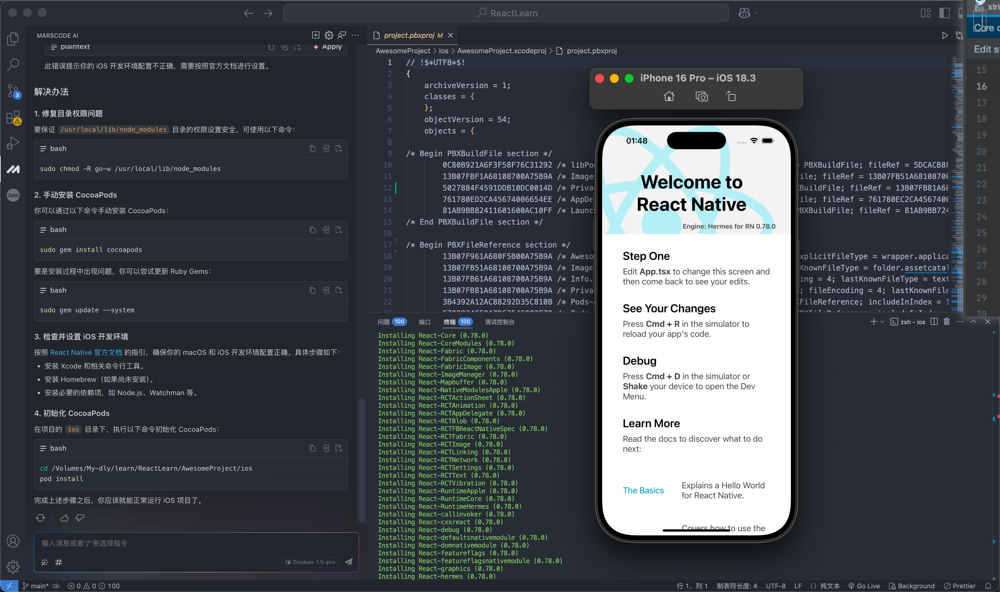

```
node版本
 v18.18.2 (with npm 9.8.1)
```

```
dlydong@DONGdeAir AwesomeProject % npm start  

// 手动打开xcode
ios/AwesomeProject.xcworkspace
```

```
指定端口
// React Native 项目已经成功启动 Metro 服务（端口 8083）
dlydong@DONGdeAir carapp % npm start -- --port 8083

// 运行 iOS 应用：也就是自动打开xcode
npx react-native run-ios --port 8083  
// 或者
open ios/aoyeApp.xcodeproj
```


```
cd ios
npm start
```

```
/Applications/carappNew/node_modules/react-native/scripts/launchPackger.command;exit;                          
```

```
Xcode

聚焦在移动端上，上方 Device/shack  自动打开goole中的Reactive Nactive Debugger
```

> `/Users/dlydong/project/AOYEXM/carapp/BasePage.js`
>
> ```js
> // 518  接口和参数的打印
> console.log(url, aoyeConsole)
> ```

# 

# `src/Home/AppIndex.js`

### 首页-进入系统

> ##### 代码功能概述
>
> 这段代码定义了一个名为 `doGoErp` 的函数，其主要功能是根据用户的登录状态和系统版本类型，执行一系列操作，最终导航到相应的主页。在执行过程中，会检查是否加载了登录数据，如果未加载则显示加载动画，同时触发检查过期天数的操作，获取登录数据，并根据系统版本类型导航到不同的主页。
>
> ```JS
> // 首页
> 
> doGoErp() {
>     // 调用 notLoginHost 方法，该方法的具体功能取决于其在类中的实现
>     // 推测可能是用于处理未登录状态下的一些操作，比如跳转到登录页面或者提示用户登录等
>     this.notLoginHost();
> 
>     // 定义一个布尔类型的变量 keepShow，并初始化为 false
>     // 该变量可能用于控制某个界面元素是否保持显示状态
>     let keepShow = false;
> 
>     // 检查 loadingLoginData 属性的值是否为 false
>     // loadingLoginData 可能是一个布尔类型的标志，用于表示是否正在加载登录数据
>     if (!this.loadingLoginData) {
>         // 如果 loadingLoginData 为 false，调用 showLoading 方法
>         // 该方法的作用可能是显示一个加载动画，提示用户正在进行某些操作
>         this.showLoading();
> 
>         // 检查全局数据对象 global.data 中的 versionType 属性是否等于 'MostEasy'
>         // versionType 可能用于区分不同的系统版本类型
>         if (global.data.versionType == 'MostEasy') {
>             // 如果版本类型为 'MostEasy'，触发 'checkExpireDay' 事件
>             // 该事件可能用于检查系统的使用期限是否过期
>             this.emit('checkExpireDay');
> 
>             // 调用 getLoginData 方法获取登录数据
>             // getLoginData 方法接受一个回调函数作为参数，当获取登录数据成功后，会执行该回调函数
>             this.getLoginData((queryLoginDataRes) => {
>                 // 在回调函数中，调用 navToPage 方法导航到 'HomeMostEasy' 页面
>                 // 传递的参数包括页面名称 'HomeMostEasy'、一个包含 keepShow 和 from 属性的对象，以及获取到的登录数据 queryLoginDataRes
>                 // keepShow 用于控制界面元素显示状态，from 表示导航来源为 'AppIndex'
>                 this.navToPage('HomeMostEasy', { keepShow, from: 'AppIndex' }, queryLoginDataRes);
>             });
>         } else {
>             // 如果版本类型不是 'MostEasy'，同样触发 'checkExpireDay' 事件
>             this.emit('checkExpireDay');
> 
>             // 调用 getLoginData 方法获取登录数据
>             this.getLoginData((queryLoginDataRes) => {
>                 // 在回调函数中，调用 navToPage 方法导航到 'Home' 页面
>                 // 传递的参数与上述类似，只是页面名称变为 'Home'
>                 this.navToPage('Home', { keepShow, from: 'AppIndex' }, queryLoginDataRes);
>             });
>         }
>     }
> }
> ```
>
> 


# `/src/Home/HomeMostEasy.js`

### 进入系统


###### `src/Home/User/UserIndex.js`

###### 个人资料


###### src/Home/CustomerList.js 

###### 客户管理

###### src/Customer/Customer.js

###### 客户资料

##### src/Home/Mine.js 我的

##### src/common/components/UpdateWarn.js 公告

##### src/Home/AppHome/UpdateWarnList.js 公告列表

##### src/Home/AppHome/UpdateWarnDetail.js 公告详情


```tsx
const response = res.data.rows as CustomerResponseModel[];
步骤一:判断是否过期了
    let expiredDateStr = response[i].expiredDate?.replace(/-/g, '/');
    let expiredDate: number;
    if (expiredDateStr) {
        expiredDate = new Date(expiredDateStr).getTime();
     } else {
         // 这里假设设置为当前时间
        expiredDate = now.getTime();
     }
     let expiredDate1 = new Date(expiredDate + 24 * 60 * 60 * 1000);
     response[i]['isOver'] = expiredDate1.getTime() >= now.getTime() ? false : true;  


步骤二：当如果 versionType == 'MostEasy'
   	1、新建数组 goodsArry
		2、遍历后 ，
    	 2.1 如果：cardCategory2 == Year                              
			res.rows[i].goodsArry[j] = {};
                res.rows[i].goodsArry[j]['name'] = (j + 1) + "、" + res.rows[i].items[j].goods.name
                if (res.rows[i].items[j].infinite) {
                  res.rows[i].goodsArry[j]['amount'] = '不限'
                } else {
                  res.rows[i].goodsArry[j]['amount'] = res.rows[i].items[j].amount
                }
      2.2 否则的话// 非年卡和普通版本一样
              for (let j = 0; j < res.rows[i].goodsName.length - 1; j++) {
                res.rows[i].goodsArry[j] = {};
                res.rows[i].goodsArry[j]['name'] = res.rows[i].goodsName[j]
                res.rows[i].goodsArry[j]['amount'] = res.rows[i].goodsAmount[j]
              }

然后将新的rows赋值给 this.carGoods
---------------
rows接口数据返回的内容和格式
"rows": [
   {
	 	"cardName": "洗车20次卡",
    "expiredDate": "2027-03-12",
    "goodsName": "1、全自动洗车;2、健康洗车;3、洗车;",
		"goodsAmount": "5;7;8;",
     "cardCategory2": "Package",
   }, 
   {
	 	"cardName": "油卡",
    "expiredDate": "2026-03-12",
    "goodsName": "1、机油;2、保养;",
		"goodsAmount": "1;1;",
     "cardCategory2": "Combination",
   }, 
	],
   
   
```


