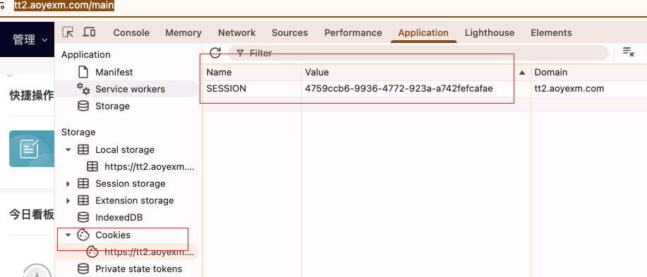

> - 记录时间：2025-05-13


# 场景目的

> 当我在做“切换门店”操作时，我的企业看板等数据应该要跟随改变
>
> `src/main/ets/pages/SystemPage.ets`
>
> ① 调用接口`client/clientUser/selectShop`切换门店 
>
> ②其余接口自动会得到新的数据，比如`client/client/indexData`企业看板（原始版）; `client/client/indexData_mosteasy`企业看板（简化版）


# 问题

> 数据未随之门店改变
>
> 因为：APP中的Cookie的SEESION值没有固定存下来，导致不断变化，系统会认为是初始化


# 解决

> 为什么？
>
> - 不属于同一个会话了，---切换门店不成功
>
> 类似PC端的https://tt2.aoyexm.com/main
>
> - 


# APP关于Cookie中SESSION=vlaue

> `src/main/ets/model/HttpUtil.ts`
>
> 关键代码
>
> ```tsx
> let cookiesSession : string = ""; // 初始化Cookie
> 
> let defaultParams = { terminal: 'App', inner: '1',appVersion:`${Constants.APP_VERSION}`,device:'App',withCredentials: true }; // 预设参数：withCredentials开启，表示接口都要携带Cookie
> 
> const options: http.HttpRequestOptions = { // header 中Cookie附值
>   method,
>   header: { 'Content-Type': 'application/x-www-form-urlencoded',"Cookie":cookiesSession},
>   extraData: convertToFormData(requestParams),
> };
> 
>  // 处理响应 中拿到Cookie值
> if (response.responseCode === http.ResponseCode.OK) {
>       let cookies = response.header?.['set-cookie'];
> 
>       // 解析 Cookie 获取 session（示例）
>       if (cookies) {
>         let sessionCookie = Array.isArray(cookies) ? cookies[0] : cookies;
>         cookiesSession=sessionCookie
>         cookiesSession=cookiesSession.split(";")[0]
>         console.info('Session ID:', cookiesSession);
>       } else {
>         // console.error('未找到 Session Cookie');
>       }
> 
>     	// ...
>       return { code: 200, data: result, msg: 'success' };
>     } else {
>       return { code: response.responseCode, data: null, msg: 'HTTP Error' };
>     }
> ```
>
> 

# 实现效果


