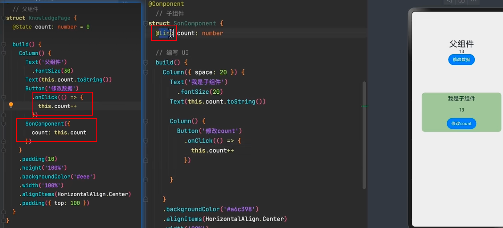
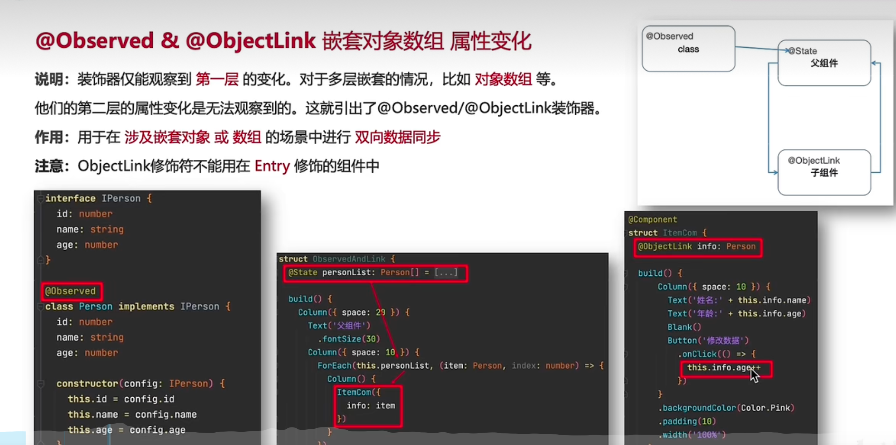
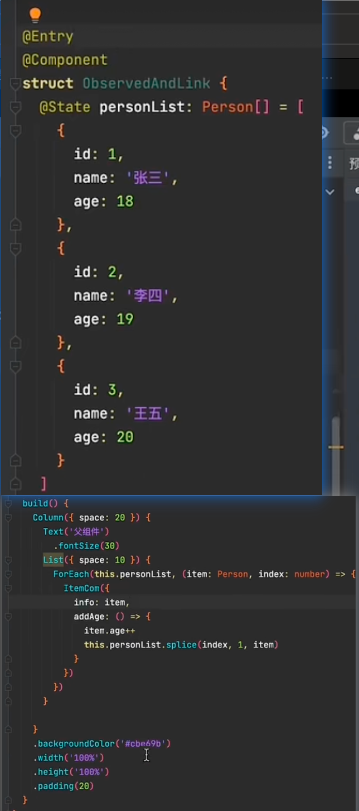
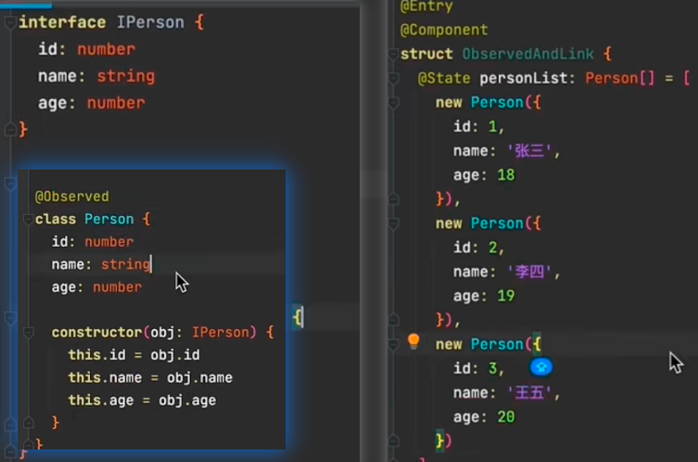
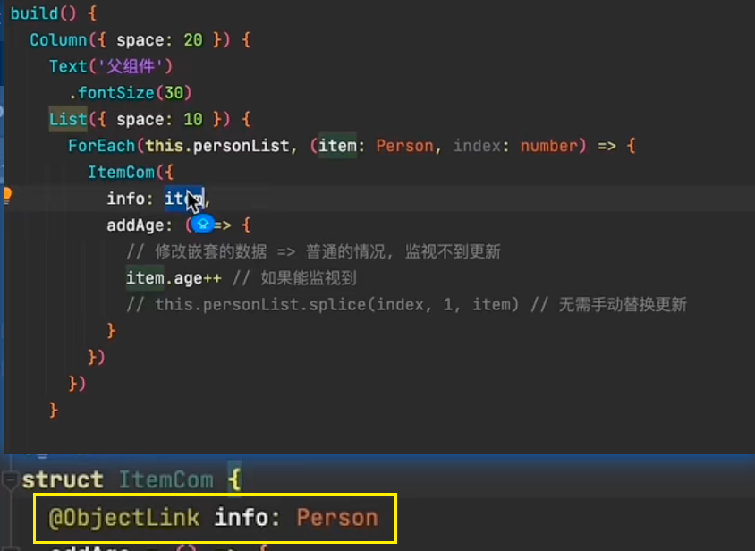
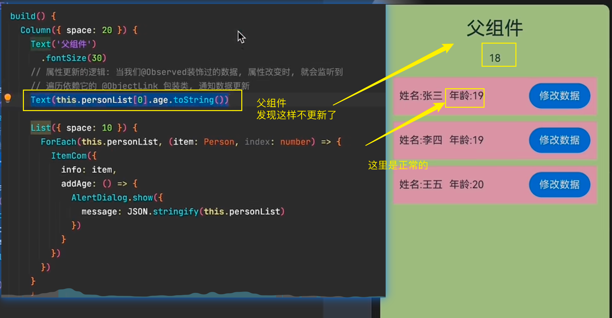
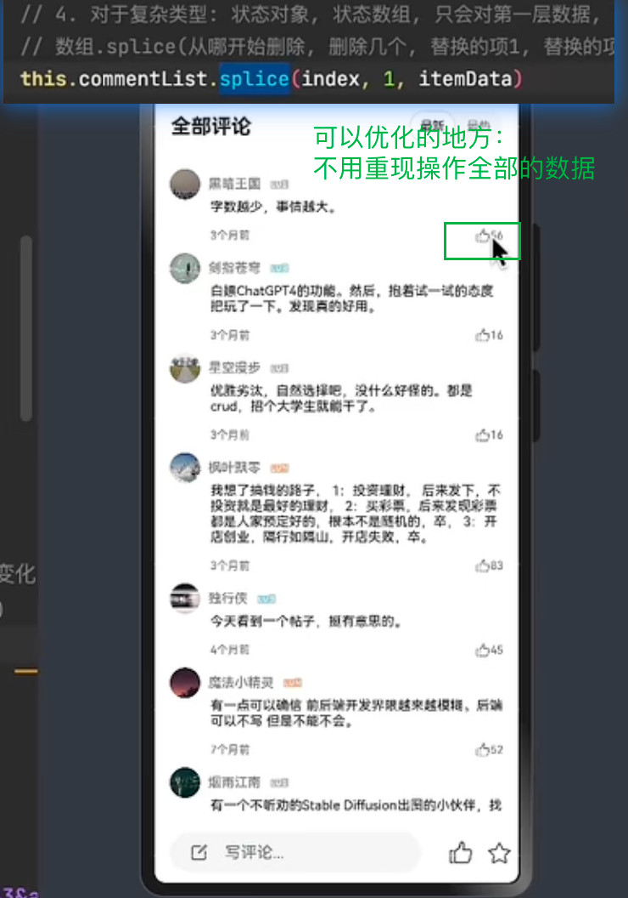
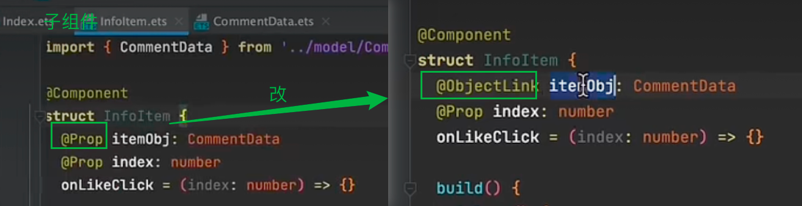

根据 HarmonyOS 官方文档 [状态管理最佳实践](https://developer.harmonyos.com/cn/docs/documentation/doc-guides/arkts-state-management-0000001724480726)：

1. 父子组件通信优先使用 ‌**回调函数 + @Link**‌

2. 跨层级组件使用 `@Provide/@Consume`

3. 复杂场景使用 ‌**Observable 模式**‌

   

# @Link双向同步

# @Provide & @Consume

# @Observed & @ObjectLink

> - 父组件
>
> 

> - 重新构造类
>   - 
>   - 

## 问题：多个位子都要用，如何共同响应

> 
>
> 怎么办？
>
> 
> 
> 

## 代码优化：

> 
>
> - 
> - 