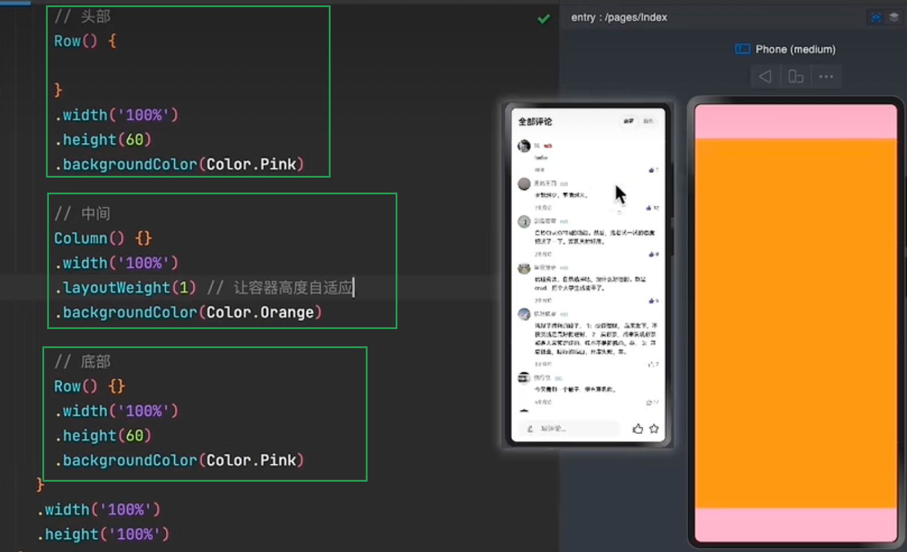
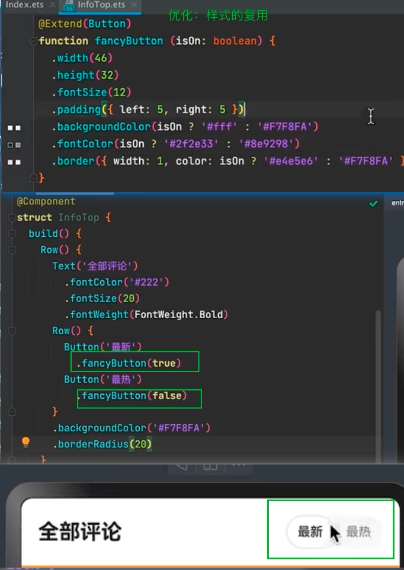
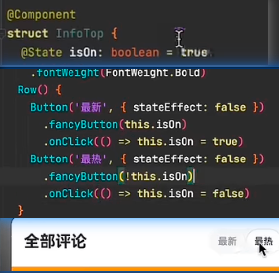
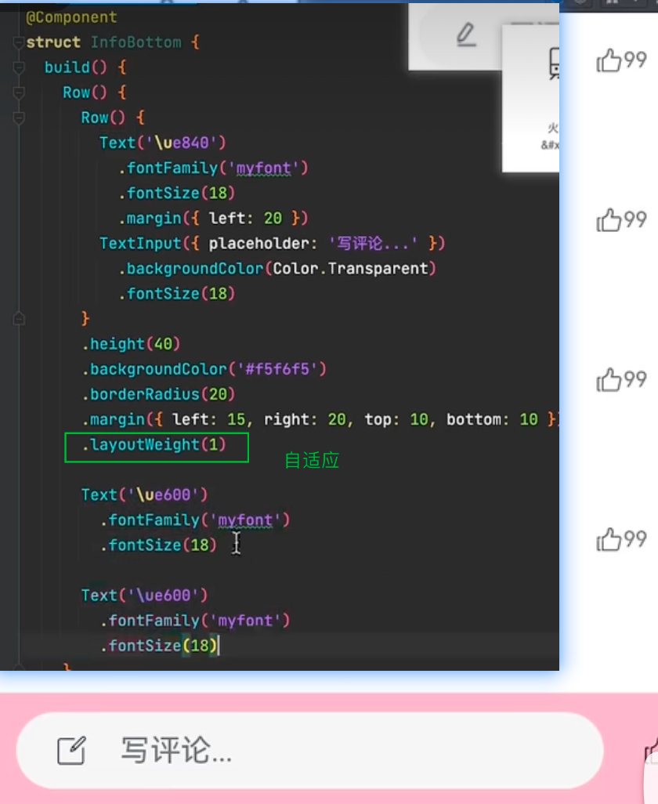
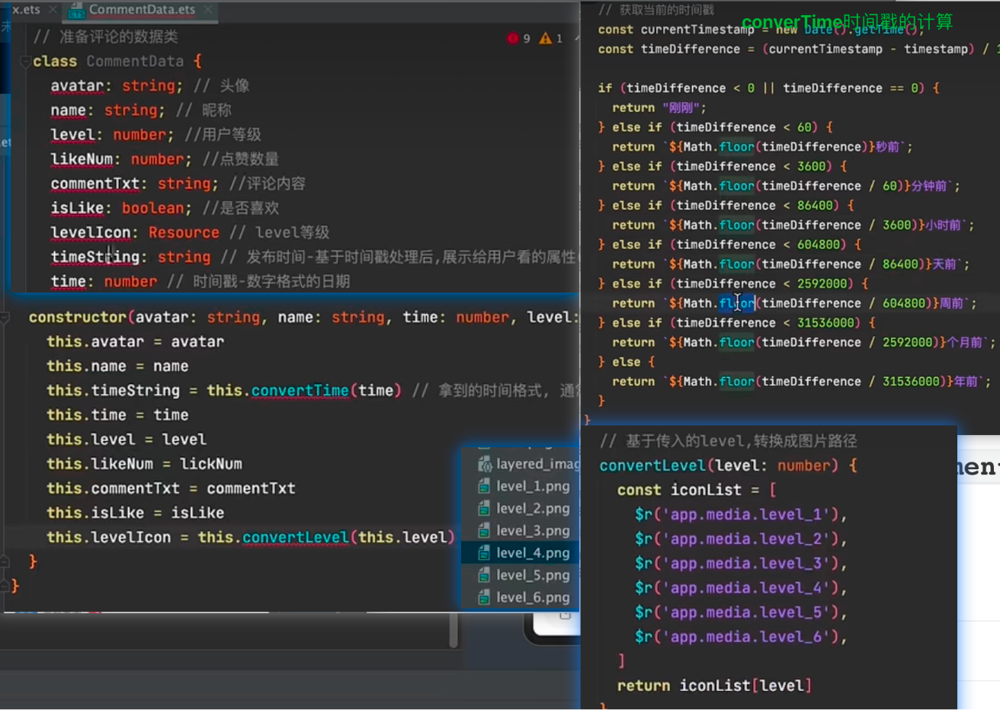
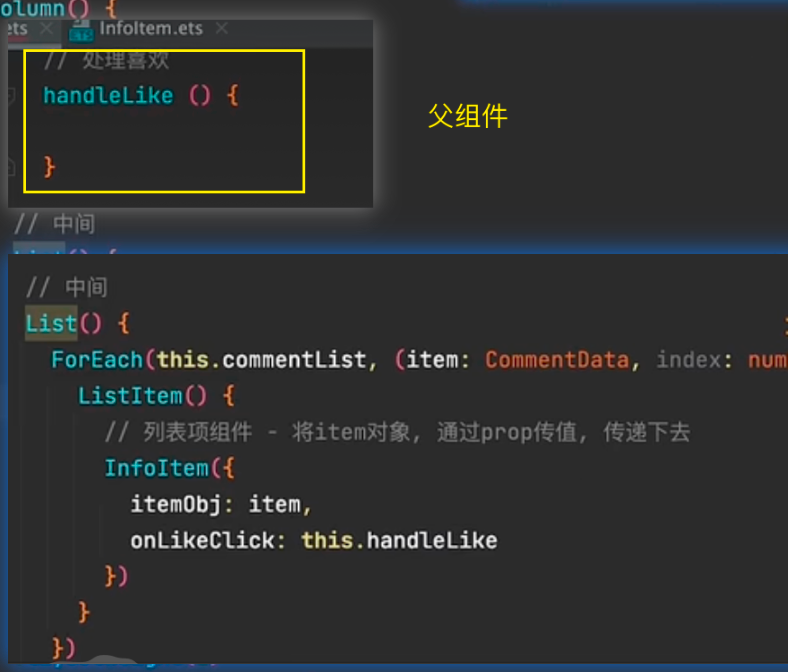
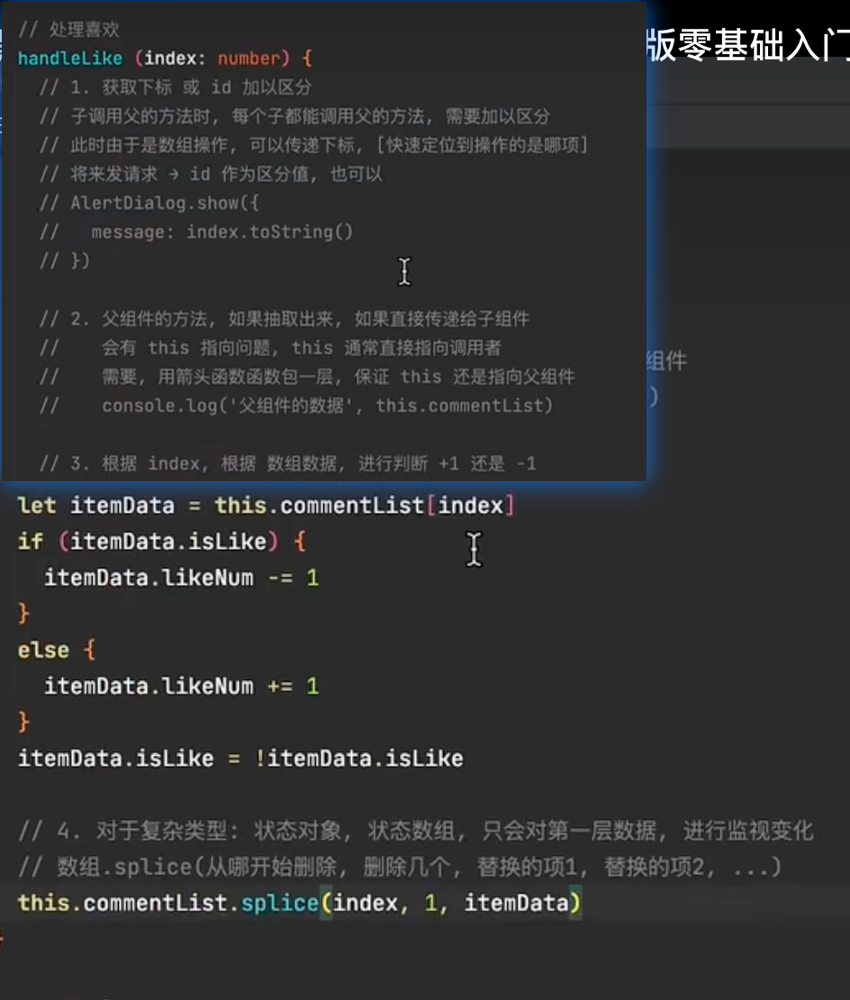
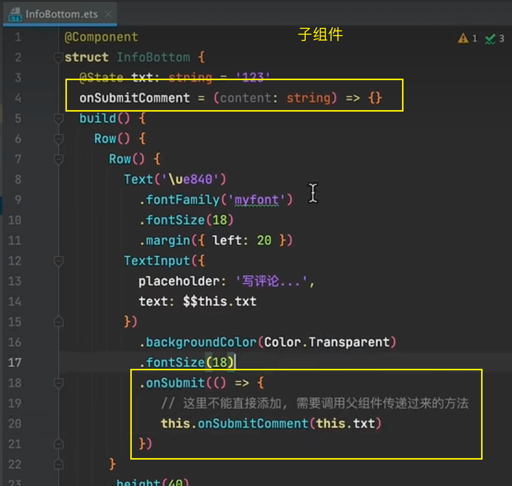
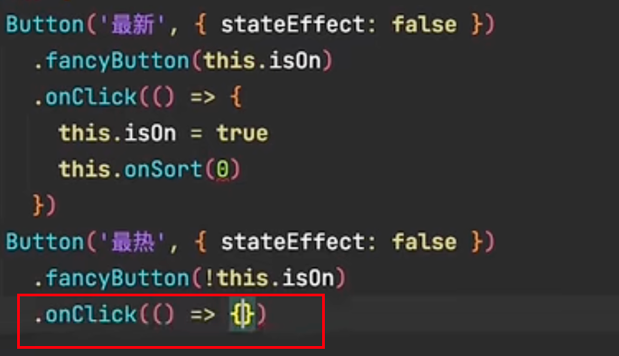
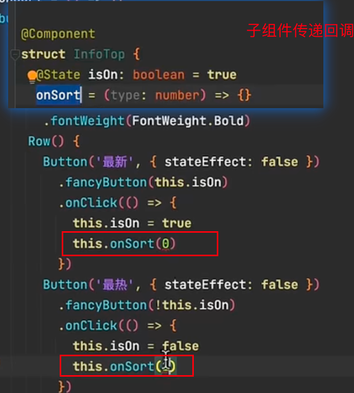

# 单 向数据传递




```tsx
@Entry
@Components 
struct Index{}
```

> #### 自适应-`layoutWeight(1)`


# 组件封装-头部标题组件

## 1、@Extend 样式的复用


> @Extend(Button) 可以传参
>
> - ###### 未优化
>
>   ##### 
>
> - ###### 封装样式
>
>   


## 2、点击切换

> 


# 组件封装-中间内容

## 1、List列表组件-超出滚动

> ###### 比起scroll更加的灵活
>
> 


## 2、List的基本使用

> 

## 3、List的参数使用

> 


## 4、组件的开发

> 
>
> ```tsx
> ```
>
> 

# 组件封装-底部

## 1、IconFont字体图标的使用

> 
>
> `aboutToApper()` 生命周期函数
>
> 

##   

> 


---


# 功能1：列表渲染

## 1、维护数据`model/commentData.est`

> 
>
> 
>
> 


## 2、导入数据使用数据

> 


## 3、数据传递、动态渲染

### `@State` 为了更好的改变操作数据

> 

##### 


# 功能2：点赞


## 1、点击子组件

> #### 基础的使用
>
> - 父组件
>   - 
> - 子组件
>   - 


## 2、调用父组件传递的方法-this指向问题

> 


## 3、修改数据并更新

> 
>
> 
>
> 


# 功能3：添加评论


## 1、绑定表单

> `$$`
>
> 

## 2、调用父组件方法

> - ##### 子组件
>
>   - 
>
> - ##### 父组件
>
>   - 


## 3、新增数据

> 


# 功能4：评论排序


## 1、点击按钮

> 

## 2、调用回调传入参数

> - 子组件
>   - 

## 3、基于参数排序展示

> 
>
> 
>
> - 默认已进入就展示最新
>
> 