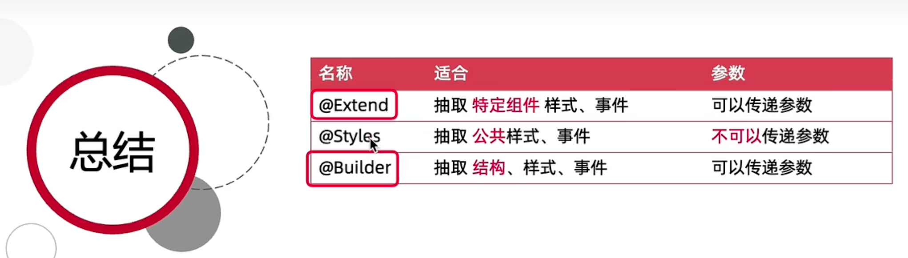
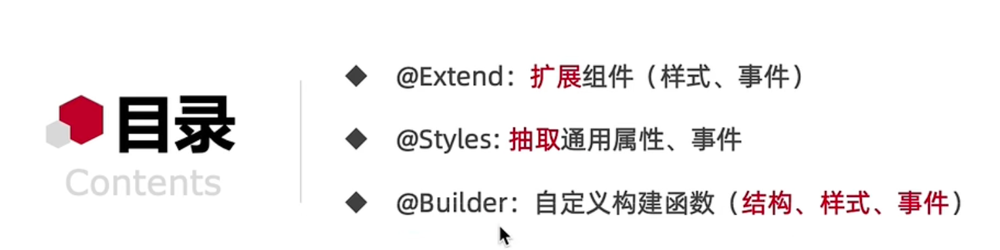
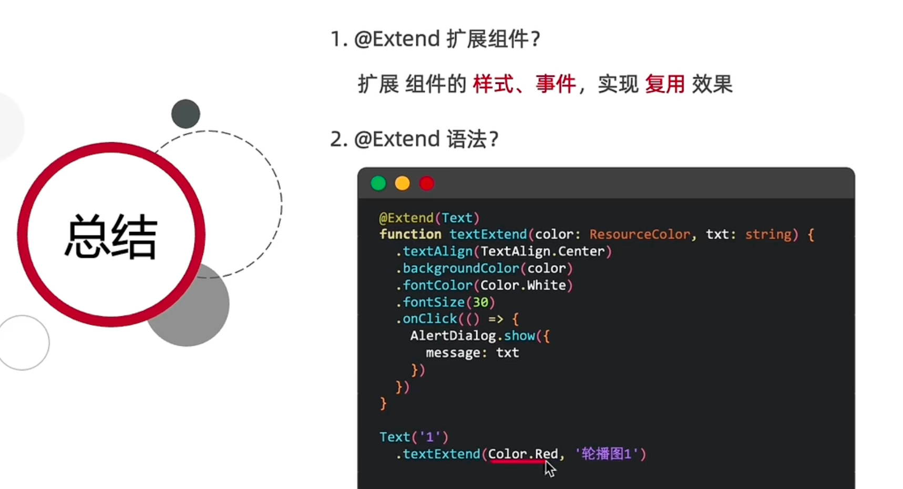
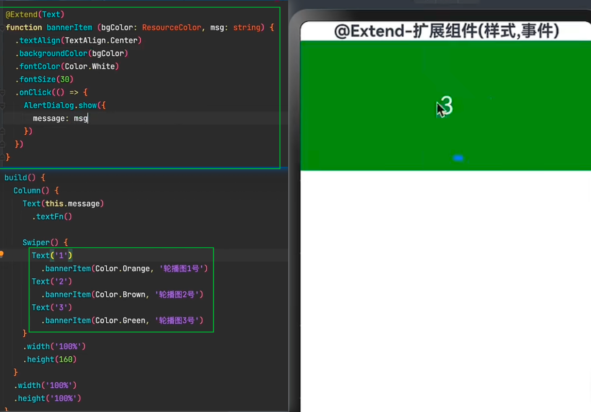
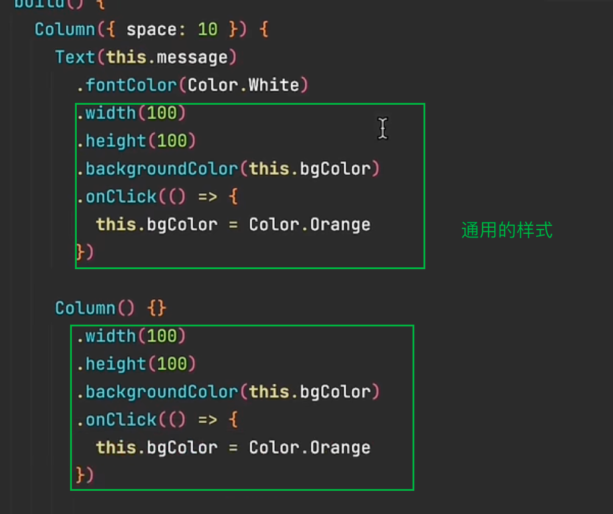
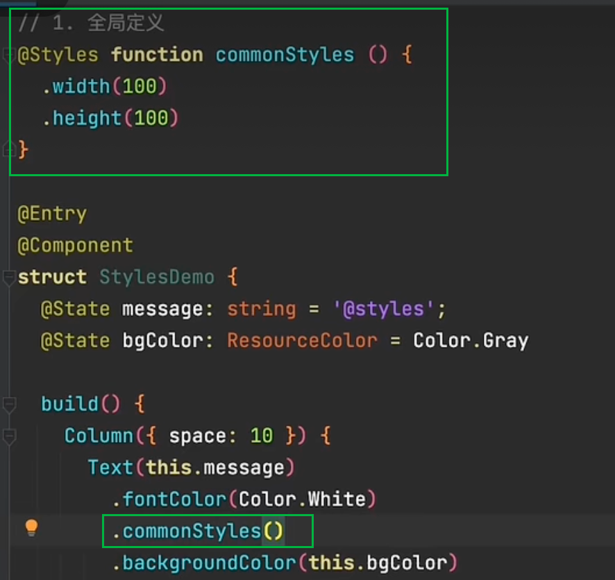
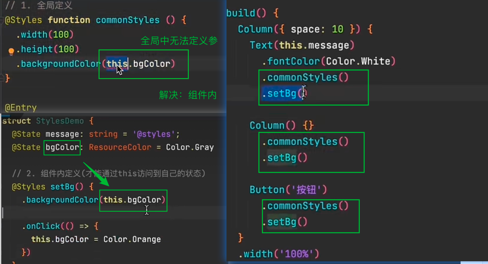
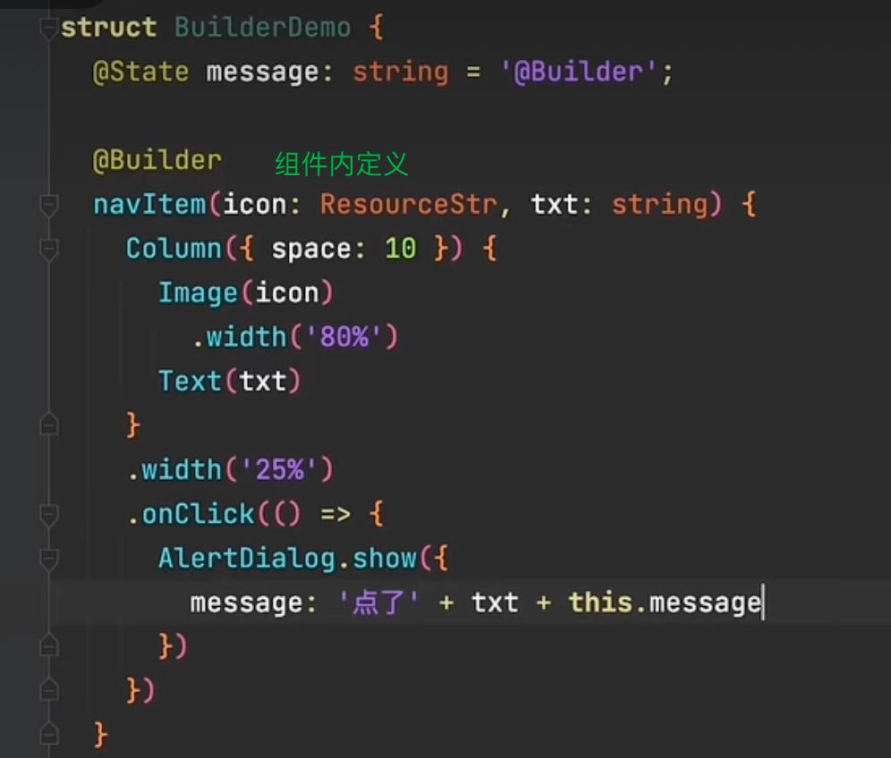

> https://www.bilibili.com/video/BV14t421W7pA?spm_id_from=333.788.videopod.episodes&vd_source=45b1ea5d80a271b24029deadc0c69379&p=78
>
> 

# @Extend-侧重组件

---

# @Style-侧重样式

### 分析

### 全局定义

### 组件内定义

---

# @Builder-结构、样式、事件

### 分析

### 全局定义

### 组件内定义

