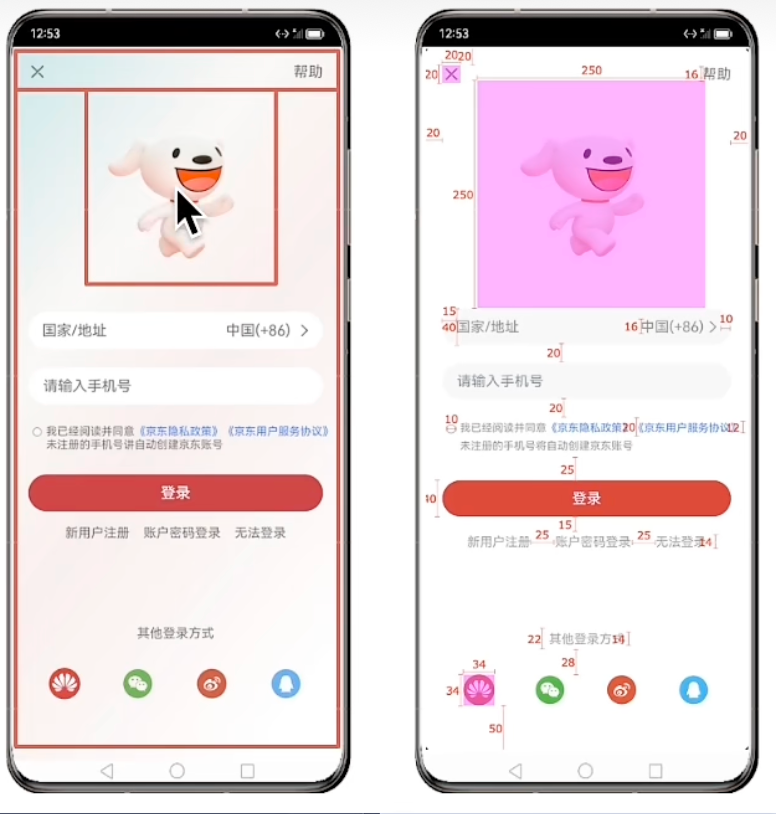
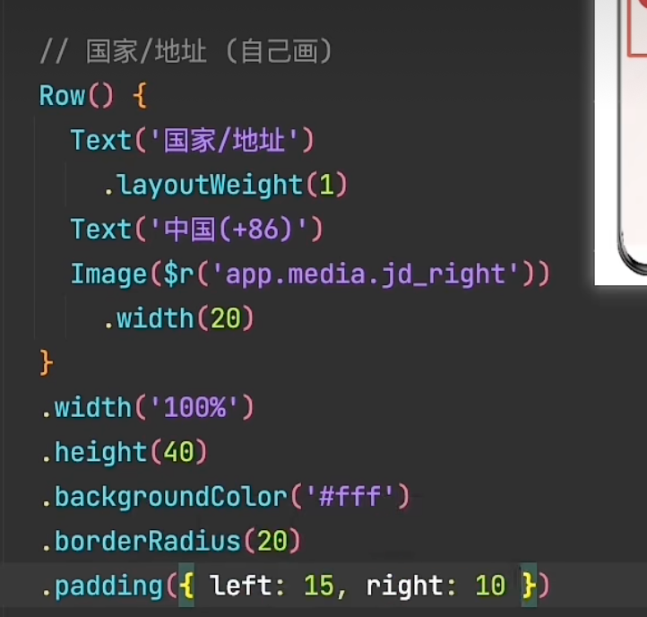
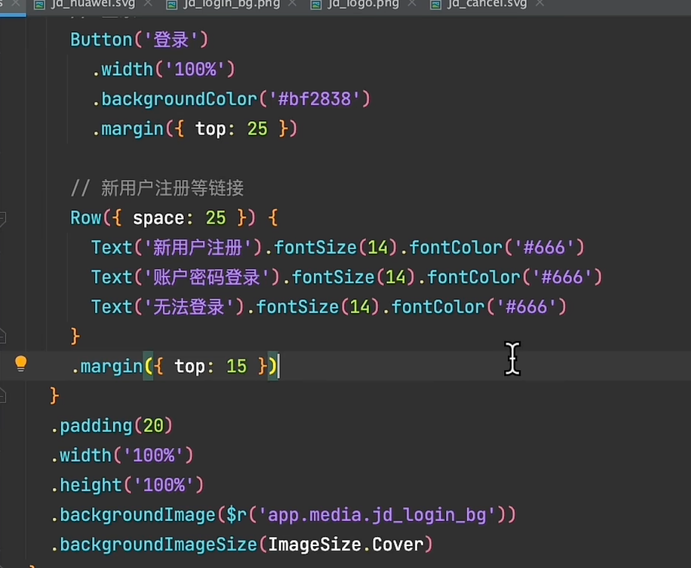
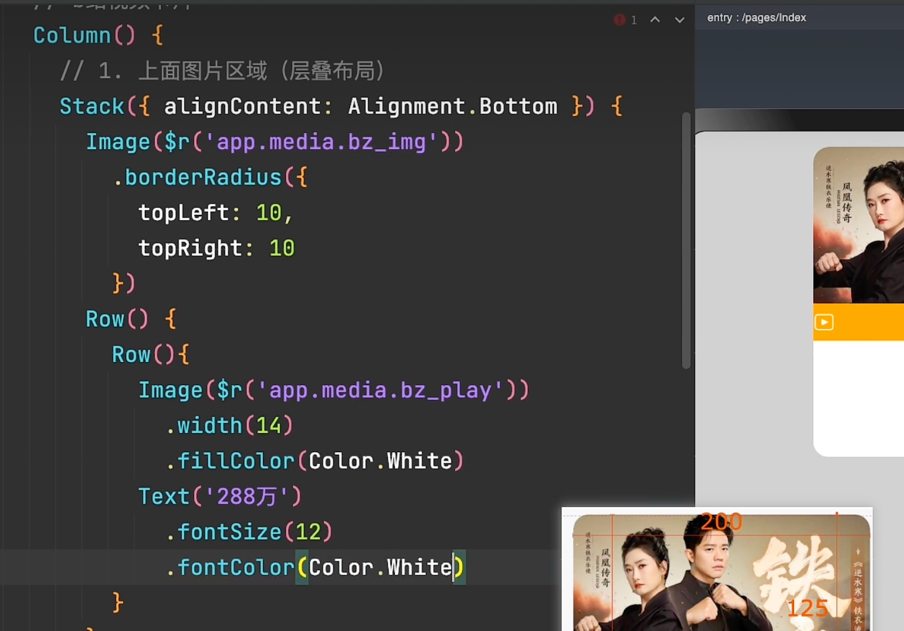
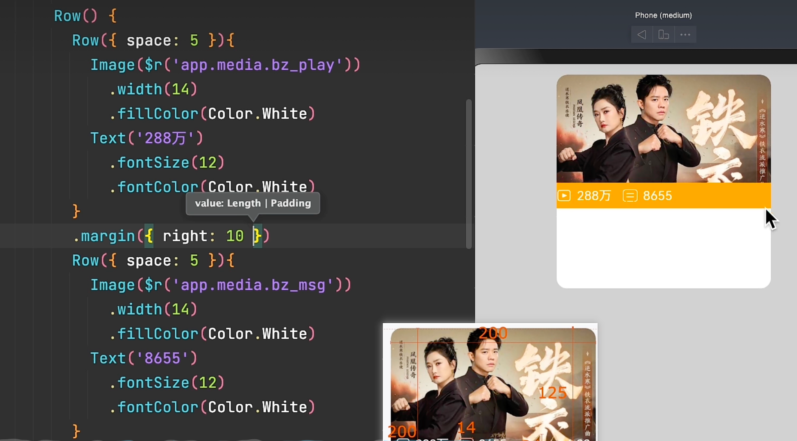
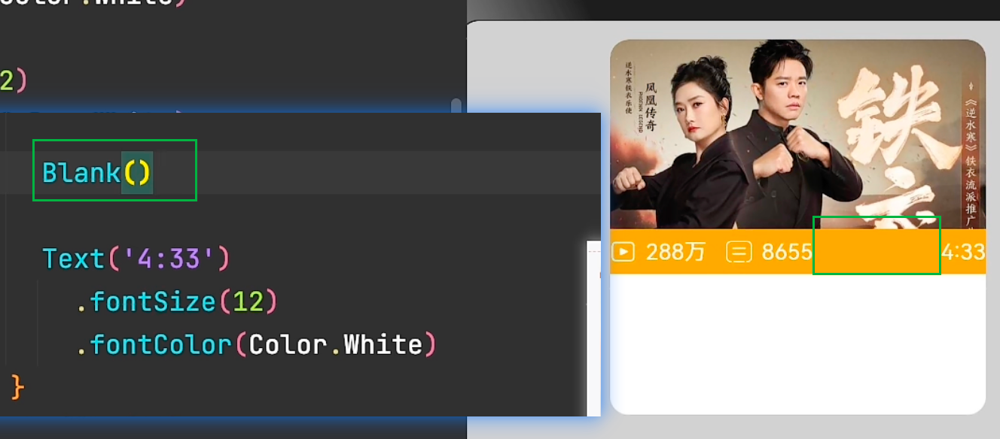
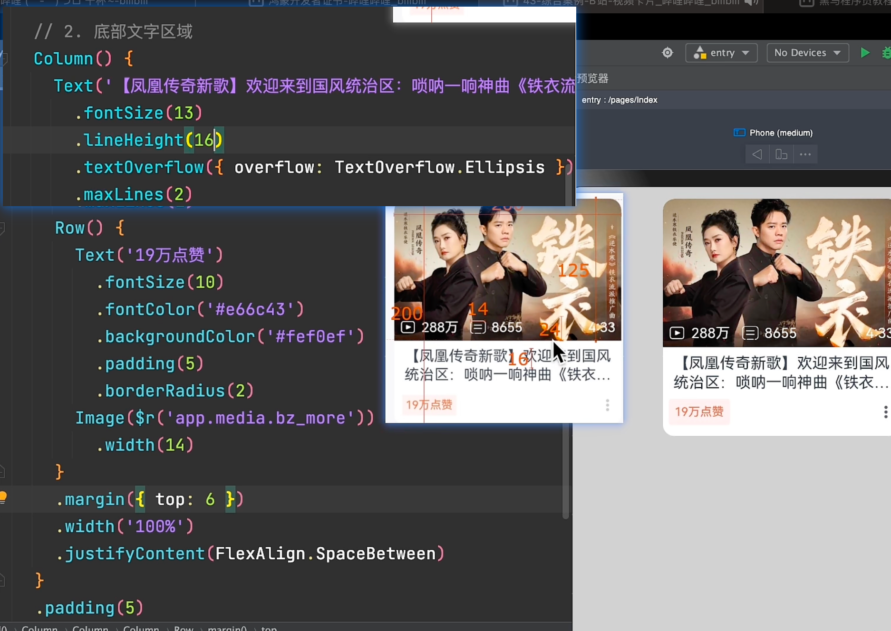
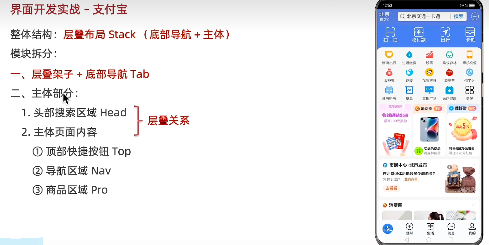
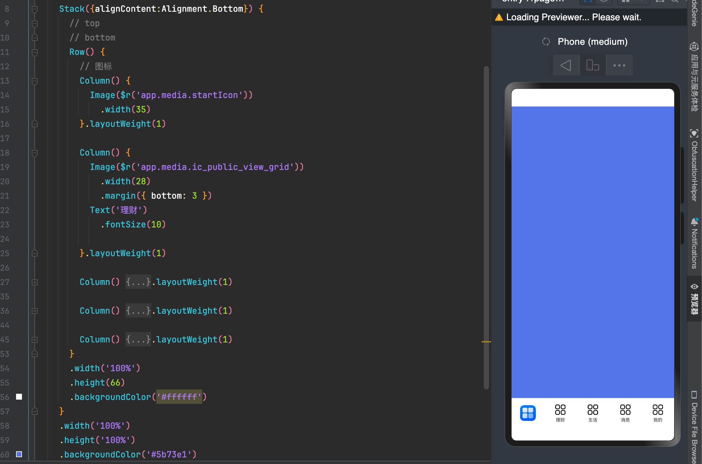
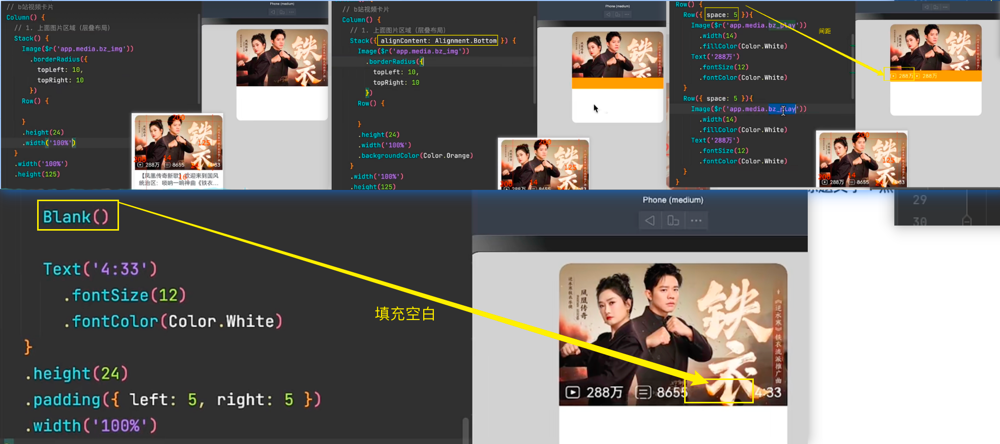

# 1、TodoList


```js
@Entry
@Component
struct Demo3TodoList {
  build () {
    Column() {
      Row() {
        // 左侧
        Column() {
          Text('玩一玩')
            .fontSize(18)
            .fontWeight(700)
          Text('签到兑换 ｜ 超多大奖 超好玩')
        }
        .alignItems(HorizontalAlign.Start)
      //   右侧
        Row() {
          Image($r('app.media.ic_public_view_grid'))
            .width(50)
            .backgroundColor('#ffffff')
            .borderRadius(5)
          Image($r('app.media.ic_public_arrow_right'))
            .width(20)
            .backgroundColor('#ffffff')
            .borderRadius(5)
        }
      }
      .justifyContent(FlexAlign.SpaceBetween)
      .padding({left:15,right:15})
      .width('100%')
      .height(80)
      .backgroundColor('#fff')
      .borderRadius(5)
    }
    .padding(10)
    .backgroundColor('#ccc')
    .borderRadius(5)
    .width('100%')
    .height('100%')
  }
}
```


# 2、ToCard



















----

# 4、总结-实战




```tsx

@Entry
@Component
struct Demo6IndexZFB {
  @State message: string = 'Hello World';

  build() {
    //整体stack布局+底部导航
    //布局顶部的导航和实现主体内容的滚动
    Stack({ alignContent: Alignment.Bottom }) {
      //头部导航
      //头部导航,我们需要让其固定在页面的顶部,
      //直接给stack设置
      Stack({ alignContent: Alignment.Top }) {
        Row() {
          //左
          Column() {
            Row() {
              Text('北京')
                .fontColor('#ffff')

              Image($r('app.media.foreground'))
                .width(20)
                .fillColor('#fff')
            }

            Text('晴27℃')
              .fontSize(12)
              .fontColor('#fff')


          }.padding({
            left: 10,
            right: 10
          })
          .alignItems(HorizontalAlign.Start)

          //中
          Row() {

            Image($r('app.media.foreground'))
              .width(20)
              .margin({
                left: 5,
                right: 5
              })

            Text('北京交通一卡通')
              .fontSize(14)
              .layoutWeight(1)

            Text('搜索')
              .fontColor('#5b73e1')
              .width(55)
              .textAlign(TextAlign.Center)
              .border({
                width: { left: 1 },
                color: '#ccc',
              })
          }.layoutWeight(1)
          .height(32)
          .backgroundColor('#fff')
          .borderRadius(5)

          //右
          Image($r('app.media.foreground'))
            .width(30)
            .margin({ left: 12, right: 10 })
            .fillColor('#fff')

        }
        .width('100%')
        .height(60)
        .backgroundColor('#5b73e1')

        //主体展示区域

        Scroll() {
          Column() {
            //tap快捷导航
            Row(){
              Column(){
                Image($r('app.media.foreground'))
                  .width(36)
                  .fillColor('#fff')
                Text('扫一扫')
                  .fontColor('#fff')
              }.layoutWeight(1)

              Column(){
                Image($r('app.media.foreground'))
                  .width(36)
                  .fillColor('#fff')
                Text('收付款')
                  .fontColor('#fff')
              }.layoutWeight(1)

              Column(){
                Image($r('app.media.foreground'))
                  .width(36)
                  .fillColor('#fff')
                Text('出行')
                  .fontColor('#fff')
              }.layoutWeight(1)

              Column(){
                Image($r('app.media.foreground'))
                  .width(36)
                  .fillColor('#fff')
                Text('卡包')
                  .fontColor('#fff')
              }.layoutWeight(1)

            }.width('100%')
            .backgroundColor('#5b73e1')
            .padding({
              top:5,
              bottom:15
            })

            //中间部分的快捷导航
            Column({space:10}){
              Row(){
                Column({space:8}){
                  Image($r('app.media.foreground'))
                    .width(28)
                  Text('滴滴出行')
                    .fontSize(12)
                    .fontColor('#666')
                }.layoutWeight(1)

                Column({space:8}){
                  Image($r('app.media.foreground'))
                    .width(28)
                  Text('滴滴出行')
                    .fontSize(12)
                    .fontColor('#666')
                }.layoutWeight(1)

                Column({space:8}){
                  Image($r('app.media.foreground'))
                    .width(28)
                  Text('滴滴出行')
                    .fontSize(12)
                    .fontColor('#666')
                }.layoutWeight(1)

                Column({space:8}){
                  Image($r('app.media.foreground'))
                    .width(28)
                  Text('滴滴出行')
                    .fontSize(12)
                    .fontColor('#666')
                }.layoutWeight(1)

                Column({space:8}){
                  Image($r('app.media.foreground'))
                    .width(28)
                  Text('滴滴出行')
                    .fontSize(12)
                    .fontColor('#666')
                }.layoutWeight(1)

              }
              .padding({left:10,right:10})

              Row(){
                Column({space:8}){
                  Image($r('app.media.foreground'))
                    .width(28)
                  Text('滴滴出行')
                    .fontSize(12)
                    .fontColor('#666')
                }.layoutWeight(1)

                Column({space:8}){
                  Image($r('app.media.foreground'))
                    .width(28)
                  Text('滴滴出行')
                    .fontSize(12)
                    .fontColor('#666')
                }.layoutWeight(1)

                Column({space:8}){
                  Image($r('app.media.foreground'))
                    .width(28)
                  Text('滴滴出行')
                    .fontSize(12)
                    .fontColor('#666')
                }.layoutWeight(1)

                Column({space:8}){
                  Image($r('app.media.foreground'))
                    .width(28)
                  Text('滴滴出行')
                    .fontSize(12)
                    .fontColor('#666')
                }.layoutWeight(1)

                Column({space:8}){
                  Image($r('app.media.foreground'))
                    .width(28)
                  Text('滴滴出行')
                    .fontSize(12)
                    .fontColor('#666')
                }.layoutWeight(1)

              }
              .padding({left:10,right:10})

              Row(){
                Column({space:8}){
                  Image($r('app.media.foreground'))
                    .width(28)
                  Text('滴滴出行')
                    .fontSize(12)
                    .fontColor('#666')
                }.layoutWeight(1)

                Column({space:8}){
                  Image($r('app.media.foreground'))
                    .width(28)
                  Text('滴滴出行')
                    .fontSize(12)
                    .fontColor('#666')
                }.layoutWeight(1)

                Column({space:8}){
                  Image($r('app.media.foreground'))
                    .width(28)
                  Text('滴滴出行')
                    .fontSize(12)
                    .fontColor('#666')
                }.layoutWeight(1)

                Column({space:8}){
                  Image($r('app.media.foreground'))
                    .width(28)
                  Text('滴滴出行')
                    .fontSize(12)
                    .fontColor('#666')
                }.layoutWeight(1)

                Column({space:8}){
                  Image($r('app.media.foreground'))
                    .width(28)
                  Text('滴滴出行')
                    .fontSize(12)
                    .fontColor('#666')
                }.layoutWeight(1)

              }
              .padding({left:10,right:10})

            }

            .borderRadius({
              topLeft:20,
              topRight:20
            })
            .padding({top:10})

            //装饰图片
            Row({space:5}){
              Image($r('app.media.foreground'))
                .layoutWeight(1)
                .borderRadius(10)

              Image($r('app.media.foreground'))
                .layoutWeight(1)
                .borderRadius(10)

              Image($r('app.media.foreground'))
                .layoutWeight(1)
                .borderRadius(10)
            }

            Image($r('app.media.foreground'))
              .width('100%')
            Image($r('app.media.foreground'))
              .width('100%')


          }
          .width('100%')
          .backgroundColor('#fff')
          .layoutWeight(1)


        }
        .scrollable(ScrollDirection.Vertical)
        //让滚动条一直显示
        .scrollBar(BarState.On)
        .margin({ top: 60, bottom: 60 })


      }
      .width('100%')
      .zIndex(666)


      //底部导航栏
      //底部是一行,选择组件row
      Row() {
        //图标
        Column() {
          Image($r('app.media.foreground'))
            .width(35)
        }
        .layoutWeight(1)

        Column() {
          Image($r('app.media.foreground'))
            .width(28)
            .margin({ bottom: 3 })
          Text('理财')
            .fontSize(10)

        }.layoutWeight(1)


        Column() {
          Image($r('app.media.foreground'))
            .width(28)
            .margin({ bottom: 3 })

          Text('生活')
            .fontSize(10)

        }.layoutWeight(1)


        Column() {
          Image($r('app.media.foreground'))
            .margin({ bottom: 3 })
            .width(28)
          Text('消息')
            .fontSize(10)

        }.layoutWeight(1)

        Column() {
          Image($r('app.media.foreground'))
            .margin({ bottom: 3 })
            .width(28)
          Text('我的')
            .fontSize(10)

        }.layoutWeight(1)

      }.width('100%')
      .height('100%')
      .height(60)
      .backgroundColor('#ccc')

    }
    .width('100%')
    .height('100%')
    .backgroundColor('#5b73e1')
  }
}

```


## bottom




```tsx
@Entry
@Component
struct Demo6IndexZFB {
  build() {
    // 1、整理Stack布局 + 底部tab
    // 2、主体：头部+主体页面面（层叠关系、主体页面）
    // 3、 Column/Row ,默认不具备可滚动的效果 == Scroll
    Stack({alignContent:Alignment.Bottom}) {
      // top
      // bottom
      Row() {
        // 图标
        Column() {
          Image($r('app.media.startIcon'))
            .width(35)
        }.layoutWeight(1)

        Column() {
          Image($r('app.media.ic_public_view_grid'))
            .width(28)
            .margin({ bottom: 3 })
          Text('理财')
            .fontSize(10)

        }.layoutWeight(1)

        Column() {
          Image($r('app.media.ic_public_view_grid'))
            .width(28)
            .margin({ bottom: 3 })
          Text('生活')
            .fontSize(10)

        }.layoutWeight(1)

        Column() {
          Image($r('app.media.ic_public_view_grid'))
            .width(28)
            .margin({ bottom: 3 })
          Text('消息')
            .fontSize(10)

        }.layoutWeight(1)

        Column() {
          Image($r('app.media.ic_public_view_grid'))
            .width(28)
            .margin({ bottom: 3 })
          Text('我的')
            .fontSize(10)

        }.layoutWeight(1)
      }
      .width('100%')
      .height(66)
      .backgroundColor('#ffffff')
    }
    .width('100%')
    .height('100%')
    .backgroundColor('#5b73e1')
  }
}
```


​	


# 布局案例





