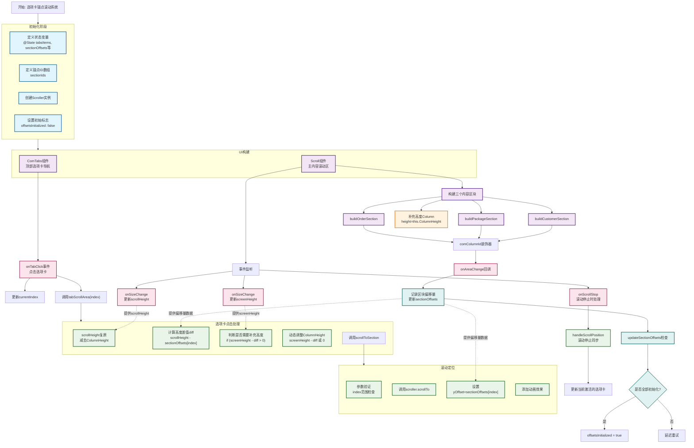
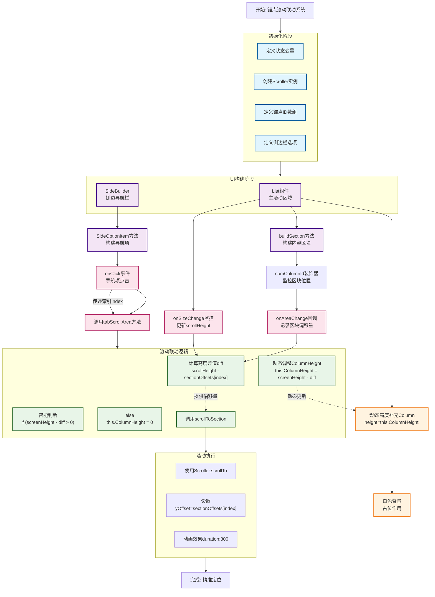
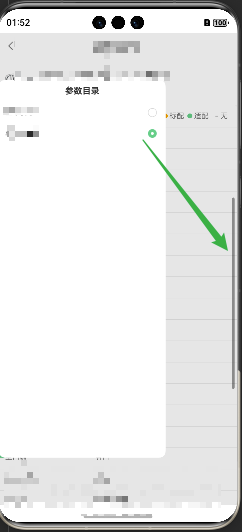

# 需求

| 需求                                    |
| --------------------------------------- |
| 1、滚动的时候，自动的切换到对应的tab栏  |
| 2、点击的时候，页面自动滚动到对应的高度 |
|                                         |

## 一、自动的切换到对应的tab栏

### 1、实现思路




### 2、代码实现

#### 1)`CustomerPage.ets`

《进入系统-客户管理-客户资料》`src/main/ets/pages/CustomerPage/CustomerPage.ets`


```tsx
	
  @State tabsItems: string[] = ['客户资料', '套餐管理', '近期单据']; 
// 内容区域锚点标识（与导航项顺序对应）
  private readonly sectionIds: string[] = [
    'customerSection',
    'packageSection',
    'orderSection'
  ]
  // 区块偏移量存储（单位：vp）
  @State private sectionOffsets: number[] = [];
  // 标记 sectionOffsets 是否已经初始化
  @State private offsetsInitialized: boolean = false;
  @State ColumnHeight: number = 0
  @State scrollHeight: number = 0
  @State screenHeight: number = 0
```


```tsx
 // 导航选项卡
 ComTabs({
          tabsItems: this.tabsItems,
          currentIndex: $currentTabIndex,
          onTabClick: (index: number) => {
            this.currentIndex = index;
            this.tabScrollArea(index)
          }
        })       

// 内容滚动区
Scroll(this.scroller) {
  Column(){
    // 客户资料
    this.buildCustomerSection()
    // 套餐管理
    this.buildPackageSection()
    // 近期单据
    this.buildOrderSection()
    
    // 补充高度
   	Column().width('100%').height(this.ColumnHeight).backgroundColor(Color.White)
  }
  				.width('100%')
          .onSizeChange((oldValue: SizeOptions, newValue: SizeOptions) => {
            // console.info(`Ace: on size change, oldValue is ${JSON.stringify(oldValue)} value is ${JSON.stringify(newValue)}`)
            this.scrollHeight = newValue.height as number
          })
}
				.scrollable(ScrollDirection.Vertical)
        .scrollBar(BarState.Auto)
        .edgeEffect(EdgeEffect.Spring)
        .onSizeChange((oldValue: SizeOptions, newValue: SizeOptions) => {
          // console.info(`Ace1: on size change, oldValue is ${JSON.stringify(oldValue)} value is ${JSON.stringify(newValue)}`)
          this.screenHeight = newValue.height as number
        })
			 .onDidScroll((xOffset: number, yOffset: number) => { // 滚动事件回调，Scroll滚动时触发。
          // // 滚动过程中持续监听位置变化
          // console.log('yOffset',yOffset)
          // this.handleScrollPosition(yOffset);
        })
        .onScrollStop(() => {
          // 滚动停止时再次确认位置，确保状态准确
          const yOffset = this.scroller.currentOffset().yOffset;
          console.log('yOffset', yOffset)
          this.handleScrollPosition(yOffset);
        })


@Builder
buildCustomerSection() {
  this.comColumnId('customerSection')
}

@Builder
buildPackageSection() {
  this.comColumnId('packageSection')
}

@Builder
buildOrderSection() {
  this.comColumnId('orderSection')
}

```

```tsx
// 滚动定位
  private scrollToSection(index: number) {
    console.log('1', index)
    if (index >= 0 && index < this.sectionOffsets.length) {
      console.log('2', this.scroller.scrollTo, this.sectionOffsets[index])
      this.scroller.scrollTo({
        xOffset: 0,  // 必须显式声明x轴偏移量
        yOffset: this.sectionOffsets[index],
        animation: {  // 可选动画参数
          duration: 300,
          curve: curves.initCurve()
        }
      });
    }
  }

// 处理tab点击区域滚动联动
  private tabScrollArea(index: number) {
    this.scrollHeight = this.scrollHeight - this.ColumnHeight; // scroll高度复原
    let diff = this.scrollHeight - this.sectionOffsets[index]; // 高度差值计算

    if (this.screenHeight - diff > 0) {
      this.ColumnHeight = this.screenHeight - diff // Column4 的容器高度补充
    } else {
      this.ColumnHeight = 0
    }
    console.log('scrollHeight', this.scrollHeight, 'ColumnHeight', this.ColumnHeight, 'diff', diff)
    this.scrollToSection(index);
  }

  private updateSectionOffsets() {
    // 增加等待时间，确保布局加载完成
    setTimeout(() => {
      // 移除使用 this.$ 的部分，因为不存在该属性
      if (this.sectionOffsets.length === this.sectionIds.length &&
      this.sectionOffsets.every(offset => offset > 0)) {
        this.offsetsInitialized = true;
        console.log('sectionOffsets 初始化完成');
      } else {
        console.log('sectionOffsets 未完全初始化', this.sectionOffsets);
      }
    }, 1000);
  }
```


----


## 二、自动滚动到对应的高度

### 1、实现思路




### 2、代码实现

#### 1) ` VehicleInfoPage.ets`

查询-车型数据 `src/main/ets/pages/QueryPage/VehicleInfoPage/VehicleInfoPage.ets`



```tsx
// 定义状态变量、创建Scroller实例、定义锚点ID数组、定义侧边栏选项

@State scrollHeight: number = 0
@State screenHeight: number = 0
private scroller: Scroller = new Scroller();

// 区块偏移量存储（单位：vp）
@State private sectionOffsets: number[] = [];
// 内容区域锚点标识（与导航项顺序对应）
private readonly sectionIds: string[] = ['Section1', 'Section2']
private sideOptions = [
    { name: '基本信息', key: 'basic' },
    { name: '车身信息', key: 'body' }
] as FinanceParams[];

```

```tsx
// UI构建阶段：SideBuilder侧边导航栏、List组件<br/>主滚动区域
List({ scroller: this.scroller }) {
  ListItem() {
    Column() {
      this.buildSection({
        comColumnId: 'Section1',
      })
      this.buildSection({
  			comColumnId: 'Section2',
			})
      // 关键优化部分-补充高度：滚动到最下面位子不够的时候，可以撑起来
     	Column().width('100%').height(this.ColumnHeight).backgroundColor(Color.White)
    }
    .onSizeChange((oldValue: SizeOptions, newValue: SizeOptions) => {
 			this.scrollHeight = newValue.height as number
     })
  }
}


@Builder
BuilderSide() {
  Column() {
   ForEach(this.sideOptions, (option: FinanceParams, index: number) => {
      this.SideOptionItem(option.name, index)
   })         
  }.margin({ top: 20 })
}


@Builder
  SideOptionItem(optionName: string, index: number) {
    Row() {
      Text(optionName)
        .fontSize(12)
        .fontColor(this.chooseSideName === optionName ? Color.Black : '#777777')

      Image(this.chooseSideName === optionName ?
      $r('app.media.btn_simple_danxuan_y_2x') :
      $r('app.media.btn_simple_danxuan_n_2x')
      )
        .width(14)
        .height('auto')
        .margin({ right: 5 })
    }
    .width('100%')
    .justifyContent(FlexAlign.SpaceBetween)
    .margin({ bottom: 20 })
    .onClick(() => {
      this.chooseSideName = optionName;
      this.tabScrollArea(index)
    })
}
```


```tsx
// 实现思路

@Builder
buildSection(sectionObj: FinanceParams) {
   this.comColumnId(sectionObj.comColumnId)
   Column() {
     // 自定义内容
   }
  .id(sectionObj.comColumnId) // 绑定锚点ID
}

// 封装scroll的获取高度方法
@Builder
comColumnId(id: string) {
  Column(){}
   .id(id)
   .onAreaChange((oldArea: Area, newArea: Area) => {
        if (newArea?.globalPosition) {
          const index = this.sectionIds.indexOf(id);
          if (index !== -1) {
            this.sectionOffsets[index] = Number(newArea.position.y);
            // console.log(`${id}偏移量更新:`, this.sectionOffsets[index]);
          }
        }
    })
}
```

```tsx
/**
 * 调用处理
 */

  //  处理tab点击区域的联动
  private tabScrollArea(index: number) {
    console.log('1', index)
    this.scrollHeight = this.scrollHeight - this.ColumnHeight; // scroll高度复原
    let diff = this.scrollHeight - this.sectionOffsets[index]; // 高度差值计算

    if (this.screenHeight - diff > 0) {
      this.ColumnHeight = this.screenHeight - diff // Column4 的容器高度补充
    } else {
      this.ColumnHeight = 0
    }
    this.scrollToSection(index);
  }

  // 滚动定位
  private scrollToSection(index: number) {
    // console.log('1',index)
    if (index >= 0 && index < this.sectionOffsets.length) {
      // console.log('2',index)
      this.scroller.scrollTo({
        xOffset: 0, // 必须显式声明x轴偏移量
        yOffset: this.sectionOffsets[index],
        animation: {
          // 可选动画参数
          duration: 300,
          curve: curves.initCurve()
        }
      });
    }
  }


```

