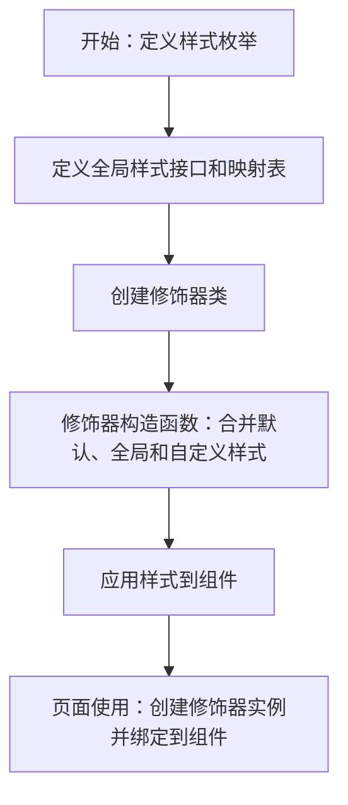

# 0、`Modifier` 模块文件结构

```bash
// Modifier 模块文件结构
src/
└── main/
    └── ets/
        └── common/          // 公共通用模块（全局样式、修饰器、枚举等）
            └── modifier/    // 样式修饰器专属目录（核心：统一管理组件样式逻辑）
                ├── enum.ts                  // 样式名称枚举（如GlobalTextStyleName/GlobalRowStyleName）
                ├── GlobalStyles.ets         // 全局样式配置（样式接口+默认样式映射表）
                ├── ModifierIndex.ets        // 修饰器实现类（TextModifier/RowBtnModifier核心逻辑）
```

### ` └── enum.ts `样式名称枚举

```tsx
// ========== 全局Text样式枚举 ==========
export enum GlobalEnumText {
  TextStyle1 = 'TextStyle1', // 主按钮文字样式
  TextStyle2 = 'TextStyle2', // 次要按钮文字样式
}
```

### ` └── GlobalStyles.ets  `全局样式配置

```tsx
// ========== 全局Text样式配置（集中管理所有Text样式） ==========

import { GlobalEnumText,GlobalEnumRow,GlobalEnumBtn } from './enum'
import { LabelMarginOptions } from '@kit.ArkUI';

// 全局Text样式接 口（替代内联对象类型）
export interface GlobalTextStyleConfig {
  fontSize?: number;
  width?: Length;
  margin?: LabelMarginOptions;
  borderWidth?: number;
  borderRadius?: Length;
  textAlign?: TextAlign;
  padding?: Length;
  fontColor?:Resource | string;
  borderColor?: Resource | string;
  textColor?:Resource | string;
  backgroundColor?: Resource | string;
}

export const GlobalTextStyles: Record<GlobalEnumText,GlobalTextStyleConfig> = {
  // 样式1：确定按钮（橙色背景+白色文字）
  [GlobalEnumText.TextStyle1]: {
    fontColor:$r('app.color.colorFf'),
    borderColor:$r('app.color.primary'),
    backgroundColor: $r('app.color.primary')
  },
  // 样式2：取消按钮(边框#ccc)
  [GlobalEnumText.TextStyle2]: {
    borderWidth: 1,
    fontColor:  '#5a5f63' ,  // 取消按钮：灰色文字
    borderColor:$r('app.color.colorCc'),// 取消按钮：灰色边框
  },
};
```


### ` └── ModifierIndex.ets`修饰器实现类

```tsx
import {
  GlobalTextStyles,
  GlobalTextStyleConfig, // 导入显式接口
} from './GlobalStyles';
import { GlobalEnumText,GlobalEnumRow,GlobalEnumBtn } from './enum'

/**
 * 全局文字样式
 */
export class TextModifier implements AttributeModifier<TextAttribute> {
  private textConfig: GlobalTextStyleConfig;       // Text文字样式
  
  // text统一样式处理
  private baseTextConfig:GlobalTextStyleConfig = {
      fontSize: 14,
      padding: 10,
      margin: { left: 5, right: 5 },
      borderRadius: 20,
      textAlign: TextAlign.Center
  }  
  
  constructor(params:TextModifierParams) {
    const typeConfig = GlobalTextStyles[params.textStyleName] || EMPTY_TEXT_STYLE;
    // 合并：全局样式 + 自定义样式（优先级：自定义 > 全局）
    this.textConfig = Util.assign(
      {},
      this.baseTextConfig,
      typeConfig,
      params.customTextStyle || EMPTY_TEXT_STYLE
    );
  }
  
  // 应用默认态样式
  applyNormalAttribute(instance: TextAttribute): void {
    instance
      .border({
        width: this.textConfig.borderWidth,
        color: this.textConfig.borderColor
      })
      .fontSize(this.textConfig.fontSize!)
      .fontColor(this.textConfig.fontColor!)
      .width(this.textConfig.width!)
      .margin(this.textConfig.margin!)
      .padding(this.textConfig.padding!)
      .borderRadius(this.textConfig.borderRadius || 0)
      .backgroundColor(this.textConfig.backgroundColor!)
      .textAlign(TextAlign.Center);
  }
}
```


# 1、使用


```tsx
// 外部页面引入（简洁）
 import { TextModifier, GlobalTextStyleName } from '../common/modifier/index';

  private TextModifier1: TextModifier = new TextModifier({
    textStyleName: GlobalEnumText.TextStyle1,
    customTextStyle: {
      width: '40%'
    }
  })
  private TextModifier2: TextModifier = new TextModifier({
    textStyleName: GlobalEnumText.TextStyle2,
    customTextStyle: {
      width: '40%'
    }
  })

	Row() {
    Text('取消').attributeModifier(this.TextModifier2)
    Text('确定').attributeModifier(this.TextModifier1)
  }.padding(10).width('100%').justifyContent(FlexAlign.SpaceBetween)
```


