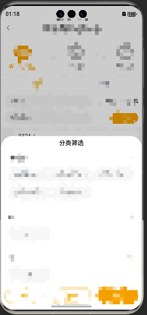
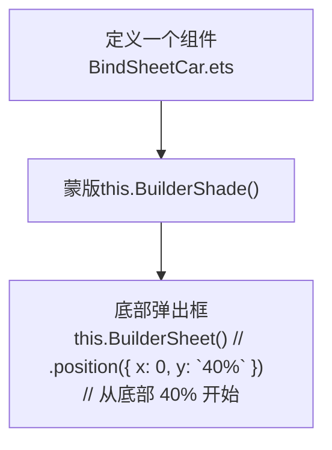
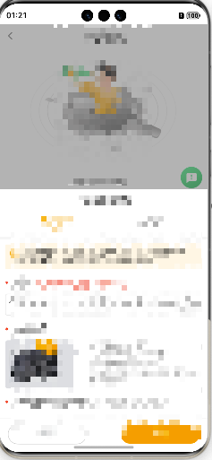
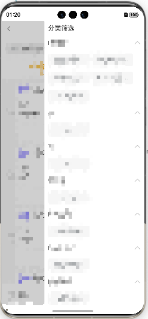

# 方案选用

| 方法                     | 优点                   | 缺点                            |
| :----------------------- | :--------------------- | :------------------------------ |
| **bindSheet **           | 简单，官方支持         | **预览在 sheet 内部，位置受限** |
| **自定义底部弹框**       | **预览**等功能完全可控 | 需要自己实现动画和交互          |
| **侧边SideBarContainer** | 官方支持               |                                 |


----


# 一、绑定模态页面bindSheet

### 1、思路

[绑定半模态页面（bindSheet）](https://developer.huawei.com/consumer/cn/doc/harmonyos-guides-V5/arkts-sheet-page-V5)


### 2、代码实现

#### 1）`LoopEditRulePage.ets`

选择循环进店活动`src/main/ets/view/UserView/page/MarketingPage/LoopEditRulePage.ets`




```tsx
// 简单调用
Row()
.onClick(() => {
  this.showPanel = true
})
.bindSheet($$this.showPanel, this.MyBuilder(), {
  height: '60%',
  showClose: false, // 按钮隐藏      
  backgroundColor: $r('app.color.colorF6'),      
  onWillAppear: () => {},      
 	onAppear: () => { // console.log("BindSheet onAppear.")},       
  onWillDisappear: () => {// console.log("BindSheet onWillDisappear.")},      
  onDisappear: () => {// console.log("BindSheet onDisappear.")}      
}) 

@Builder
  /* 弹框 */
  MyBuilder() {
    Column() {
       Text('分类筛选').fontWeight(FontWeight.Bold).fontSize(17)
       List({ space: 20, initialIndex: 0 }) {}
    }
    .backgroundColor('#ffffff')
    .padding(10)
    .width('100%')
    .height('100%')
  }
```


---


# 二、自定义底部弹框

### 1、思路



### 2、代码实现

#### 1）`BindSheetCar.ets`

1、车型缺失反馈 `src/main/ets/pages/QueryPage/QueryCarVehicleListPage/components/BindSheetCar.ets`



```tsx
@Component
export default struct BindSheetCar {

  build() {
    Stack() {
     this.BuilderShade() // 遮罩层
     this.BuilderSheet()  // 底部弹框层
   }
    .zIndex(999)
    .width('100%')
    .height('100%')
    .position({
      right: 0,
      left: 0,
      top: 0,
      bottom: 0
    })
  }

  @Builder // 遮罩层
  BuilderShade() {
    Column()
    .width('100%')
    .height('100%')
    .backgroundColor(Color.Black)
    .opacity(0.3)
    .position({ x: 0, y: 0 })  // 明确绝对定位
    .onClick(() => {
      this.onShade?.()
    })
    .zIndex(100)
    .transition(TransitionEffect.opacity(0.5))
  }
	
  @Builder // 底部弹框层
  BuilderSheet() {
    Column() {
       // 内容自定义（可做插槽/也可直接定义各种组件）
     }
     .width('100%')
     .height('auto')
     .backgroundColor($r('app.color.colorF6'))
     .position({ x: 0, y: `40%` })  // 从底部 40% 开始
     .animation({
       duration: 300,
       curve: Curve.EaseOut
     })
     .borderRadius({ topLeft:20,topRight:20 })
     .zIndex(200)
  }
}

```

```tsx
// BindSheetCar调用（关键代码）
	.onClick(() => {
   	this.showPanel = true;         
 })
 if (this.showPanel) {
    this.buildSheetContent()
 }

@Builder
  buildSheetContent() {
    // 导航选项卡
    BindSheetCar({
      onShade:() => {
        this.showPanel = false;
      }
    })
  }
```


----


# 三、侧边栏

### 1、思路

[SideBarContainer](https://developer.huawei.com/consumer/cn/doc/harmonyos-references-V5/ts-container-sidebarcontainer-V5)


### 2、代码实现

#### 1）`ProductNameListPage.ets`

品名设置`src/main/ets/view/UserView/page/ProductNamePage/ProductNameListPage.ets`




```tsx
if (this.showSideBar) {
    this.builderSideBarContainer()
}
@Builder
builderSideBarContainer() {
  Column(){
    SideBarContainer(SideBarContainerType.Overlay) {
      
    }
      .showControlButton(false) // 设置是否显示控制按钮。
    	.sideBarWidth('70%')
      .sideBarPosition(SideBarPosition.End)
      .minSideBarWidth(50)
      .maxSideBarWidth(300)
      .minContentWidth(0)
      .onChange((value: boolean) => {
        console.info('status:' + value)
      })
      .divider({
        strokeWidth: 1,
        color: $r('app.color.color19'),
        startMargin: '4vp',
        endMargin: '4vp'
      })
      .showSideBar(this.showSideBar)
    
  }
  	.zIndex(9999)
    .position({
      top: 0,
      bottom: 0,
      right: 0
    })
    .width('100%')
    .height('100%')
    .backgroundColor($r('app.color.color19'))
}
```


