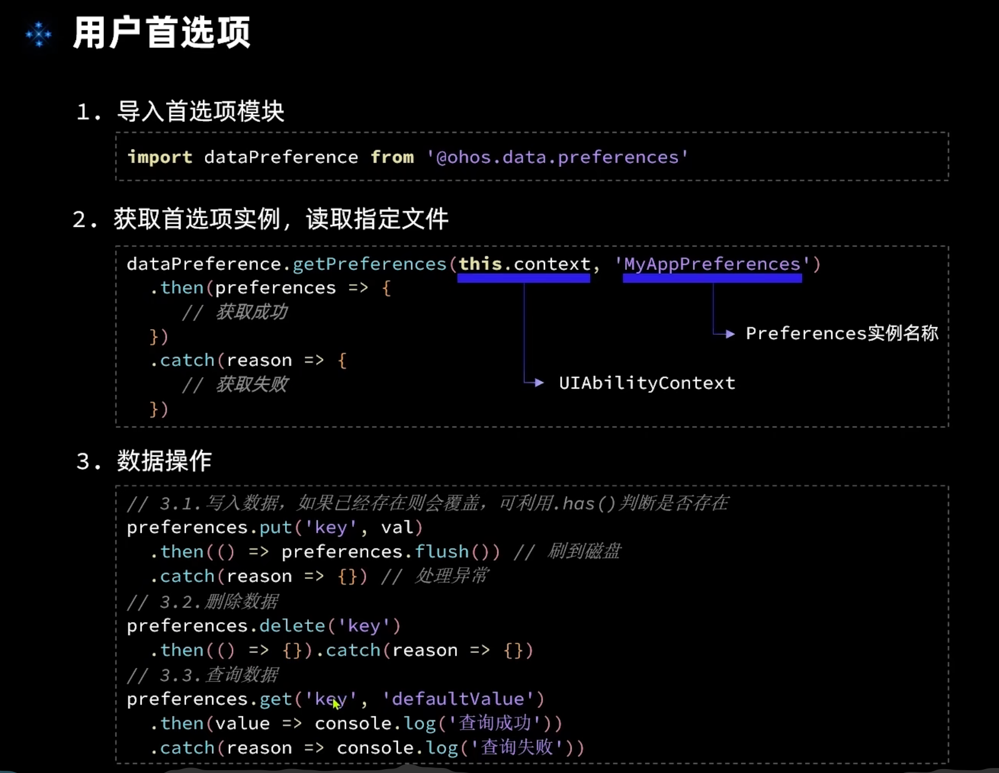
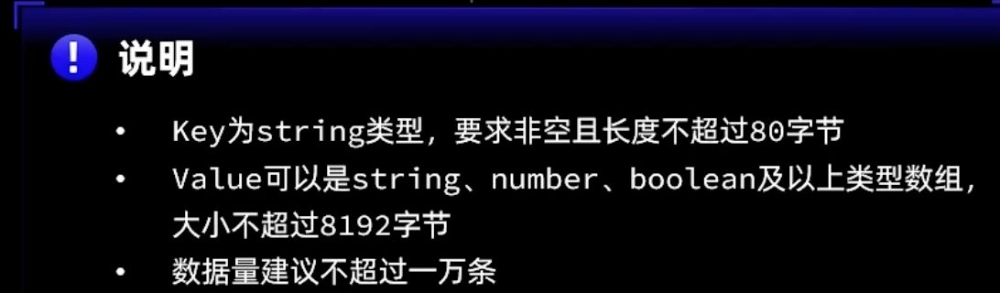
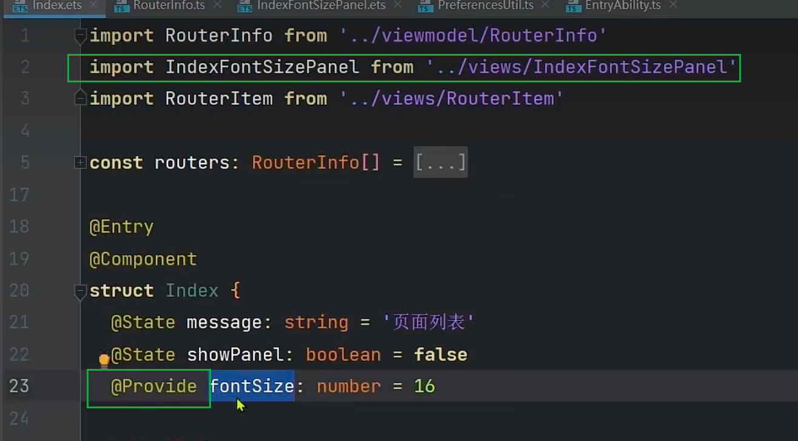
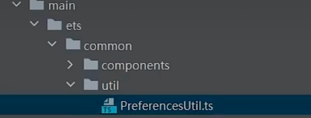
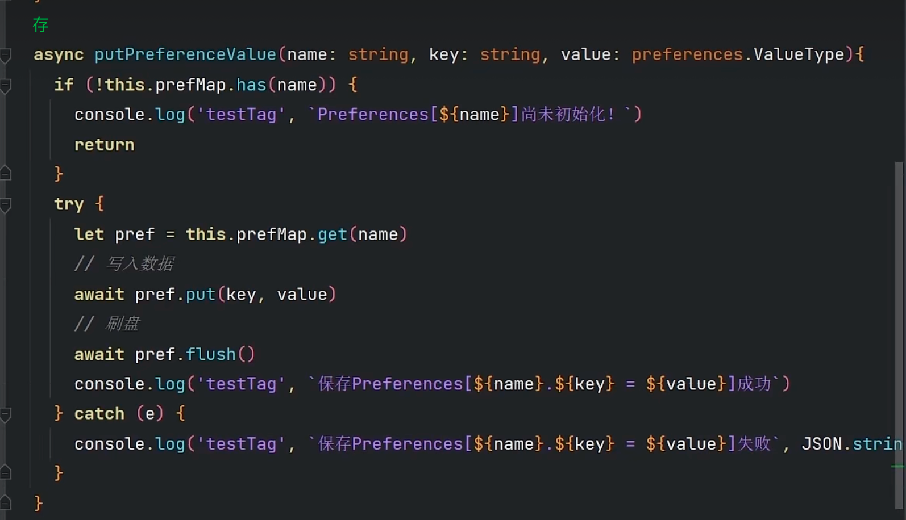
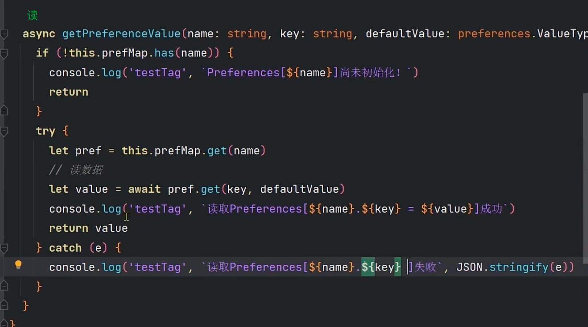
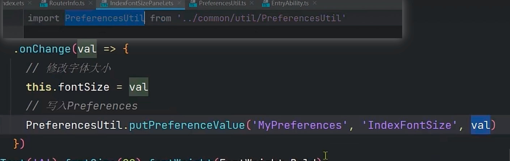
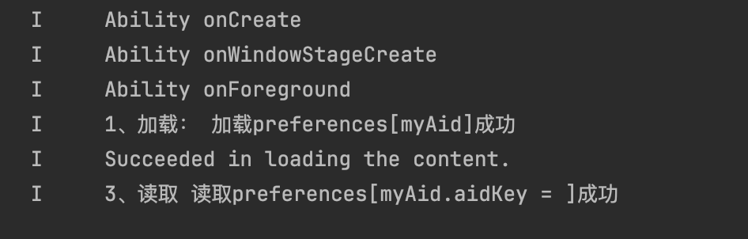

## 父子双向绑定@Consume/@Provide





## 使用首选项



### 加载获取实例


### 操作






### 使用-项目启动时


##### 一进入首页就去调用





##### ——模拟器重启，这个字体的大小就被保留下来了


# 用户首选项-存储Aid



## 1、封装`PreferencesUtil.ts`

```ts
// utils/PreferencesUtil.ts
import preferences from '@ohos.data.preferences';

class PreferencesUtil {
  //   加载实例
  prefMap:Map<string,preferences.Preferences> = new Map()

  // 同步写法
  async loadPreference(context,name:string) {
    try {
      let pre = await  preferences.getPreferences(context,name)
      this.prefMap.set(name,pre)
      console.log('1、加载：',`加载preferences[${name}]成功`)
    } catch (e) {
      console.log('1、加载：',`加载preferences[${name}]失败`,JSON.stringify(e))
    }

  }

  // 存
  async putPreferenceValue(name:string,key:string,value:preferences.ValueType) {
    // 判断是否存在
    if (!this.prefMap.has(name)) {
      console.log('判断name',`preferences[${name}]没有初始化`)
      return;
    }
    try {
      //   先取
      let pref = this.prefMap.get(name)
      // 写
      await pref.put(key,value)
      //   刷盘
      await pref.flush()
      console.log('2、写入',`保存preferences[${name}.${key} = ${value}]成功`)
    } catch(e) {
      console.log('2、写入',`保存preferences[${name}.${key} = ${value}]失败`,JSON.stringify(e))
    }
  }

  // 读
  async getPreferenceValue(name:string,key:string,defaultValue:preferences.ValueType) {
    // / 判断是否存在
    if (!this.prefMap.has(name)) {
      console.log('判断name',`preferences[${name}]没有初始化`)
      return;
    }
    try {
      //   先取
      let pref = this.prefMap.get(name)
      // 读
      let value =  await pref.get(key,defaultValue)

      console.log('3、读取',`读取preferences[${name}.${key} = ${value}]成功`)
      return value
    } catch(e) {
      console.log('3、读取',`读取preferences[${name}.${key}}]失败`,JSON.stringify(e))
    }

  }

  // 删除单个键值对
  async deletePreferenceKey(name: string, key: string) {
    if (!this.prefMap.has(name)) {
      console.log('判断name', `preferences[${name}]没有初始化`);
      return false;
    }
    try {
      const pref = this.prefMap.get(name);
      await pref.delete(key);
      await pref.flush(); // 立即持久化
      console.log('4、删除', `删除preferences[${name}.${key}]成功`);
      return true;
    } catch (e) {
      console.log('4、删除', `删除preferences[${name}.${key}]失败`, JSON.stringify(e));
      return false;
    }
  }

  // 清空所有数据（保留Preferences实例）
  async clearPreferences(name: string) {
    if (!this.prefMap.has(name)) {
      console.log('判断name', `preferences[${name}]没有初始化`);
      return false;
    }
    try {
      const pref = this.prefMap.get(name);
      await pref.clear();
      await pref.flush();
      console.log('5、清空', `清空preferences[${name}]成功`);
      return true;
    } catch (e) {
      console.log('5、清空', `清空preferences[${name}]失败`, JSON.stringify(e));
      return false;
    }
  }
}
const preferencesUtil = new PreferencesUtil()
export  default preferencesUtil as PreferencesUtil
```

## 2、 `EntryAbility.ets`启动加载

```tsx
// EntryAbility.ets
import PreferencesUtil from '../common/util/PreferenceUtil';

export default class EntryAbility extends UIAbility {
  async onCreate(want: Want, launchParam: AbilityConstant.LaunchParam){

    this.context.getApplicationContext().setColorMode(ConfigurationConstant.ColorMode.COLOR_MODE_NOT_SET);
    hilog.info(DOMAIN, 'testTag', '%{public}s', 'Ability onCreate');

    // 加载实例
    await PreferencesUtil.loadPreference(this.context,'myAid')

  }


}
```

## 3、读和存的使用

```tsx
// Index.ets 测试使用读和存
import { router } from '@kit.ArkUI'
import promptAction from '@ohos.promptAction';
import UserRegModel from '../model/UserRegModel'; // 引入接口文件

import PreferencesUtil from '../common/util/PreferenceUtil';


@Entry
@Component
struct HttpExample {
  @State responseData: string = '等待响应...';
  @State curMyAid:string = ''

  async aboutToAppear() {
    // 读
    let isAgree = await PreferencesUtil.getPreferenceValue('myAid','aidKey','') as string

    if (isAgree) {
      promptAction.showToast({ message: '已登录MyPreferences！！！' });
      setTimeout(() => {
        router.pushUrl({url:'pages/HomePage'})
      },1500)
    } else {
      promptAction.showToast({ message: '没登录，请发送请求，MyPreferences！！！' });
    }
  }
  // 发起POST请求
  private async postRequest() {
    // 存
    PreferencesUtil.putPreferenceValue('myAid','aidKey','18959808131')

    setTimeout(() => {
      router.pushUrl({url:'pages/MinePage'})
    },1500)
    return;
    const res = await UserRegModel.login({
      mobilePhone: '18959808131',
      psword: '111111',
      terminal: 'App',
      device: 'App',
      appVersion: '2.22.230202.51',
      inner: '1'
    });

    if (res.code === 200) {
      this.responseData = JSON.stringify(res.data);
      promptAction.showToast({ message: '登录成功' });
    } else {
      promptAction.showToast({ message: `失败：${res.msg}` });
    }
  }

  build() {
    Column({ space: 20 }) {
      Text(this.responseData)
        .fontSize(16)
        .textAlign(TextAlign.Center)

      Button('发送POST请求')
        .width('60%')
        .height(40)
        .onClick(() => this.postRequest())
    }
    .width('100%')
    .padding(20)
  }
}

```

## 4、退出删除

```tsx
/**
 * 我的 MinePage.ets 
 * logout()退出清除
 */
import { UserInfoType,INIT_USER_INFO } from '../common/types'
import { router } from '@kit.ArkUI';
import preferencesUtil from '../common/util/PreferenceUtil';
import promptAction from '@ohos.promptAction';
interface typeMyList {
  avatar?:string,
  name?:string,
  phone?:string,
  icon?:string;
  title?:string
  url?:string
}
@Entry
@Component
struct MinePage {
  @StorageLink('userInfo') userInfo: UserInfoType = {};

  @State MyListData:typeMyList[] = [
    {icon:'ic_simple_person_xmm',title:'设置新密码',url:'view/MineView/SetNewPassWord'},
    {icon:'ic_person_about',title:'关于我们',url:'view/MineView/AboutUs'},
    {icon:'ic_person_privacy',title:'隐私政策',url:''},
    {icon:'ic_simple_person_zx',title:'删除账号与账号数据'},
    {icon:'ic_simple_person_dqbb',title:'当前版本'},
  ]
  @State mineUserInfo:typeMyList = {}

  async aboutToAppear() {
    // 安全访问可选属性
    const safeUserInfo: UserInfoType = this.userInfo || {};

    // 使用类型断言确保结构完整
    this.mineUserInfo = {
      avatar: safeUserInfo.headImg,
      name: safeUserInfo.name?.trim() || '暂无',
      phone: safeUserInfo.phone?.replace(/\D/g, '') || '暂无'
    };
  }
  private async logout() {

    // // 删除单个键值对
    // const deleteSuccess = await preferencesUtil.deletePreferenceKey('myAid','aidKey');
    // if (deleteSuccess) {
    //   promptAction.showToast({ message: '令牌已删除' });
    // }

    // 清空整个Preferences
    const clearSuccess = await preferencesUtil.clearPreferences('myAid');
    if (clearSuccess) {
      promptAction.showToast({ message: '用户数据已清空' });
    }

    // 清除运行时数据
    // AppStorage.SetOrCreate<string>('curAid', '');
    // this.curAid = '';
  }
    build() {
    Column() {
      // 顶部图片区域
      Stack() {
        Image($r('app.media.pic_simple_person_topbg'))
          .expandSafeArea([SafeAreaType.SYSTEM], [SafeAreaEdge.TOP])
          .size({ width: '100%', height: 260 })
          .objectFit(ImageFit.Cover);

        Image($r('app.media.ic_svg_back'))
          .size({ width: 24, height: 24 })
          .position({ top: 20, left: 20 })
          .zIndex(1000)
          .onClick(() => {
            // 这里可以添加返回逻辑
            console.log('点击了返回按钮');
          });
        Column() {
          Image(this.mineUserInfo.avatar)
            .size({ width: 60, height: 60 })
            .borderRadius(40)
            .margin({ top: 80 });

          Text(this.mineUserInfo.name)
            .fontColor('#FFFFFF')
            .fontSize(16)
            .fontWeight(FontWeight.Bold)
            .margin({ top: 15 });

          Text(this.mineUserInfo.phone)
            .fontColor('#FFFFFF')
            .fontSize(12)
            .margin({ top: 9.5 });
        }
        .width('100%')
        .position({ top: -45, left: 0, right: 0 });
      }

      Column() {
        Column() {
          ForEach(this.MyListData, (item:typeMyList, index) => {
            this.ListItem(item, index === this.MyListData.length - 1)
          }, (item:typeMyList, index) => `${item.title}_${index}`)
        }

        .padding(12)
        .position({
          top:-90,
          right:0,
          left:0
        })
        .backgroundColor($r('app.color.colorFf'))
        .zIndex(999)
        .width('100%')
        .height('100%')
        .layoutWeight(1)
        .borderRadius(10)
      }
        .padding({left:15,right:15})
        .width('100%')
        .layoutWeight(1)

      Column() {
        // 退出按钮
        Button('退出账号', { type: ButtonType.Normal })
          .size({ width: '100%'})
          .backgroundColor($r('app.color.primary'))
          .borderRadius(20)
          .onClick(() => {
            // 退出登录方法
            this.logout()
            setTimeout(() => {
              router.pushUrl({url:'pages/Index'})
            },1500)
          })
      }.padding({
        left:52,right:52,bottom:33
      })
    }
    .width('100%')
    .backgroundColor($r('app.color.colorF6'))
    .alignItems(HorizontalAlign.Center)
  }

  // 列表
  @Builder
  ListItem(item: typeMyList, isLast: boolean) {
    Flex({ alignItems: ItemAlign.Center, justifyContent: FlexAlign.SpaceBetween }) {
      Flex({ alignItems: ItemAlign.Center }) {
        Image($r(`app.media.${item.icon}`))
          .size({ width: 16, height: 16 })
          .margin({ right: 5.5 })
          .objectFit(ImageFit.Contain)
        // .cached(true) // 图片缓存

        Text(item.title).fontColor('#323232').fontSize(12).fontWeight(FontWeight.Bold)
      }

      Image($r('app.media.ic_svg_right'))
        .size({ width: 6, height: 11 })
    }
    .width('100%')
    .padding( { top: 12, bottom: 12 })
    .border({ // 动态边框处理
      width: { bottom: isLast ? 0 : 1 },
      color: '#EEEEEE'
    })
    .layoutWeight(1)
    .onClick(() => {
      if(item.url) {
        console.log(JSON.stringify(item.url))

        router.pushUrl({
          url: item.url
        })
      }

    })
  }
}
```


